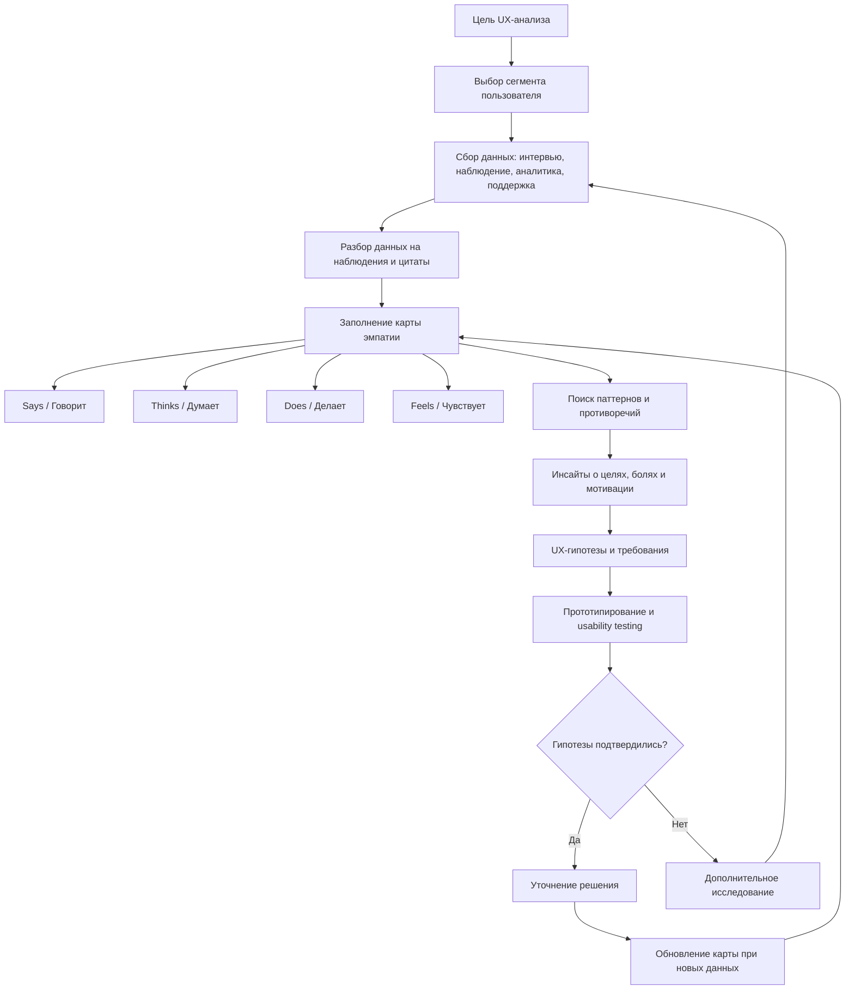

# 18. Построение карты эмпатий [5, стр.136]

## Краткое определение

**Карта эмпатии** (empathy map) - это UX-инструмент для структурирования знаний о пользователе: что пользователь говорит, думает, делает и чувствует в конкретном контексте взаимодействия с продуктом. Она помогает команде перейти от абстрактного "среднего пользователя" к более живому и проверяемому образу человека с целями, ограничениями, мотивами, страхами и типичными действиями.

Карту эмпатии обычно строят после пользовательского исследования: интервью, наблюдений, анализа обращений в поддержку, данных аналитики, usability testing, customer journey map и других источников. Важно, что карта эмпатии не должна быть набором фантазий команды о пользователе. Ее ценность появляется тогда, когда элементы карты опираются на реальные данные или явно помечены как гипотезы, требующие проверки.

Главная идея: **карта эмпатии помогает понять не только то, что пользователь делает в интерфейсе, но и почему он действует именно так**.

## Назначение карты эмпатии в UX

В UX-проектировании карта эмпатии нужна для того, чтобы команда могла согласованно описать пользователя и принять проектные решения с учетом его реального опыта. Она используется на ранних этапах анализа и проектирования, но может обновляться и позже, когда появляются новые данные.

Основные назначения:

1. **Фокусировка на пользователе.** Карта заставляет команду обсуждать не только функции продукта, но и человеческий контекст: задачи, сомнения, эмоции, ожидания и барьеры.
2. **Выявление скрытых потребностей.** Пользователь может прямо говорить одно, но его действия и эмоции показывают другое. Например, он говорит "мне нужен быстрый поиск", а на практике боится ошибиться с выбором и нуждается в понятных подсказках.
3. **Согласование понимания внутри команды.** Аналитик, дизайнер, разработчик, тестировщик и заказчик получают общий артефакт, по которому можно обсуждать требования и интерфейсные решения.
4. **Подготовка к построению personas, CJM и user flow.** Карта эмпатии хорошо дополняет персоны и карту пути пользователя: она объясняет, что происходит с пользователем на уровне мыслей, чувств и поведения.
5. **Формирование UX-гипотез.** Из карты можно вывести гипотезы: какие функции нужны, какие тексты должны быть на экране, где нужны подтверждения, какие шаги нужно упростить.
6. **Приоритизация проблем.** Если на карте видны сильные боли, страхи или повторяющиеся действия-обходы, команда может понять, какие проблемы важнее исправить.
7. **Снижение риска проектирования "под себя".** Карта напоминает, что пользователь может иметь другую терминологию, другой уровень подготовки, другой контекст работы и другую мотивацию.

Карта эмпатии особенно полезна, когда продукт создается для людей, сильно отличающихся от команды разработки: врачей, студентов, пожилых пользователей, операторов колл-центра, бухгалтеров, государственных служащих, клиентов банка, курьеров, администраторов и т.д.

## Когда применять карту эмпатии

Карту эмпатии целесообразно строить:

- при запуске нового продукта или новой функции;
- после проведения интервью или наблюдения за пользователями;
- перед проектированием интерфейса, чтобы уточнить реальные пользовательские задачи;
- перед составлением personas;
- при анализе проблем существующего продукта;
- перед usability testing, чтобы сформулировать сценарии проверки;
- после usability testing, чтобы обобщить наблюдения о поведении и эмоциях пользователей;
- при конфликте в команде, когда разные участники по-разному представляют целевую аудиторию.

Не стоит использовать карту эмпатии как замену полноценному исследованию. Это не метод сбора данных сам по себе, а способ **организовать и интерпретировать** уже полученные данные.

## Сегменты пользователя

Карта эмпатии строится не для "всех пользователей сразу", а для конкретного сегмента, роли или персоны. Если разные группы пользователей имеют разные задачи и мотивацию, для них нужны отдельные карты.

**Сегмент пользователя** - это группа пользователей, объединенная существенными признаками, которые влияют на опыт взаимодействия с продуктом.

Сегменты можно выделять по следующим основаниям:

| Основание сегментации | Примеры |
|---|---|
| Роль в системе | студент, преподаватель, администратор, модератор, оператор |
| Цель использования | оформить заказ, записаться на прием, проверить статус, найти документ |
| Частота использования | новый пользователь, регулярный пользователь, эксперт |
| Уровень компетентности | новичок, уверенный пользователь, профессионал предметной области |
| Контекст | дома, на работе, в дороге, в стрессовой ситуации, при ограниченном времени |
| Канал взаимодействия | мобильное приложение, веб-интерфейс, терминал, голосовой помощник |
| Ограничения | слабое зрение, низкая цифровая грамотность, медленный интернет, дефицит времени |
| Мотивация | экономия времени, снижение риска ошибки, контроль процесса, удобство сравнения |

Например, для сервиса записи к врачу нельзя строить одну карту для всех. У пожилого пациента, родителя ребенка, администратора клиники и врача будут разные задачи, страхи, термины и критерии удобства. Поэтому каждая карта должна начинаться с явного ответа на вопросы:

- кто именно является пользователем;
- какую задачу он решает;
- в каком контексте он использует продукт;
- какой результат считает успешным.

## Основные поля карты: Says, Thinks, Does, Feels

Классическая карта эмпатии часто включает четыре поля:

| Поле | Русский аналог | Что фиксируется |
|---|---|---|
| **Says** | **Говорит** | Прямые высказывания пользователя: цитаты из интервью, фразы из обращений, комментарии при тестировании |
| **Thinks** | **Думает** | Предположения о мыслях, сомнениях, ожиданиях, вопросах и внутренних рассуждениях пользователя |
| **Does** | **Делает** | Наблюдаемое поведение: действия, последовательность шагов, обходные пути, ошибки, паузы |
| **Feels** | **Чувствует** | Эмоциональное состояние: тревога, раздражение, уверенность, облегчение, недоверие, интерес |

Иногда используются расширенные варианты карты:

- **Sees / Видит** - что пользователь видит вокруг себя: интерфейс, рекламу, сообщения, действия коллег, конкурентные продукты;
- **Hears / Слышит** - что говорят коллеги, друзья, поддержка, консультанты, преподаватели;
- **Pains / Боли** - что мешает пользователю, вызывает риск, тревогу или потери;
- **Gains / Выгоды** - что пользователь хочет получить: экономию времени, уверенность, контроль, признание, удобство;
- **Goals / Цели** - какой результат пользователь хочет достичь;
- **Jobs / Задачи** - какую работу пользователь пытается выполнить.

В учебной и практической работе часто достаточно четырех полей Says / Thinks / Does / Feels, но для проектирования продукта полезно дополнительно выделять **цели**, **боли** и **выгоды**, потому что именно они переходят в требования к интерфейсу.

## Что важно различать в полях

Поля карты не должны дублировать друг друга.

**Says / Говорит** - это то, что можно процитировать или близко пересказать. Например: "Я не понимаю, где посмотреть статус заявки". Это данные из интервью, тестирования, поддержки или отзывов.

**Thinks / Думает** - это внутренние вопросы и предположения пользователя. Например: "Если я нажму эту кнопку, заявка уйдет без проверки?" Такие мысли не всегда произносятся вслух, поэтому их нужно выводить осторожно и помечать как гипотезы, если они не подтверждены.

**Does / Делает** - это наблюдаемое действие. Например: "Пользователь три раза возвращается на предыдущий экран", "открывает FAQ вместо заполнения формы", "копирует номер заявки в заметки".

**Feels / Чувствует** - это эмоция или состояние. Например: "раздражен из-за длинной формы", "тревожится из-за отсутствия подтверждения", "испытывает облегчение после понятного сообщения об успехе".

Типичная ошибка - записывать в поле "чувствует" абстрактные выводы вроде "хочет удобства". Это не чувство, а потребность. Лучше писать конкретнее: "боится ошибиться", "чувствует неопределенность", "раздражается из-за повторного ввода данных".

## Входные данные для построения

Карта эмпатии должна строиться на основании данных. Чем критичнее продукт, тем важнее качество входных данных.

Основные источники:

1. **Интервью с пользователями.** Позволяют узнать цели, мотивацию, ожидания, язык пользователя и субъективные трудности.
2. **Контекстное наблюдение.** Показывает, как пользователь реально работает в своей среде: какие инструменты использует, где отвлекается, что записывает отдельно, какие действия выполняет вручную.
3. **Usability testing.** Позволяет увидеть, где пользователь ошибается, где теряется, что комментирует и какие эмоции проявляет при выполнении сценариев.
4. **Продуктовая аналитика.** Показывает количественные закономерности: где пользователи уходят, сколько времени проводят на шаге, какие функции используют чаще.
5. **Логи и записи сессий.** Помогают восстановить реальные маршруты и повторяющиеся проблемы.
6. **Обращения в поддержку.** Дают готовые формулировки болей: "не могу найти", "не пришло подтверждение", "непонятно, что делать дальше".
7. **Отзывы, анкеты и NPS-комментарии.** Позволяют увидеть отношение к продукту, но требуют осторожной интерпретации, потому что отзывы часто оставляют пользователи с крайним опытом.
8. **Данные от предметных экспертов.** Полезны для понимания домена, но не заменяют исследование реальных пользователей.
9. **CJM и сценарии использования.** Помогают связать мысли и чувства пользователя с конкретными этапами пути.
10. **Конкурентный анализ.** Показывает, какие ожидания уже сформированы у пользователей похожими продуктами.

Данные на карте желательно маркировать по степени надежности:

- **факт** - подтвержден наблюдением, цитатой или аналитикой;
- **интерпретация** - вывод исследователя на основе нескольких наблюдений;
- **гипотеза** - предположение команды, которое нужно проверить.

## Процесс построения карты эмпатии

Построение карты эмпатии можно представить как последовательность аналитических шагов.

### 1. Определить цель карты

Сначала нужно понять, зачем строится карта. Например:

- спроектировать новую функцию;
- улучшить существующий экран;
- понять причины отказов;
- подготовить сценарии usability testing;
- согласовать видение пользователя в команде.

Без цели карта превращается в набор случайных наблюдений. Цель задает фокус: какие данные важны, какой сегмент выбирать, какие выводы делать.

### 2. Выбрать сегмент или персону

Нужно описать конкретного пользователя:

- роль: кто он;
- задача: что он хочет сделать;
- контекст: где и при каких условиях действует;
- уровень опыта: новичок или постоянный пользователь;
- критерий успеха: как он понимает, что задача выполнена.

Например: "студент 1 курса, который впервые записывается на пересдачу через личный кабинет" - хороший фокус. "Все студенты университета" - слишком широкий фокус.

### 3. Собрать данные

Команда собирает интервью, заметки наблюдения, цитаты, записи тестирования, обращения в поддержку, аналитику. На этом этапе важно не начинать сразу придумывать решения. Сначала нужно собрать материал о пользователе.

Полезно фиксировать данные на стикерах или в таблице: одна мысль - один стикер. Так легче группировать наблюдения и не смешивать разные проблемы.

### 4. Разложить данные по полям

Каждое наблюдение помещают в соответствующее поле:

- цитаты - в "Говорит";
- внутренние вопросы и сомнения - в "Думает";
- реальные действия - в "Делает";
- эмоциональные реакции - в "Чувствует";
- препятствия - в "Боли";
- ожидаемые результаты - в "Выгоды" или "Цели".

Если наблюдение подходит сразу в несколько полей, его лучше разделить. Например: пользователь сказал "я боюсь отправить не туда" - это цитата в "Говорит", а "боится ошибочной отправки" - чувство или боль.

### 5. Сгруппировать повторяющиеся паттерны

После заполнения карты нужно найти повторяющиеся темы:

- частые вопросы;
- типовые страхи;
- повторяющиеся ошибки;
- моменты неопределенности;
- обходные действия;
- конфликт между тем, что пользователь говорит, и тем, что делает.

Например, если пользователи говорят, что форма "нормальная", но при наблюдении часто возвращаются назад и перепроверяют данные, значит существует скрытая проблема уверенности и контроля.

### 6. Сформулировать инсайты

**Инсайт** - это содержательный вывод о пользователе, который помогает принять проектное решение.

Пример слабого вывода: "Пользователю нужен удобный интерфейс".

Пример полезного инсайта: "Пользователь боится отправить заявку с ошибкой, потому что после отправки не видит понятного способа исправить данные. Поэтому перед отправкой нужен экран проверки и явное сообщение о возможности редактирования".

Хороший инсайт связывает:

- наблюдение;
- причину;
- пользовательскую потребность;
- возможное направление решения.

### 7. Превратить выводы в требования и гипотезы

Карта эмпатии должна влиять на проектирование. По результатам карты можно сформировать:

- функциональные требования;
- UX-требования;
- тексты интерфейса;
- требования к уведомлениям и обратной связи;
- сценарии тестирования;
- идеи для прототипа;
- метрики проверки.

Например, если пользователь тревожится из-за статуса заявки, требованием может стать "система должна показывать текущий статус заявки и следующий ожидаемый шаг".

### 8. Проверить и обновить карту

Карта эмпатии не является окончательной истиной. Ее нужно уточнять после новых интервью, тестов, релиза и анализа поведения. Устаревшая карта может вредить, если команда продолжает принимать решения по старым представлениям о пользователе.

## Схема процесса построения



## Схема самой карты эмпатии

Упрощенную карту можно представить так:

| | |
|---|---|
| **Говорит (Says)**<br>Прямые фразы, жалобы, комментарии, ожидания | **Думает (Thinks)**<br>Сомнения, вопросы, внутренние рассуждения |
| **Делает (Does)**<br>Наблюдаемые действия, ошибки, обходные пути | **Чувствует (Feels)**<br>Эмоции, напряжение, уверенность, раздражение |
| **Боли (Pains)**<br>Что мешает, пугает, раздражает, создает риск | **Выгоды (Gains)**<br>Что хочет получить, какой результат считает ценным |

В центре карты часто указывают пользователя:

```text
                 +----------------------+
                 |   Пользователь       |
                 |   сегмент / роль     |
                 |   задача / контекст  |
                 +----------------------+

        Говорит                         Думает
        Что произносит?                 Что предполагает?

        Делает                          Чувствует
        Как ведет себя?                 Что переживает?

        Боли                            Выгоды
        Что мешает?                     Что хочет получить?
```

## Пример: сервис записи к врачу

Рассмотрим продукт: мобильное приложение для записи к врачу в городской поликлинике.

**Сегмент:** взрослый пациент, который редко пользуется медицинскими сервисами и хочет записаться к терапевту из дома.

**Контекст:** пользователь плохо себя чувствует, не хочет звонить в регистратуру, пользуется смартфоном вечером после работы. Ему важно быстро понять, есть ли свободные слоты, и получить подтверждение записи.

### Карта эмпатии

| Поле | Содержание |
|---|---|
| **Говорит** | "Мне бы просто выбрать врача и время"; "Я не понимаю, чем терапевт отличается от врача общей практики"; "А если я ошибся с поликлиникой?"; "Где посмотреть, что запись точно прошла?" |
| **Думает** | "Вдруг талонов уже нет"; "Если я выберу не того специалиста, меня не примут"; "Нужно ли брать с собой документы"; "Можно ли отменить запись"; "Придет ли подтверждение по SMS?" |
| **Делает** | Открывает список специалистов; несколько раз возвращается к выбору поликлиники; ищет ближайшую дату; нажимает на свободный слот, но долго не подтверждает; после записи ищет раздел "Мои записи"; делает скриншот подтверждения |
| **Чувствует** | Тревожится из-за болезни и неопределенности; раздражается, если свободные слоты не видны сразу; испытывает недоверие, если нет номера записи; чувствует облегчение после явного подтверждения |
| **Боли** | Непонятные медицинские термины; отсутствие свободных слотов; страх записаться не туда; неясный статус записи; невозможность быстро отменить или перенести прием |
| **Выгоды** | Быстро найти ближайшее время; получить понятное подтверждение; видеть адрес, кабинет и список документов; иметь возможность отменить или перенести запись без звонка |

### Выводы из примера

Из такой карты можно получить конкретные UX-решения:

- показывать ближайшие доступные слоты сразу, без лишних переходов;
- объяснять специальности простыми словами;
- перед подтверждением показывать краткую сводку: врач, дата, время, адрес, поликлиника;
- после записи показывать номер записи и статус;
- добавить понятные действия "Отменить" и "Перенести";
- отправлять подтверждение в приложение, SMS или email;
- использовать спокойные формулировки: "Запись подтверждена", "Вы сможете отменить ее до ...";
- в сценарии usability testing проверить, сможет ли пользователь найти запись после подтверждения.

Это показывает, что карта эмпатии не просто описывает пользователя, а помогает сформировать требования к интерфейсу и проверить их.

## Пример преобразования карты в требования

| Наблюдение на карте | UX-инсайт | Возможное требование |
|---|---|---|
| Пользователь делает скриншот подтверждения | Он не уверен, что запись сохранена и доступна позже | После записи показать постоянный раздел "Мои записи" и номер записи |
| Пользователь спрашивает, чем отличаются специалисты | Термины системы не совпадают с языком пользователя | Добавить короткие пояснения к специальностям |
| Пользователь долго не нажимает "Подтвердить" | Он боится необратимого действия | Перед отправкой показать экран проверки и возможность изменить данные |
| Пользователь раздражается при отсутствии свободных дат | Ему важно быстро понять доступность услуги | Показывать ближайшую свободную дату и альтернативные поликлиники |
| Пользователь ищет документы для приема | Ему нужен не только факт записи, но и подготовка к визиту | После подтверждения показать список документов и адрес |

## Связь с другими UX-артефактами

Карта эмпатии редко используется изолированно. Она связана с другими методами UX/UI-проектирования.

| Артефакт | Связь с картой эмпатии |
|---|---|
| **Persona** | Карта эмпатии уточняет внутренний мир и поведение персоны |
| **CJM** | CJM показывает этапы пути, а карта эмпатии раскрывает мысли и чувства на этих этапах |
| **User story** | Из потребностей и болей можно формулировать пользовательские истории |
| **User flow** | Действия из поля Does помогают построить последовательность шагов |
| **Прототип** | Инсайты из карты переходят в интерфейсные решения |
| **Usability testing** | Карта помогает выбрать сценарии и критерии проверки |
| **Требования** | Боли, цели и ожидания превращаются в UX- и функциональные требования |

Например, для user story можно использовать формулу:

```text
Как пациент, который редко пользуется медицинскими сервисами,
я хочу видеть понятное подтверждение записи,
чтобы быть уверенным, что меня примут в выбранное время.
```

Такая история напрямую вытекает из полей "Думает", "Чувствует" и "Боли".

## Типичные ошибки при построении карты эмпатии

### 1. Карта построена без данных

Если карта заполнена только предположениями команды, она может закрепить стереотипы. Например, разработчики могут считать, что пользователь "не читает инструкции", хотя на самом деле инструкции написаны непонятным языком или находятся не в том месте.

Правильно: отделять факты от гипотез и проверять ключевые предположения.

### 2. Слишком широкий пользовательский сегмент

Карта для "всех клиентов", "всех студентов" или "всех сотрудников" обычно бесполезна. Разные пользователи имеют разные цели и ограничения.

Правильно: строить отдельные карты для разных ролей и сценариев.

### 3. Смешение полей

Команда может записывать действия в "чувства", мысли в "говорит", а выводы о решении - в "делает". В результате карта теряет аналитическую точность.

Правильно: различать цитаты, наблюдения, эмоции, мысли и выводы.

### 4. Слишком общие формулировки

Фразы вроде "хочет удобства", "любит простоту", "боится сложностей" мало помогают проектированию.

Правильно: писать конкретно: "боится отправить заявку без возможности исправления", "не понимает термин 'прикрепление к поликлинике'", "проверяет статус заявки дважды в день".

### 5. Игнорирование противоречий

Пользователь может говорить, что интерфейс понятен, но при этом совершать ошибки. Или говорить, что функция не нужна, но регулярно использовать обходной путь.

Правильно: анализировать расхождение между Says и Does. Часто именно там находятся сильные UX-инсайты.

### 6. Подмена пользователя заказчиком или экспертом

Заказчик и предметный эксперт знают систему лучше реального пользователя. Их мнение важно, но оно не равно пользовательскому опыту.

Правильно: включать данные от реальных пользователей или хотя бы проверять экспертные предположения.

### 7. Карта не приводит к решениям

Иногда команда красиво оформляет карту, но не переводит выводы в требования, гипотезы и изменения интерфейса.

Правильно: после карты обязательно формулировать инсайты и проектные последствия.

### 8. Карта не обновляется

Пользовательское поведение меняется: появляется новый интерфейс, новая аудитория, новые каналы, новые ограничения. Старая карта может перестать соответствовать реальности.

Правильно: обновлять карту после новых исследований, релизов и анализа обратной связи.

### 9. Смешение нескольких сценариев

Один и тот же пользователь может по-разному думать и чувствовать в разных сценариях. Например, "оформить заявку" и "исправить ошибку в заявке" - разные ситуации.

Правильно: строить карту вокруг конкретной задачи или этапа пути.

### 10. Отсутствие связи с бизнес-целями

Карта эмпатии не должна быть только психологическим описанием. В продуктовой работе она должна помогать улучшать метрики: конверсию, удержание, снижение ошибок, скорость выполнения задачи, удовлетворенность.

Правильно: связывать пользовательские боли с целями продукта и измеримыми критериями успеха.

## Практические рекомендации

Для качественной карты эмпатии полезно соблюдать несколько правил:

1. **Начинать с вопроса "для кого и для какой задачи?".** Без этого карта будет слишком общей.
2. **Использовать реальные цитаты.** Они сохраняют язык пользователя и помогают команде не переводить все сразу на внутренние термины.
3. **Не смешивать наблюдения и решения.** Сначала понять пользователя, затем проектировать.
4. **Помечать гипотезы.** Если команда предполагает, что пользователь "боится ошибки", нужно указать, чем это подтверждено.
5. **Искать противоречия.** Разница между словами и действиями часто важнее прямых ответов.
6. **Формулировать инсайты.** Карта должна завершаться выводами, а не только заполненными полями.
7. **Проверять выводы тестированием.** UX-решения, полученные из карты, нужно проверять на пользователях.
8. **Делать карту доступной команде.** Она должна использоваться при обсуждении требований, макетов, текстов и приоритизации.

## Критерии хорошей карты эмпатии

Хорошая карта эмпатии:

- построена для конкретного сегмента и сценария;
- содержит данные из исследований, а не только мнения команды;
- разделяет цитаты, мысли, действия и чувства;
- фиксирует боли и желаемые выгоды;
- содержит конкретные, проверяемые формулировки;
- показывает противоречия между словами и поведением;
- приводит к UX-инсайтам и требованиям;
- может быть обновлена после новых данных;
- понятна всем участникам команды.

Плохая карта эмпатии:

- описывает "всех пользователей";
- состоит из банальных утверждений;
- не имеет связи с реальными данными;
- используется только как формальность;
- не влияет на интерфейс и требования;
- не содержит проверяемых гипотез.

## Итоговый алгоритм построения

Кратко процесс можно запомнить так:

1. Определить продуктовую или UX-задачу.
2. Выбрать конкретный пользовательский сегмент.
3. Описать контекст и цель пользователя.
4. Собрать данные из интервью, наблюдений, аналитики и поддержки.
5. Разложить данные по полям: говорит, думает, делает, чувствует.
6. Добавить боли, выгоды и цели, если используется расширенная карта.
7. Найти повторяющиеся паттерны и противоречия.
8. Сформулировать инсайты.
9. Превратить инсайты в требования, гипотезы и сценарии тестирования.
10. Проверить решения и обновить карту.

## Вывод

Карта эмпатии - это простой, но важный инструмент UX-анализа. Она помогает команде увидеть пользователя не как набор демографических характеристик, а как человека, который решает конкретную задачу в конкретном контексте, имеет ожидания, сомнения, эмоции и ограничения.

В экзаменационном ответе важно подчеркнуть, что карта эмпатии строится не ради оформления, а ради принятия проектных решений. Ее результатом должны быть инсайты, UX-гипотезы, требования к интерфейсу и сценарии проверки. Наиболее ценна карта, основанная на реальных данных и построенная для конкретного сегмента пользователя. Если карта показывает, что пользователь говорит, думает, делает и чувствует, команда получает основу для более удобного, понятного и человеко-ориентированного продукта.

## Источники

1. Источник из списка дисциплины, указанный в вопросе: **[5, стр.136]**.
2. Dave Gray, Sunni Brown, James Macanufo. **Gamestorming: A Playbook for Innovators, Rulebreakers, and Changemakers**. O'Reilly Media, 2010. Описывает визуальные фасилитационные методы, включая empathy map как инструмент командного понимания пользователя.
3. XPLANE. **Updated Empathy Map Canvas**. Материалы Дэйва Грея и XPLANE по обновленной карте эмпатии: https://medium.com/the-xplane-collection/updated-empathy-map-canvas-46df22df3c8a
4. Nielsen Norman Group. **Empathy Mapping: The First Step in Design Thinking**. Обзор роли empathy mapping в UX и design thinking: https://www.nngroup.com/articles/empathy-mapping/
5. ISO 9241-210:2019. **Ergonomics of human-system interaction - Part 210: Human-centred design for interactive systems**. Стандарт о человеко-ориентированном проектировании интерактивных систем.
