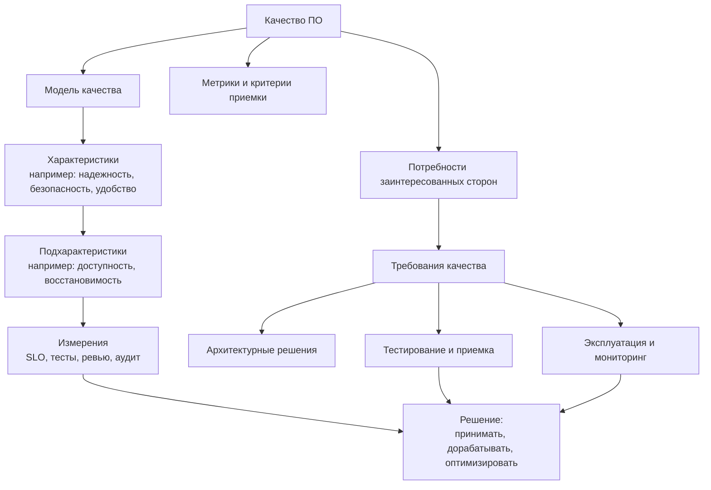
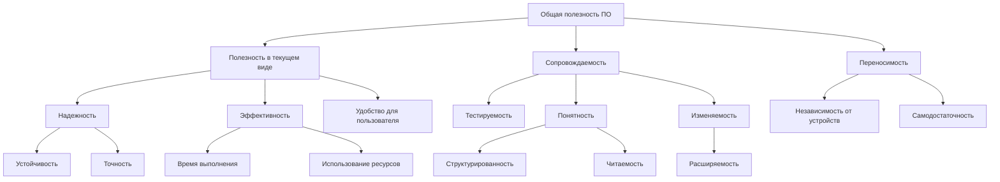

# 19. Модели качества программного обеспечения

## Краткое определение

**Качество программного обеспечения** - это степень, в которой программный продукт удовлетворяет явно заданные и подразумеваемые потребности заинтересованных сторон: пользователей, заказчика, владельца продукта, разработчиков, службы эксплуатации, аудиторов, регуляторов и бизнеса в целом.

Качество нельзя свести только к отсутствию ошибок. Программа может не падать, но быть неудобной, медленной, небезопасной, плохо сопровождаемой или непригодной для переноса на другую платформу. Поэтому в программной инженерии используют **модели качества** - структурированные наборы характеристик, подхарактеристик и метрик, которые помогают:

- формулировать нефункциональные требования;
- проверять полноту требований;
- проектировать архитектуру под важные атрибуты качества;
- выбирать тесты и критерии приемки;
- сравнивать альтернативные решения;
- объяснять заказчику, почему "качественно" означает не только "работает".

Пример: для интернет-банка важны функциональная корректность, безопасность, доступность и производительность; для обучающего приложения - удобство, доступность интерфейса и сопровождаемость; для встроенного ПО медицинского прибора - надежность, безопасность для пользователя и предсказуемость поведения.

---

## Понятие качества ПО

Качество ПО рассматривают с нескольких точек зрения.

| Точка зрения | Что считается качеством | Пример вопроса |
|---|---|---|
| **Пользовательская** | Пользователь достигает цели быстро, безопасно и без лишних ошибок | Можно ли оформить заказ за 2 минуты? |
| **Функциональная** | Система выполняет нужные функции корректно и полно | Все ли бизнес-правила расчета налога учтены? |
| **Эксплуатационная** | Система стабильно работает в реальной среде | Выдержит ли сервис 10 000 запросов в минуту? |
| **Инженерная** | Код и архитектуру можно понимать, изменять и тестировать | Можно ли добавить новый способ оплаты без переписывания ядра? |
| **Экономическая** | Продукт дает ценность при приемлемой стоимости владения | Не станет ли сопровождение дороже разработки? |
| **Регуляторная** | Система соответствует стандартам, законам и отраслевым требованиям | Соблюдаются ли требования по персональным данным? |

Важно различать:

- **внутреннее качество** - свойства кода, архитектуры, документации, тестов: модульность, читаемость, связность, покрытие тестами;
- **внешнее качество** - свойства, наблюдаемые при выполнении: скорость, надежность, безопасность, корректность результатов;
- **качество при использовании** - результат взаимодействия пользователя с системой в конкретном контексте: эффективность, удовлетворенность, отсутствие риска.

Связь между ними непрямая, но существенная. Например, слабая модульность кода не видна пользователю сразу, но через несколько релизов приводит к дорогим изменениям, дефектам и снижению скорости разработки.

---

## Зачем нужны модели качества

Модель качества задает общий язык для обсуждения качества. Без модели команда обычно ограничивается расплывчатыми формулировками: "система должна быть быстрой", "интерфейс должен быть удобным", "код должен быть хорошим". Такие требования трудно проверить.

Модель переводит общие ожидания в структуру:

```text
Цель качества
    -> характеристика
        -> подхарактеристика
            -> измеримый критерий
                -> метод проверки
```

Пример:

```text
Система должна быть производительной
    -> Performance efficiency / эффективность производительности
        -> Time behaviour / временное поведение
            -> 95-й перцентиль времени ответа API не более 300 мс
                -> нагрузочный тест в JMeter/k6 на профиле 500 RPS
```

Модели качества особенно полезны при работе с **нефункциональными требованиями**. Функциональное требование отвечает на вопрос "что система должна делать", а качественное требование отвечает на вопрос "как хорошо и в каких условиях она должна это делать".

---

## Общая схема модели качества



Главная идея: модель качества не заменяет требования, тестирование или архитектуру. Она связывает их между собой.

---

## Модель McCall

### Суть модели

**Модель McCall** - одна из ранних классических моделей качества ПО. Она была предложена Дж. МакКоллом, П. Ричардсом и Дж. Уолтерсом в отчете *Factors in Software Quality* в 1977 году. Модель строится как иерархия:

```text
Факторы качества -> критерии качества -> метрики
```

**Фактор качества** - крупная характеристика, понятная заказчику и руководителю проекта.  
**Критерий качества** - более конкретное свойство, влияющее на фактор.  
**Метрика** - способ количественно или качественно оценить критерий.

McCall группирует 11 факторов качества по трем направлениям: эксплуатация продукта, изменение продукта и переход продукта в другую среду.

### Факторы McCall

| Направление | Фактор | Смысл |
|---|---|---|
| **Product operation** - работа продукта | **Correctness** - корректность | Выполняет ли система требуемые функции и бизнес-правила |
|  | **Reliability** - надежность | Насколько стабильно система работает без отказов |
|  | **Efficiency** - эффективность | Насколько рационально используются время и ресурсы |
|  | **Integrity** - целостность/защищенность | Насколько система защищена от несанкционированного доступа и искажения данных |
|  | **Usability** - удобство использования | Насколько просто пользователю освоить и применять систему |
| **Product revision** - изменение продукта | **Maintainability** - сопровождаемость | Насколько легко находить и исправлять дефекты |
|  | **Flexibility** - гибкость | Насколько легко изменять систему под новые требования |
|  | **Testability** - тестируемость | Насколько легко проверять систему и обнаруживать ошибки |
| **Product transition** - перенос продукта | **Portability** - переносимость | Насколько легко перенести систему в другую среду |
|  | **Reusability** - повторное использование | Можно ли использовать части системы в других продуктах |
|  | **Interoperability** - совместимость/взаимодействие | Насколько легко система взаимодействует с другими системами |

### Примеры критериев и метрик

| Фактор | Возможные критерии | Возможные метрики |
|---|---|---|
| Correctness | полнота, согласованность, трассируемость требований | доля реализованных требований, число дефектов бизнес-логики |
| Reliability | отказоустойчивость, устойчивость к ошибочным данным, восстановление | MTBF, частота отказов, процент успешных операций |
| Efficiency | время выполнения, использование памяти, пропускная способность | p95 latency, CPU/RAM usage, throughput |
| Integrity | контроль доступа, аудит, защита данных | число критических уязвимостей, покрытие ролей правами |
| Usability | обучаемость, понятность, простота операций | время выполнения сценария, SUS-оценка, число ошибок пользователя |
| Maintainability | модульность, простота диагностики, документированность | среднее время исправления дефекта, cyclomatic complexity |
| Flexibility | расширяемость, настраиваемость, слабая связность | время добавления функции, число затронутых модулей |
| Testability | наблюдаемость, управляемость тестовой среды, автоматизация | покрытие тестами, время регрессионного прогона |
| Portability | независимость от платформы, стандартизованные интерфейсы | число поддерживаемых ОС, усилия переноса |
| Reusability | универсальность компонентов, слабая зависимость от контекста | доля повторно используемых модулей |
| Interoperability | совместимые протоколы, форматы данных, API-контракты | число успешных интеграционных сценариев |

### Пример применения McCall

Допустим, разрабатывается система электронного документооборота. Для заказчика важны:

- **Correctness**: маршруты согласования должны соответствовать регламенту.
- **Integrity**: документы нельзя изменять без прав; все действия должны попадать в журнал аудита.
- **Interoperability**: система должна обмениваться документами с бухгалтерской системой.
- **Maintainability**: регламенты согласования часто меняются, поэтому их нужно изменять без переписывания ядра.

Модель McCall помогает разложить эти ожидания на проверяемые критерии: матрицу прав доступа, тесты маршрутов, интеграционные тесты, метрики времени изменения маршрута.

### Достоинства и ограничения

Достоинства:

- простая и понятная иерархия;
- хорошо показывает, что качество многомерно;
- связывает факторы качества с измеримыми метриками;
- удобна для аудита и чек-листов.

Ограничения:

- модель появилась до современных веб-, облачных и мобильных систем;
- безопасность описана через Integrity и не раскрыта так подробно, как в современных стандартах;
- нет явного разделения качества продукта и качества при использовании;
- некоторые факторы пересекаются: например, Flexibility, Maintainability и Reusability.

---

## Модель Boehm

### Суть модели

**Модель Boehm** - иерархическая модель качества, предложенная Б. Боэмом и соавторами в 1970-х годах. Она пытается связать высокоуровневые цели использования ПО с инженерными свойствами продукта.

Упрощенно модель имеет три уровня:

```text
Высокоуровневые цели качества
    -> промежуточные характеристики
        -> примитивные характеристики, которые можно оценивать
```

Верхний уровень часто описывают через три главные цели:

| Высокоуровневая цель | Смысл |
|---|---|
| **As-is utility / полезность в текущем виде** | Насколько продукт полезен пользователю сейчас |
| **Maintainability / сопровождаемость** | Насколько легко исправлять, понимать и изменять продукт |
| **Portability / переносимость** | Насколько легко использовать продукт в другой технической среде |

### Промежуточные характеристики Boehm

| Характеристика | Смысл |
|---|---|
| **Reliability** - надежность | Способность выполнять функции без отказов |
| **Efficiency** - эффективность | Рациональное использование ресурсов |
| **Human engineering / usability** - удобство для человека | Удобство взаимодействия пользователя с системой |
| **Testability** - тестируемость | Возможность эффективно проверять систему |
| **Understandability** - понятность | Возможность понять структуру, логику и назначение компонентов |
| **Modifiability** - изменяемость | Возможность вносить изменения с приемлемыми затратами |
| **Portability** - переносимость | Возможность переноса между средами |

### Примитивные характеристики

На нижнем уровне у Boehm находятся более конкретные свойства, например:

- **Accuracy** - точность результатов;
- **Completeness** - полнота реализации;
- **Robustness** - устойчивость к ошибкам и нестандартным ситуациям;
- **Consistency** - согласованность интерфейсов, данных и поведения;
- **Device independence** - независимость от устройства;
- **Self-containedness** - самодостаточность компонента;
- **Structuredness** - структурированность;
- **Legibility** - читаемость;
- **Conciseness** - лаконичность;
- **Accountability** - возможность установить ответственность и источник действия;
- **Communicativeness** - понятность сообщений и взаимодействий;
- **Augmentability** - возможность расширения.

### Схема Boehm



### Пример применения Boehm

Предположим, команда поддерживает старую учетную систему. Она работает, но любое изменение занимает недели. В модели Boehm это проблема не столько "полезности в текущем виде", сколько **сопровождаемости**:

- низкая **understandability**: разработчики не понимают связи между модулями;
- низкая **modifiability**: изменение одного отчета ломает расчеты в другом;
- низкая **testability**: нет автоматических тестов и тестовых данных;
- слабая **structuredness**: бизнес-логика смешана с SQL и UI.

Решение будет не только в исправлении дефектов, но и в рефакторинге, модульных тестах, документировании критических правил и выделении доменной логики.

### Достоинства и ограничения

Достоинства:

- хорошо связывает пользовательскую полезность и инженерные свойства;
- подчеркивает важность сопровождаемости;
- удобна для анализа технического долга;
- показывает, что качество кода влияет на стоимость жизненного цикла.

Ограничения:

- модель исторически ранняя и не содержит современных акцентов на безопасность, приватность, доступность интерфейсов и облачную эксплуатацию;
- терминология отличается от современных стандартов;
- часть характеристик трудно измерять напрямую;
- для практического применения требуется адаптация под проект.

---

## FURPS и FURPS+

### Суть модели

**FURPS** - модель классификации требований и атрибутов качества, разработанная в Hewlett-Packard и распространенная через работы Роберта Грейди и Деборы Касвелл. Название образовано от пяти категорий:

```text
F - Functionality
U - Usability
R - Reliability
P - Performance
S - Supportability
```

Модель особенно удобна в прикладной разработке, потому что помогает быстро классифицировать требования на функциональные и нефункциональные.

### Категории FURPS

| Категория | Перевод | Что включает |
|---|---|---|
| **Functionality** | функциональность | функции, бизнес-правила, возможности, безопасность, совместимость функций |
| **Usability** | удобство использования | понятность, обучаемость, эстетика, документация, доступность для пользователя |
| **Reliability** | надежность | доступность, частота отказов, восстановление, устойчивость к ошибкам |
| **Performance** | производительность | время ответа, пропускная способность, потребление ресурсов, масштабируемость |
| **Supportability** | поддерживаемость | тестируемость, сопровождаемость, конфигурируемость, локализация, расширяемость |

### FURPS+

Знак **+** добавляет ограничения и дополнительные классы требований, которые не всегда удобно помещать в пять основных букв.

| Элемент FURPS+ | Смысл | Пример |
|---|---|---|
| **Design constraints** | ограничения проектирования | использовать микросервисную архитектуру или конкретный паттерн |
| **Implementation constraints** | ограничения реализации | язык Java 21, база PostgreSQL, фреймворк Spring |
| **Interface requirements** | требования к интерфейсам | REST API, OpenAPI-контракт, формат JSON |
| **Physical requirements** | физические ограничения | работа на терминале с 2 ГБ RAM или в закрытом контуре |
| **Legal/regulatory constraints** | правовые ограничения | персональные данные, лицензии, отраслевые стандарты |

### Пример применения FURPS+

Для мобильного приложения доставки требования можно разложить так:

| Категория | Пример требования |
|---|---|
| Functionality | Пользователь может выбрать ресторан, оформить заказ и оплатить картой |
| Usability | Новый пользователь должен оформить первый заказ без обучения |
| Reliability | При сбое платежного шлюза заказ не должен потеряться |
| Performance | Экран каталога открывается не дольше 1 секунды при нормальной сети |
| Supportability | Тексты интерфейса должны локализоваться без изменения кода |
| + Interface | Интеграция с платежным шлюзом выполняется через REST API |
| + Legal | Персональные данные хранятся и обрабатываются по требованиям законодательства |

### Достоинства и ограничения

Достоинства:

- легко запоминается;
- удобна для сбора и классификации требований;
- хорошо подходит для разговоров с заказчиком и аналитиками;
- помогает не забыть производительность, надежность и поддерживаемость.

Ограничения:

- менее строгая, чем ISO/IEC 25010;
- категории могут пересекаться: безопасность иногда относят к Functionality, иногда выделяют отдельно;
- не дает готовой системы подхарактеристик и метрик;
- требует детализации для приемки и тестирования.

---

## ISO/IEC 25010

### Общая идея стандарта

**ISO/IEC 25010** входит в семейство стандартов **SQuaRE** (*Systems and software Quality Requirements and Evaluation*). Это современная стандартная модель качества продукта, предназначенная для задания, измерения и оценки качества систем и программных продуктов.

Важно для экзамена:

- во многих учебных материалах используется **ISO/IEC 25010:2011**, где модель качества продукта содержит **8 характеристик** и 31 подхарактеристику, а также отдельно рассматривается качество при использовании;
- текущая редакция **ISO/IEC 25010:2023** обновила модель качества продукта: она содержит **9 характеристик**, добавила **Safety**, переименовала **Usability** в **Interaction capability**, а **Portability** в **Flexibility**; модель качества при использовании вынесена в отдельный стандарт ISO/IEC 25019:2023.

На экзамене обычно достаточно уверенно знать классическую структуру 2011 года и уметь объяснить, что современная редакция развивает ее.

---

## ISO/IEC 25010:2011 - модель качества продукта

### 8 характеристик и подхарактеристики

| Характеристика | Подхарактеристики | Смысл |
|---|---|---|
| **Functional suitability** - функциональная пригодность | functional completeness, functional correctness, functional appropriateness | Система предоставляет нужные функции, делает это правильно и уместно для задач пользователя |
| **Performance efficiency** - эффективность производительности | time behaviour, resource utilization, capacity | Система работает достаточно быстро и рационально использует ресурсы |
| **Compatibility** - совместимость | co-existence, interoperability | Система может сосуществовать и взаимодействовать с другими системами |
| **Usability** - удобство использования | appropriateness recognizability, learnability, operability, user error protection, user interface aesthetics, accessibility | Пользователь может понять, освоить и эффективно использовать систему |
| **Reliability** - надежность | maturity, availability, fault tolerance, recoverability | Система стабильно работает, выдерживает сбои и восстанавливается |
| **Security** - защищенность | confidentiality, integrity, non-repudiation, accountability, authenticity | Данные и функции защищены от несанкционированного доступа и искажения |
| **Maintainability** - сопровождаемость | modularity, reusability, analysability, modifiability, testability | Систему можно понимать, изменять, повторно использовать и тестировать |
| **Portability** - переносимость | adaptability, installability, replaceability | Систему можно перенести, установить или заменить в другой среде |

### Развернутое объяснение характеристик ISO/IEC 25010:2011

#### 1. Functional suitability - функциональная пригодность

Показывает, насколько функции системы соответствуют заданным и подразумеваемым потребностям.

Подхарактеристики:

- **Functional completeness** - полнота: покрыты ли все требуемые задачи.
- **Functional correctness** - корректность: дает ли система правильные результаты.
- **Functional appropriateness** - уместность: помогают ли функции эффективно решать реальные задачи.

Пример: калькулятор налогов должен учитывать все типы ставок, правильно считать сумму и не заставлять пользователя вручную выполнять лишние промежуточные вычисления.

#### 2. Performance efficiency - эффективность производительности

Описывает производительность относительно используемых ресурсов.

Подхарактеристики:

- **Time behaviour** - временное поведение: время ответа, время обработки, задержки.
- **Resource utilization** - использование ресурсов: CPU, память, сеть, диск.
- **Capacity** - емкость: максимальное число пользователей, транзакций, записей, соединений.

Пример: API поиска должен отвечать за 300 мс на 95-м перцентиле при 1000 одновременных пользователях.

#### 3. Compatibility - совместимость

Показывает, может ли система работать рядом с другими системами и обмениваться с ними информацией.

Подхарактеристики:

- **Co-existence** - сосуществование: система не мешает другим продуктам в общей среде.
- **Interoperability** - интероперабельность: система корректно обменивается данными и использует общие протоколы.

Пример: CRM должна обмениваться данными с ERP через согласованный API и не блокировать общие ресурсы сервера.

#### 4. Usability - удобство использования

Описывает, насколько продукт понятен и удобен целевым пользователям.

Подхарактеристики:

- **Appropriateness recognizability** - пользователь понимает, подходит ли система для его задачи.
- **Learnability** - обучаемость.
- **Operability** - управляемость и простота выполнения операций.
- **User error protection** - защита от пользовательских ошибок.
- **User interface aesthetics** - эстетика интерфейса.
- **Accessibility** - доступность для людей с ограничениями и разных условий использования.

Пример: форма перевода денег должна явно показывать сумму, комиссию, получателя и предупреждать о необратимом действии.

#### 5. Reliability - надежность

Показывает, насколько система сохраняет работоспособность в заданных условиях.

Подхарактеристики:

- **Maturity** - зрелость: низкая частота отказов при нормальной эксплуатации.
- **Availability** - доступность: система доступна пользователям в нужное время.
- **Fault tolerance** - отказоустойчивость: система продолжает работать при сбоях компонентов.
- **Recoverability** - восстанавливаемость: система возвращается в рабочее состояние после сбоя.

Пример: интернет-магазин должен сохранять заказ даже при временной недоступности платежного шлюза.

#### 6. Security - защищенность

Описывает защиту информации и функций системы.

Подхарактеристики:

- **Confidentiality** - конфиденциальность: данные доступны только тем, кому разрешено.
- **Integrity** - целостность: данные нельзя незаметно исказить.
- **Non-repudiation** - невозможность отказа от совершенного действия.
- **Accountability** - подотчетность: действия можно связать с субъектом.
- **Authenticity** - подлинность: субъект или ресурс действительно является тем, кем представляется.

Пример: в системе электронного документооборота пользователь не должен иметь возможность подписать документ от имени другого человека, а факт подписи должен фиксироваться в журнале.

#### 7. Maintainability - сопровождаемость

Показывает, насколько эффективно систему можно анализировать, изменять и тестировать.

Подхарактеристики:

- **Modularity** - модульность: изменение одного компонента минимально влияет на другие.
- **Reusability** - повторное использование.
- **Analysability** - анализируемость: можно быстро понять причину дефекта или последствия изменения.
- **Modifiability** - модифицируемость: изменения вносятся без чрезмерных затрат и побочных эффектов.
- **Testability** - тестируемость.

Пример: если новый тип скидки добавляется через отдельную стратегию расчета, а не через переписывание всего checkout, сопровождаемость выше.

#### 8. Portability - переносимость

Описывает, насколько легко перенести продукт в другую среду.

Подхарактеристики:

- **Adaptability** - адаптируемость к другой среде.
- **Installability** - устанавливаемость.
- **Replaceability** - заменяемость другим продуктом или компонентом.

Пример: приложение можно развернуть в тестовой, staging- и production-среде через один и тот же контейнерный образ с разной конфигурацией.

---

## ISO/IEC 25010:2011 - качество при использовании

Помимо качества продукта, в редакции 2011 года выделялась модель **quality in use** - качество при использовании. Она оценивает не свойства системы сами по себе, а результат использования системы конкретными пользователями в конкретном контексте.

| Характеристика | Подхарактеристики | Смысл |
|---|---|---|
| **Effectiveness** - результативность | - | Пользователь достигает целей точно и полно |
| **Efficiency** - эффективность | - | Пользователь достигает целей с приемлемыми затратами времени и усилий |
| **Satisfaction** - удовлетворенность | usefulness, trust, pleasure, comfort | Пользователь доволен использованием |
| **Freedom from risk** - свобода от риска | economic risk mitigation, health and safety risk mitigation, environmental risk mitigation | Использование не создает неприемлемых рисков |
| **Context coverage** - покрытие контекста | context completeness, flexibility | Система пригодна для разных условий использования |

Пример: интерфейс оператора call-центра может быть функционально полным, но если оператор тратит 2 минуты на поиск карточки клиента вместо 10 секунд, качество при использовании низкое.

---

## ISO/IEC 25010:2023 - актуальная редакция

В 2023 году ISO/IEC 25010 был обновлен. По официальному описанию ISO, текущий стандарт определяет модель качества продукта для ИКТ-продуктов и программных продуктов и состоит из 9 характеристик, разделенных на подхарактеристики.

### 9 характеристик ISO/IEC 25010:2023

| Характеристика 2023 | Близкий аналог в 2011 | Основной смысл |
|---|---|---|
| **Functional suitability** | Functional suitability | Функциональная полнота, корректность и уместность |
| **Performance efficiency** | Performance efficiency | Время, ресурсы, емкость |
| **Compatibility** | Compatibility | Сосуществование и взаимодействие |
| **Interaction capability** | Usability | Возможность эффективного взаимодействия пользователя с продуктом |
| **Reliability** | Reliability | Устойчивое функционирование и восстановление |
| **Security** | Security | Защита данных, действий и идентичности |
| **Maintainability** | Maintainability | Анализ, изменение, тестирование и повторное использование |
| **Flexibility** | Portability | Адаптация, масштабирование, установка, замена |
| **Safety** | новая характеристика | Предотвращение вреда людям, бизнесу, имуществу, ПО и окружающей среде |

### Подхарактеристики ISO/IEC 25010:2023

| Характеристика | Подхарактеристики |
|---|---|
| **Functional suitability** | functional completeness, functional correctness, functional appropriateness |
| **Performance efficiency** | time behaviour, resource utilization, capacity |
| **Compatibility** | co-existence, interoperability |
| **Interaction capability** | appropriateness recognizability, learnability, operability, user error protection, user engagement, inclusivity, user assistance, self-descriptiveness |
| **Reliability** | faultlessness, availability, fault tolerance, recoverability |
| **Security** | confidentiality, integrity, non-repudiation, accountability, authenticity, resistance |
| **Maintainability** | modularity, reusability, analysability, modifiability, testability |
| **Flexibility** | adaptability, scalability, installability, replaceability |
| **Safety** | operational constraint, risk identification, fail safe, hazard warning, safe integration |

Для экзамена можно сказать так: **ISO/IEC 25010 задает эталонную иерархию характеристик качества продукта; в классической редакции 2011 года обычно приводят 8 характеристик, а в текущей редакции 2023 года - 9, потому что Safety стало отдельной характеристикой**.

---

## Сопоставление моделей

| Критерий | McCall | Boehm | FURPS/FURPS+ | ISO/IEC 25010 |
|---|---|---|---|---|
| Период и роль | Классическая ранняя модель качества | Классическая инженерная модель | Практичная классификация требований | Современный международный стандарт |
| Основная структура | Факторы -> критерии -> метрики | Цели -> характеристики -> примитивные свойства | 5 категорий + ограничения | Характеристики -> подхарактеристики |
| Сильная сторона | Связь качества с метриками | Связь полезности и сопровождаемости | Простота применения в требованиях | Полнота, стандартизованность, современная терминология |
| Удобна для | Аудита, чек-листов, оценки продукта | Анализа технического долга и сопровождаемости | Сбора и классификации требований | Формальных требований, оценки, приемки, закупки |
| Ограничение | Устаревшая терминология | Требует адаптации и метрик | Не очень строгая | Может быть избыточной для малых проектов |
| Безопасность | Integrity | Не выделена подробно | Может входить в Functionality или "+" | Отдельная характеристика Security |
| Удобство | Usability | Human engineering | Usability | Usability в 2011, Interaction capability в 2023 |
| Сопровождаемость | Maintainability, Flexibility, Testability | Один из ключевых фокусов | Supportability | Maintainability |

---

## Как применять модели качества на практике

### 1. Определить заинтересованные стороны

Для одного и того же продукта разные участники видят качество по-разному:

- пользователь хочет быстро и удобно решить задачу;
- заказчик хочет бизнес-эффект и приемлемую стоимость;
- разработчик хочет понятную архитектуру;
- эксплуатация хочет наблюдаемость, надежность и восстановление;
- служба безопасности хочет контроль доступа, аудит и защиту данных;
- регулятор хочет соответствие нормам.

### 2. Выбрать релевантные характеристики

Не все характеристики одинаково важны в каждом проекте. Для прототипа может быть важнее функциональная пригодность и скорость изменения, чем переносимость. Для банковской системы безопасность и надежность критичнее визуальной эстетики.

Пример приоритизации:

| Тип системы | Наиболее критичные характеристики |
|---|---|
| Интернет-банк | security, reliability, functional correctness, performance efficiency |
| Медицинское устройство | safety, reliability, functional correctness, recoverability |
| CRM для малого бизнеса | usability, functional suitability, maintainability |
| API-платформа | interoperability, performance efficiency, availability, security |
| Библиотека для разработчиков | reusability, testability, documentation, compatibility |
| Стартап-прототип | functional suitability, modifiability, usability |

### 3. Превратить характеристики в измеримые требования

Плохие формулировки:

- "Система должна быть быстрой".
- "Интерфейс должен быть удобным".
- "Приложение должно быть надежным".
- "Код должен быть поддерживаемым".

Хорошие формулировки:

- "95-й перцентиль времени ответа `GET /orders` не превышает 300 мс при нагрузке 500 RPS".
- "Новый оператор после 30 минут обучения оформляет заявку без помощи наставника".
- "Доступность сервиса в рабочее время не ниже 99,9% за календарный месяц".
- "Новая ставка налога добавляется без изменения существующих классов расчета и покрывается unit-тестами".

### 4. Связать требования с архитектурой

Качественные требования часто определяют архитектуру:

- высокая доступность -> репликация, health checks, failover, очереди;
- безопасность -> аутентификация, авторизация, шифрование, аудит;
- сопровождаемость -> модульная архитектура, слабая связность, тесты;
- производительность -> кэширование, индексы, асинхронная обработка;
- переносимость -> контейнеризация, конфигурация через окружение, независимость от платформы;
- интероперабельность -> стандартизованные API, схемы данных, версионирование контрактов.

### 5. Задать методы проверки

| Характеристика | Как проверять |
|---|---|
| Functional suitability | функциональные тесты, приемочные сценарии, трассировка требований |
| Performance efficiency | нагрузочные тесты, профилирование, мониторинг ресурсов |
| Compatibility | интеграционные тесты, contract testing, проверка форматов |
| Usability / interaction capability | UX-тесты, эвристическая оценка, аналитика пользовательских ошибок |
| Reliability | chaos testing, тесты восстановления, SLO/SLA мониторинг |
| Security | threat modeling, SAST/DAST, pentest, аудит прав |
| Maintainability | code review, статический анализ, метрики сложности, тестируемость |
| Portability / flexibility | тестовые развертывания, контейнеризация, миграционные проверки |
| Safety | анализ рисков, fail-safe сценарии, проверки ограничений эксплуатации |

---

## Пример комплексного применения модели

Пусть команда разрабатывает сервис записи к врачу.

### Требования качества

| Характеристика | Требование | Проверка |
|---|---|---|
| Functional suitability | Пациент может найти врача, выбрать слот и получить подтверждение записи | приемочный сценарий end-to-end |
| Functional correctness | Нельзя записаться на занятый слот | тесты конкурентной записи |
| Performance efficiency | Поиск свободных слотов отвечает до 500 мс на p95 | нагрузочный тест |
| Reliability | При сбое SMS-провайдера запись сохраняется, уведомление повторяется позже | тест отказа внешнего сервиса |
| Security | Пациент видит только свои записи и персональные данные | тесты авторизации |
| Usability | Пользователь может записаться без звонка в регистратуру | UX-тестирование сценария |
| Maintainability | Новый тип расписания врача добавляется без изменения API записи | архитектурное ревью и unit-тесты |
| Compatibility | Сервис передает данные в медицинскую информационную систему | интеграционный тест |
| Safety | Ошибочная отмена критически важного приема требует явного подтверждения | сценарии защиты от опасных действий |

### Вывод по примеру

Одна и та же функция "записаться к врачу" имеет разные аспекты качества. Модель качества помогает не ограничиться проверкой кнопки "Записаться", а учесть конкурентность, безопасность данных, отказ внешних сервисов, понятность интерфейса и последствия ошибок.

---

## Типичные ошибки при использовании моделей качества

### 1. Считать качество только отсутствием дефектов

Низкое число багов не означает высокое качество. Система может быть стабильной, но медленной, неудобной или неподдерживаемой.

### 2. Писать неизмеримые требования

Фраза "система должна быть надежной" не задает критерий приемки. Нужно указать условия, порог и способ проверки: например, доступность 99,9% в рабочее время, восстановление после сбоя не дольше 10 минут.

### 3. Копировать всю модель без приоритизации

Если все характеристики объявлены одинаково важными, команда фактически не имеет приоритетов. Качество всегда связано с компромиссами: максимальная безопасность, максимальная удобность и минимальная стоимость редко достигаются одновременно.

### 4. Путать функциональные и качественные требования

"Пользователь может оплатить заказ" - функциональное требование.  
"Оплата подтверждается не дольше 3 секунд в 95% случаев" - требование производительности.  
"Платежные данные не сохраняются в открытом виде" - требование безопасности.

### 5. Не связывать качество с архитектурой

Нельзя добавить высокую доступность или безопасность "в конце" только тестированием. Многие свойства качества должны быть заложены в архитектуру с начала проекта.

### 6. Игнорировать качество сопровождения

Проект может быстро выйти на рынок, но стать дорогим в развитии из-за плохой модульности, слабых тестов и неясной архитектуры. Maintainability часто определяет стоимость владения продуктом.

### 7. Измерять только то, что легко измерить

Количество строк кода или процент покрытия тестами сами по себе не гарантируют качество. Метрики должны быть связаны с реальными рисками и целями продукта.

### 8. Смешивать Safety и Security

**Security** - защита от несанкционированных действий, атак и нарушения свойств информации.  
**Safety** - предотвращение вреда людям, имуществу, бизнесу, программам или окружающей среде.

Пример: защита медицинской системы от взлома - Security; предотвращение опасной дозировки лекарства из-за ошибки интерфейса - Safety.

---

## Короткая шпаргалка для экзамена

**Модель качества ПО** - это структурированное описание характеристик, по которым оценивается качество программного продукта.

**McCall**:

- 1977 год;
- факторы -> критерии -> метрики;
- 11 факторов;
- три группы: product operation, product revision, product transition;
- факторы: correctness, reliability, efficiency, integrity, usability, maintainability, flexibility, testability, portability, reusability, interoperability.

**Boehm**:

- иерархическая модель;
- связывает полезность, сопровождаемость и переносимость с инженерными характеристиками;
- важные характеристики: reliability, efficiency, human engineering, testability, understandability, modifiability, portability;
- хорошо подходит для анализа сопровождаемости и технического долга.

**FURPS/FURPS+**:

- Functionality, Usability, Reliability, Performance, Supportability;
- плюс ограничения проектирования, реализации, интерфейсов, физической среды, законодательства;
- удобна для классификации требований.

**ISO/IEC 25010**:

- часть семейства SQuaRE;
- стандартная модель качества продукта;
- ISO/IEC 25010:2011: 8 характеристик: functional suitability, performance efficiency, compatibility, usability, reliability, security, maintainability, portability;
- ISO/IEC 25010:2023: 9 характеристик: functional suitability, performance efficiency, compatibility, interaction capability, reliability, security, maintainability, flexibility, safety.

---

## Вывод

Качество программного обеспечения - многомерное понятие. Оно включает не только корректность функций, но и надежность, производительность, безопасность, удобство, сопровождаемость, совместимость, переносимость и безопасность применения. Поэтому в программной инженерии используют модели качества.

McCall и Boehm заложили классический подход: качество раскладывается на иерархию характеристик, критериев и измерений. FURPS/FURPS+ удобна как практичная схема классификации требований. ISO/IEC 25010 является современной стандартной моделью, которая помогает формально задавать, измерять и оценивать качество продукта.

Главная практическая мысль: модель качества полезна только тогда, когда характеристики превращаются в измеримые требования, архитектурные решения, тесты и критерии приемки.

---

## Источники

1. ISO, **ISO/IEC 25010:2023. Systems and software engineering - Systems and software Quality Requirements and Evaluation (SQuaRE) - Product quality model**: https://www.iso.org/standard/78176.html
2. ISO 25000 Portal, **ISO/IEC 25010**: https://www.iso25000.com/index.php/en/iso-25000-standards/iso-25010
3. ISO/IEC, **ISO/IEC 25010:2011. Systems and software engineering - Systems and software Quality Requirements and Evaluation (SQuaRE) - System and software quality models**.
4. J. A. McCall, P. K. Richards, G. F. Walters, **Factors in Software Quality**, National Technical Information Service, 1977.
5. B. W. Boehm, J. R. Brown, H. Kaspar, M. Lipow, G. MacLeod, M. Merritt, **Characteristics of Software Quality**, North-Holland, 1978.
6. R. B. Grady, D. L. Caswell, **Software Metrics: Establishing a Company-Wide Program**, Prentice Hall, 1987.
7. IBM developerWorks / Rational, **Capturing architectural requirements with FURPS+**.
8. ISO/IEC 25000 SQuaRE series: quality requirements, product quality models, measurement and evaluation standards.
