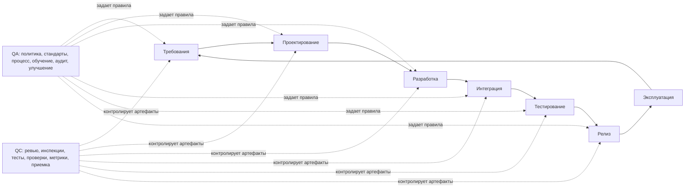
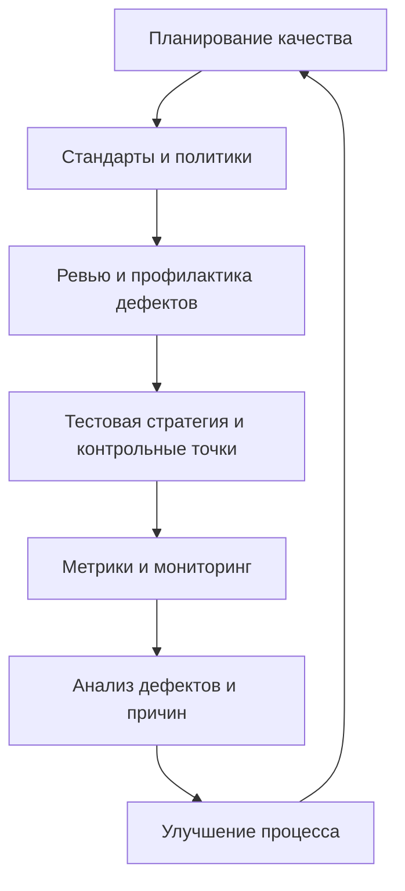
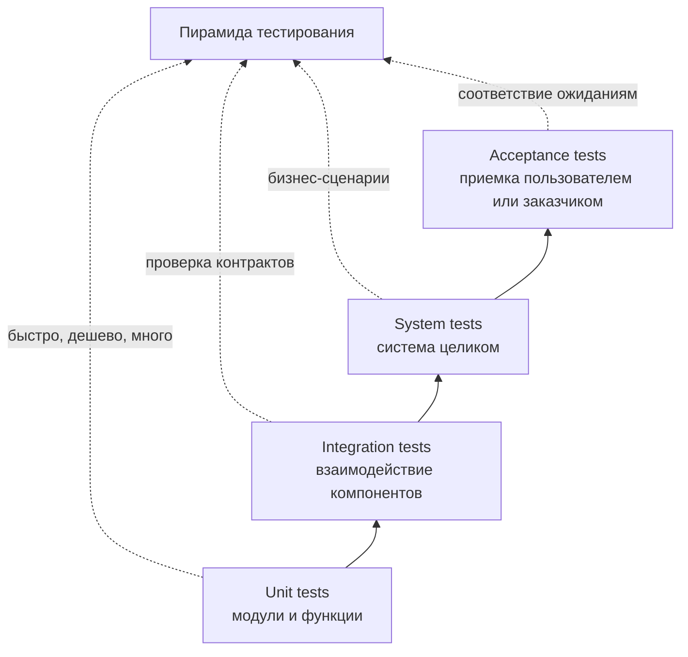

# 20. Контроль и обеспечение качества ПО [8]

## Краткое определение

**Качество программного обеспечения** - это степень, в которой программный продукт и процесс его создания удовлетворяют требованиям, ожиданиям пользователей, ограничениям предметной области и принятым инженерным стандартам.

В управлении качеством ПО обычно различают три близких, но не одинаковых понятия:

- **QA (Quality Assurance, обеспечение качества)** - процессная деятельность: как организовать разработку так, чтобы дефекты предотвращались заранее.
- **QC (Quality Control, контроль качества)** - продуктовая контрольная деятельность: как проверить конкретный результат работы и понять, соответствует ли он требованиям.
- **Testing (тестирование)** - один из основных методов QC: выполнение проверок, статический анализ или иная верификация, направленная на обнаружение дефектов и получение информации о качестве.

Главная мысль: **QA отвечает за систему предотвращения дефектов, QC - за контроль результата, тестирование - за один из инструментов такого контроля**. Поэтому неверно говорить, что "QA = тестировщик" или что "качество обеспечивается только тестами".

## QA, QC и testing: различия

| Критерий | QA: обеспечение качества | QC: контроль качества | Testing: тестирование |
|---|---|---|---|
| Основной вопрос | Как построить процесс, чтобы дефектов было меньше? | Соответствует ли конкретный артефакт требованиям? | Есть ли дефекты в продукте или компоненте? |
| Фокус | Процесс разработки и управления | Продукт, документация, код, релиз | Проверяемый объект: модуль, API, UI, система |
| Характер | Предупреждающий | Обнаруживающий и подтверждающий | Обнаруживающий, измеряющий, подтверждающий |
| Когда применяется | На протяжении всего жизненного цикла | На контрольных точках и перед передачей результата | На разных уровнях: unit, integration, system, acceptance |
| Примеры | политика качества, стандарты кодирования, процесс ревью, Definition of Done, аудит процесса | приемка требований, ревью архитектуры, проверка сборки, контроль релиза | модульные, интеграционные, системные, нагрузочные, регрессионные тесты |
| Результат | Улучшенный и управляемый процесс | Решение о соответствии/несоответствии | Отчеты о тестах, дефекты, покрытие, оценка риска |

### Простая аналогия

Если команда выпускает интернет-магазин:

- **QA** задает правила: требования должны иметь критерии приемки, код проходит ревью, сборка запускает автотесты, релиз идет через quality gate.
- **QC** проверяет результаты: спецификация оформлена, API соответствует контракту, релизная сборка прошла smoke-проверку.
- **Testing** выполняет конкретные проверки: добавить товар в корзину, оплатить заказ, проверить ошибку при неверной карте, измерить время ответа под нагрузкой.

## Место качества в жизненном цикле ПО

Качество нельзя "добавить" в конце проекта. Оно формируется во всех видах работ: анализ требований, проектирование, разработка, интеграция, тестирование, сопровождение.



На практике это означает, что качество проверяют не только на готовом продукте. Требования, архитектура, код, тестовые сценарии, документация, конфигурация окружений и процесс релиза тоже являются объектами контроля.

## Цели обеспечения качества

Обеспечение качества ПО преследует несколько целей:

- снизить вероятность дефектов до того, как они попадут в код и релиз;
- сделать процесс разработки воспроизводимым и управляемым;
- обеспечить соответствие требованиям заказчика, нормативным ограничениям и внутренним стандартам;
- повысить предсказуемость сроков, стоимости и рисков;
- создать объективные критерии приемки;
- обеспечить трассируемость: от требования к реализации, тестам, дефектам и релизу;
- организовать постоянное улучшение процесса на основе данных.

Важно: QA не гарантирует абсолютного отсутствия ошибок. В сложных системах это практически недостижимо. QA создает систему, при которой ошибки обнаруживаются раньше, обходятся дешевле и реже повторяются.

## Процесс обеспечения качества ПО

Типичный процесс QA можно представить как цикл управления качеством.



### 1. Планирование качества

На этапе планирования команда определяет:

- какие характеристики качества важны для продукта;
- какие риски являются критичными;
- какие стандарты и практики применяются;
- какие артефакты должны быть проверены;
- какие виды тестирования нужны;
- какие quality gates блокируют переход на следующий этап;
- какие метрики будут собираться;
- кто отвечает за качество на каждом участке.

Пример: для банковского приложения особенно важны безопасность, надежность, трассируемость операций и соответствие регуляторным требованиям. Для игровой мобильной игры могут быть критичнее производительность, стабильность на устройствах и удобство интерфейса.

### 2. Политика качества

**Политика качества** - это набор принципов и обязательных правил, по которым организация управляет качеством.

В политике могут быть закреплены:

- обязательность ревью требований и кода;
- правила ведения дефектов;
- минимальные требования к тестовому покрытию;
- порядок приемки релиза;
- критерии готовности задачи;
- правила работы с критическими инцидентами;
- ответственность ролей;
- требования к документации;
- правила управления изменениями.

Пример фрагмента политики:

> Изменение не может попасть в основную ветку, если оно не имеет связанного требования или задачи, не прошло code review, не прошло автоматические проверки CI и содержит нерешенные дефекты критичности Blocker или Critical.

### 3. Стандарты и процедуры

Политика задает общие принципы, а стандарты и процедуры делают их исполнимыми.

Примеры внутренних стандартов:

- стандарт оформления требований;
- стандарт архитектурного описания;
- стандарт кодирования;
- стандарт именования тест-кейсов;
- стандарт логирования;
- стандарт обработки ошибок;
- стандарт безопасности;
- стандарт релизной документации.

Примеры процедур:

- процедура ревью требований;
- процедура code review;
- процедура регистрации дефекта;
- процедура регрессионного тестирования;
- процедура выпуска релиза;
- процедура анализа инцидента;
- процедура изменения требований.

Хороший стандарт должен быть проверяемым. Плохая формулировка: "код должен быть хорошим". Проверяемая формулировка: "публичные методы должны иметь понятные имена, покрытие unit-тестами критической бизнес-логики не ниже установленного порога, исключения не должны проглатываться без логирования или обработки".

### 4. Ревью и инспекции

Ревью - один из самых эффективных способов профилактики дефектов. Оно позволяет находить ошибки до выполнения программы.

Объекты ревью:

- требования;
- пользовательские истории;
- прототипы интерфейса;
- архитектурные решения;
- модели данных;
- API-контракты;
- исходный код;
- тест-кейсы;
- миграции базы данных;
- релизная документация.

Виды ревью:

| Вид | Характеристика | Пример |
|---|---|---|
| Неформальное ревью | Быстрая проверка коллегой | разработчик просит посмотреть сложный фрагмент кода |
| Walkthrough | Автор проводит участников по артефакту | аналитик объясняет сценарий заказа |
| Technical review | Экспертная техническая оценка | архитектор проверяет решение по интеграции |
| Inspection | Формальная проверка по чек-листу | ревью требований перед подписанием спецификации |
| Code review | Проверка исходного кода | pull request перед merge |

Пример чек-листа ревью требований:

- требование понятно без устных пояснений;
- есть критерии приемки;
- нет противоречий с другими требованиями;
- указаны ограничения и исключительные случаи;
- требование тестируемо;
- определен приоритет;
- есть связь с бизнес-целью или пользовательской потребностью.

### 5. Тестовая стратегия

**Тестовая стратегия** определяет, что, зачем, когда и какими средствами будет тестироваться.

Она обычно включает:

- цели тестирования;
- уровни тестирования;
- виды тестирования;
- тестовые окружения;
- тестовые данные;
- подход к автоматизации;
- критерии начала и окончания тестирования;
- критерии приемки;
- управление дефектами;
- распределение ответственности;
- риски и ограничения.

Тестирование строится с учетом рисков. Нельзя одинаково глубоко проверить все. Поэтому критические функции проверяют подробнее, а второстепенные - легче.

### 6. Метрики и мониторинг

Метрики нужны не для украшения отчета, а для управленческих решений. Они помогают понять:

- где чаще всего возникают дефекты;
- какие этапы дают больше всего переработок;
- насколько стабилен релиз;
- не ухудшается ли качество после изменений;
- достаточно ли эффективна автоматизация;
- где процесс требует улучшения.

При этом метрики легко исказить. Если команда слепо гонится за числом тестов, она может получить много слабых проверок. Если разработчиков оценивают по количеству дефектов, они начинают спорить о классификации вместо устранения причин.

### 7. Анализ причин и улучшение

После серьезных дефектов и инцидентов важно выяснять не только "кто ошибся", а "почему процесс позволил ошибке пройти".

Пример анализа:

- дефект: пользователь мог оформить заказ с отрицательным количеством товара;
- непосредственная причина: не было проверки значения на API;
- системная причина: в требованиях не описаны граничные значения, unit-тесты проверяли только обычный случай, в code review не было чек-листа на валидацию входных данных;
- улучшение: добавить правило описания граничных значений в требования, тесты на boundary values, пункт проверки в code review.

Так QA превращает найденные дефекты в улучшение процесса.

## Стандарты и модели, применяемые к качеству ПО

### ISO 9001

**ISO 9001** - международный стандарт системы менеджмента качества. Он не является стандартом только для разработки ПО, но задает общие требования к управлению качеством: ориентация на клиента, процессный подход, ответственность руководства, управление ресурсами, оценка результатов и постоянное улучшение.

Для software engineering ISO 9001 полезен как рамка управления:

- определить процессы разработки и поддержки;
- назначить ответственность;
- управлять документированной информацией;
- контролировать несоответствия;
- проводить внутренние аудиты;
- улучшать систему менеджмента качества.

### ISO/IEC 25010

**ISO/IEC 25010** относится к серии SQuaRE и описывает модель качества программного продукта. В актуальной версии ISO/IEC 25010:2023 модель используется для описания и оценки характеристик качества ICT- и software-продуктов.

Характеристики качества помогают переводить абстрактное слово "качественно" в проверяемые свойства.

Примеры характеристик:

- функциональная пригодность;
- производительность и эффективность;
- совместимость;
- удобство использования;
- надежность;
- безопасность;
- сопровождаемость;
- переносимость;
- гибкость или адаптируемость в зависимости от применяемой редакции и модели.

Пример применения: если система должна быть "надежной", это надо раскрыть через измеримые требования: доступность 99,9%, восстановление после сбоя не дольше 10 минут, отсутствие потери подтвержденных транзакций.

### ISO/IEC/IEEE 29119

**ISO/IEC/IEEE 29119** - серия международных стандартов по тестированию ПО. Она описывает общие понятия, процессы тестирования, тестовую документацию, техники тест-дизайна и применение подходов в разных контекстах.

Практическая польза:

- унифицирует терминологию тестирования;
- помогает определить организационный, управленческий и динамический уровни тестового процесса;
- задает состав тестовых артефактов;
- поддерживает выбор техник тест-дизайна.

### SWEBOK и ISTQB

**SWEBOK** рассматривает качество ПО как отдельную область знаний software engineering и связывает его с требованиями, проектированием, тестированием, сопровождением, управлением конфигурацией и процессами.

**ISTQB** полезен как источник терминологии и практик тестирования: уровни тестирования, типы тестирования, статическое и динамическое тестирование, дефекты, тестовая документация, тест-дизайн.

## Качество процесса и качество продукта

В QA важно различать два уровня качества.

| Уровень | Что оценивается | Примеры вопросов |
|---|---|---|
| Качество процесса | Как организована разработка | Есть ли ревью? Управляются ли требования? Повторяем ли релиз? Анализируются ли дефекты? |
| Качество продукта | Каким получился продукт | Работает ли функциональность? Безопасна ли система? Удобен ли интерфейс? Стабильна ли работа? |

Связь между ними сильная, но не абсолютная. Хороший процесс повышает вероятность хорошего продукта, но сам по себе не гарантирует его. И наоборот, команда может случайно выпустить приемлемый продукт при слабом процессе, но такой результат плохо воспроизводим.

## Контроль качества: основные методы

QC применяет разные методы проверки артефактов.

### Статические методы

Статические методы не требуют запуска программы.

Примеры:

- ревью требований;
- инспекция архитектуры;
- code review;
- статический анализ кода;
- проверка стиля кодирования;
- анализ зависимостей;
- проверка модели данных;
- анализ угроз безопасности;
- проверка документации.

Преимущество статических методов в том, что они находят дефекты рано. Например, противоречие в требованиях дешевле исправить до разработки, чем после реализации и интеграции.

### Динамические методы

Динамические методы требуют выполнения кода или системы.

Примеры:

- unit-тестирование;
- интеграционное тестирование;
- системное тестирование;
- приемочное тестирование;
- регрессионное тестирование;
- нагрузочное тестирование;
- тестирование безопасности;
- тестирование удобства использования;
- smoke- и sanity-проверки.

Динамическое тестирование показывает фактическое поведение системы в заданных условиях, но не доказывает отсутствие всех дефектов.

## Тестирование как часть контроля качества

Тестирование можно классифицировать по уровням.



### Уровни тестирования

| Уровень | Что проверяется | Пример |
|---|---|---|
| Модульное | Отдельная функция, класс, модуль | расчет скидки |
| Интеграционное | Взаимодействие компонентов | сервис заказа вызывает сервис оплаты |
| Системное | Система как единое целое | полный сценарий покупки |
| Приемочное | Соответствие потребностям заказчика | заказчик подтверждает, что процесс возврата работает по регламенту |

### Виды тестирования

| Вид | Цель |
|---|---|
| Функциональное | Проверить, что система делает нужные функции |
| Нефункциональное | Проверить характеристики качества: производительность, безопасность, удобство, надежность |
| Регрессионное | Убедиться, что изменения не сломали уже работавшее |
| Smoke | Быстро проверить, что сборка пригодна для дальнейшего тестирования |
| Sanity | Узко проверить исправление или измененную область |
| Exploratory | Исследовать систему на основе опыта тестировщика |
| Usability | Проверить удобство для пользователя |
| Security | Найти уязвимости и нарушения защиты |
| Performance/load | Оценить скорость, пропускную способность и устойчивость под нагрузкой |

## Роль требований в качестве

Качество невозможно контролировать без требований. Если не определено ожидаемое поведение, нельзя объективно решить, является ли результат дефектом.

Хорошие требования должны быть:

- понятными;
- непротиворечивыми;
- полными для своего уровня детализации;
- проверяемыми;
- трассируемыми;
- реалистичными;
- согласованными с заинтересованными сторонами.

Пример слабого требования:

> Система должна быстро открывать страницу заказа.

Пример проверяемого требования:

> При 500 одновременных пользователях страница заказа должна открываться не дольше 2 секунд для 95% запросов при штатной работе инфраструктуры.

Во втором случае можно построить тест, измерить результат и принять решение.

## Quality gates

**Quality gate** - это контрольная точка, после которой работа может перейти дальше только при выполнении заданных критериев.

Примеры quality gates:

- задача не принимается в разработку без критериев приемки;
- pull request не вливается без code review;
- сборка не проходит дальше при провале unit-тестов;
- релиз не выпускается при критических дефектах;
- изменение API не принимается без обновленного контракта и тестов;
- миграция базы не допускается без плана отката;
- релиз в production блокируется при отсутствии smoke-проверки.

Quality gates полезны, если они объективны и автоматизированы там, где это возможно. Если gate существует только "на бумаге", он не управляет качеством.

## Метрики качества

Метрики можно разделить на несколько групп.

### Метрики продукта

| Метрика | Что показывает |
|---|---|
| Defect density | число дефектов на размер продукта или модуль |
| Количество критических дефектов | риск для пользователей и бизнеса |
| Надежность | частота отказов, среднее время между отказами |
| Производительность | время ответа, пропускная способность, потребление ресурсов |
| Доступность | доля времени, когда система доступна |
| Сопровождаемость | сложность изменений, связность, сложность кода |
| Безопасность | число уязвимостей, уровень риска, время устранения |

### Метрики процесса

| Метрика | Что показывает |
|---|---|
| Lead time | время от запроса до готового результата |
| Cycle time | время выполнения работы внутри процесса |
| Rework rate | доля переработок |
| Defect leakage | сколько дефектов ушло на следующий этап или в production |
| Review effectiveness | сколько дефектов найдено на ревью до тестирования |
| Build stability | доля успешных сборок |
| Change failure rate | доля изменений, вызвавших инциденты |

### Метрики тестирования

| Метрика | Что показывает |
|---|---|
| Test coverage | какая часть требований, кода или рисков покрыта проверками |
| Pass/fail rate | доля прошедших и упавших тестов |
| Automation coverage | доля проверок, автоматизированных на нужном уровне |
| Flaky tests rate | нестабильность автотестов |
| Defect detection rate | скорость нахождения дефектов |
| Mean time to detect | среднее время обнаружения дефекта |
| Mean time to repair | среднее время исправления дефекта |

### Ограничения метрик

Метрики не должны подменять инженерное мышление. Высокое покрытие кода не означает, что проверены важные бизнес-сценарии. Низкое число дефектов может означать хорошее качество, а может означать слабое тестирование. Поэтому метрики надо интерпретировать вместе с контекстом.

## Пример процесса QA/QC в команде

Допустим, команда разрабатывает функцию "возврат товара" в интернет-магазине.

1. Аналитик описывает бизнес-правила: сроки возврата, категории товаров, статусы заказа, исключения.
2. QA участвует в ревью требований и уточняет граничные случаи: частичный возврат, возврат после отмены, возврат товара с промокодом.
3. Команда определяет критерии приемки.
4. Разработчик пишет код и unit-тесты на расчет суммы возврата.
5. Pull request проходит code review.
6. CI запускает статический анализ, unit- и integration-тесты.
7. Тестировщик выполняет системные и регрессионные проверки.
8. Product owner принимает функцию по критериям приемки.
9. После релиза команда отслеживает инциденты, метрики возвратов и ошибки в логах.
10. Если найден дефект, команда анализирует причину и улучшает требования, тесты или процесс ревью.

В этом примере QA не ограничивается запуском тестов. QA участвует в предупреждении ошибок, настройке процесса, контроле рисков и улучшении практик.

## Документы и артефакты качества

К типичным артефактам относятся:

- политика качества;
- план качества проекта;
- тестовая стратегия;
- тест-план;
- тест-кейсы и чек-листы;
- матрица трассируемости требований;
- отчеты о тестировании;
- отчеты о дефектах;
- чек-листы ревью;
- протоколы ревью;
- отчеты аудита;
- релизные критерии;
- postmortem или RCA-отчеты по инцидентам;
- стандарты кодирования и проектирования.

Матрица трассируемости особенно важна в регулируемых областях. Она показывает связь:

```text
Бизнес-требование -> системное требование -> дизайн -> код -> тесты -> дефекты -> релиз
```

Если связь потеряна, трудно доказать, что требование реализовано и проверено.

## Роли и ответственность

Качество не является задачей только QA-инженера. Ответственность распределена.

| Роль | Вклад в качество |
|---|---|
| Заказчик/Product Owner | формулирует цели, приоритеты и критерии приемки |
| Аналитик | уточняет требования и исключительные сценарии |
| Архитектор | отвечает за техническую целостность, масштабируемость, надежность |
| Разработчик | пишет корректный, поддерживаемый и тестируемый код |
| QA-инженер | проектирует проверки, анализирует риски, контролирует качество процесса и продукта |
| DevOps/SRE | обеспечивает стабильность окружений, CI/CD, мониторинг, надежность эксплуатации |
| Менеджер проекта | управляет сроками, ресурсами, рисками и процессными ограничениями |
| Пользователь | дает обратную связь о реальной пригодности продукта |

Зрелая команда понимает: QA помогает строить систему качества, но качество создают все участники процесса.

## Verification и validation

С QA/QC тесно связаны два понятия.

| Понятие | Вопрос | Пример |
|---|---|---|
| Verification | Правильно ли мы строим продукт согласно спецификации? | API возвращает поля, описанные в контракте |
| Validation | Тот ли продукт мы строим для пользователя? | Пользователь действительно может оформить возврат без обращения в поддержку |

Verification чаще связана с соответствием требованиям, проекту и стандартам. Validation - с пригодностью результата для реальных целей пользователя и бизнеса.

## Дефекты и несоответствия

**Дефект** - это изъян в артефакте или системе, который может привести к неправильному поведению.

**Failure** - наблюдаемый отказ или неправильное поведение системы при выполнении.

**Несоответствие** - невыполнение установленного требования, стандарта или процедуры.

Пример:

- в требовании не указан лимит суммы перевода - дефект требования;
- в коде отсутствует проверка лимита - дефект реализации;
- пользователь смог перевести сумму выше лимита - отказ системы;
- разработчик обошел обязательное code review - несоответствие процессу.

## Управление дефектами

Процесс управления дефектами обычно включает:

- регистрацию;
- классификацию по серьезности и приоритету;
- воспроизведение;
- назначение ответственного;
- исправление;
- повторную проверку;
- закрытие;
- анализ причин.

Типичные поля дефекта:

- заголовок;
- окружение;
- шаги воспроизведения;
- фактический результат;
- ожидаемый результат;
- вложения: логи, скриншоты, трассы;
- серьезность;
- приоритет;
- связанное требование;
- версия продукта;
- статус.

Серьезность показывает технический и пользовательский ущерб, а приоритет - срочность исправления для бизнеса. Критический дефект может иметь низкий приоритет, если он находится в отключенной экспериментальной функции. Маленький дефект может иметь высокий приоритет, если он портит главный экран перед публичной демонстрацией.

## Автоматизация качества

Автоматизация помогает сделать контроль быстрым и воспроизводимым.

Примеры автоматизированных проверок:

- линтеры;
- статический анализ;
- unit-тесты;
- integration-тесты;
- contract-тесты;
- UI smoke-тесты;
- security scanning;
- dependency scanning;
- performance smoke;
- проверка миграций;
- сборка и упаковка артефактов.

Пример CI quality gate:

```text
Commit
  -> lint
  -> static analysis
  -> unit tests
  -> integration tests
  -> build artifact
  -> deploy to test environment
  -> smoke tests
  -> release candidate
```

Автоматизация не заменяет аналитическое тестирование, ревью требований и исследовательскую проверку. Она хорошо работает для повторяемых проверок, но хуже отвечает на вопрос: "А тот ли сценарий вообще был выбран?"

## Стоимость дефектов

Чем позже найден дефект, тем дороже его исправление.

Пример:

- ошибка в требовании исправляется правкой текста и обсуждением;
- ошибка в дизайне требует изменения архитектурного решения;
- ошибка в коде требует разработки, ревью и тестирования;
- ошибка после релиза требует hotfix, поддержки пользователей, анализа инцидента и иногда компенсаций.

Поэтому QA стремится сдвигать качество "влево" - ближе к началу жизненного цикла. Это называют **shift-left testing** или **раннее обеспечение качества**.

## Связь QA с Agile и DevOps

В гибких процессах QA не должен быть отдельной фазой после разработки. Качество встраивается в итерацию.

Примеры Agile-практик:

- Definition of Ready;
- Definition of Done;
- acceptance criteria;
- refinement с участием QA;
- тестирование внутри спринта;
- ретроспективы по дефектам;
- быстрая обратная связь.

В DevOps качество поддерживается через:

- CI/CD;
- инфраструктуру как код;
- автоматические проверки;
- мониторинг;
- observability;
- canary release;
- feature flags;
- post-release метрики;
- incident review.

Таким образом, QA распространяется не только на разработку, но и на эксплуатацию.

## Сравнение подходов к контролю качества

| Подход | Сильные стороны | Ограничения |
|---|---|---|
| Ревью требований | Находит ошибки очень рано | Требует участия предметных экспертов |
| Code review | Улучшает код и распространяет знания | Может стать формальностью без чек-листов и ответственности |
| Автотесты | Быстрая повторяемая проверка | Не гарантируют правильность выбранных сценариев |
| Ручное exploratory testing | Хорошо находит неожиданные проблемы | Сложнее воспроизводить и масштабировать |
| Нагрузочное тестирование | Проверяет поведение под нагрузкой | Требует реалистичного окружения и данных |
| Аудит процесса | Выявляет системные слабости | Может превратиться в бюрократию |
| Метрики | Дают управленческую видимость | Могут искажать поведение команды |

## Типичные ошибки

1. **Считать QA синонимом тестирования.** Тестирование - часть QC, а QA шире: процессы, стандарты, профилактика, улучшение.
2. **Проверять качество только в конце.** Поздний контроль находит дефекты, но не предотвращает их появление.
3. **Писать непроверяемые требования.** Если требование нельзя проверить, им трудно управлять.
4. **Автоматизировать все подряд.** Автоматизация дорогих, нестабильных или малозначимых сценариев может ухудшить процесс.
5. **Измерять ради измерения.** Метрики должны поддерживать решения, а не создавать отчетность ради отчетности.
6. **Игнорировать root cause analysis.** Исправление отдельного дефекта без устранения причины приводит к повторению ошибки.
7. **Путать серьезность и приоритет дефекта.** Это мешает правильно планировать исправления.
8. **Сводить качество к отсутствию багов.** Качество также включает удобство, производительность, безопасность, сопровождаемость и соответствие реальным потребностям.
9. **Не контролировать тестовые данные и окружения.** Нестабильные окружения создают ложные дефекты и недоверие к тестам.
10. **Делать ревью формально.** Ревью без критериев, времени и ответственности редко улучшает качество.

## Мини-пример экзаменационного ответа

Контроль и обеспечение качества ПО - это совокупность организационных, процессных и технических мер, направленных на создание программного продукта, соответствующего требованиям и ожиданиям пользователей. Обеспечение качества (QA) ориентировано на предупреждение дефектов через стандарты, регламенты, обучение, ревью, аудит процессов и постоянное улучшение. Контроль качества (QC) ориентирован на проверку конкретных артефактов и продукта: требований, архитектуры, кода, тестов, документации и релизов. Тестирование является важнейшим, но не единственным методом контроля качества.

Процесс QA включает планирование качества, определение политики и стандартов, ревью артефактов, разработку тестовой стратегии, выполнение проверок, сбор метрик, анализ дефектов и улучшение процесса. В качестве ориентиров применяются ISO 9001 для системы менеджмента качества, ISO/IEC 25010 для модели качества программного продукта, ISO/IEC/IEEE 29119 для процессов и документации тестирования, а также терминология ISTQB и области знаний SWEBOK.

Качество ПО оценивается не только числом найденных дефектов. Важны функциональная пригодность, надежность, производительность, безопасность, удобство использования, сопровождаемость, переносимость и соответствие бизнес-целям. Эффективная система качества сочетает профилактику дефектов, ранние ревью, автоматизированные проверки, риск-ориентированное тестирование, метрики и регулярное улучшение процесса.

## Вывод

QA, QC и testing образуют единую систему управления качеством, но выполняют разные функции. **QA строит процесс, QC контролирует результат, testing предоставляет данные о поведении продукта**. Чем раньше качество встроено в жизненный цикл, тем дешевле исправлять ошибки и тем выше вероятность получить надежный, удобный и сопровождаемый продукт. Зрелая разработка рассматривает качество как ответственность всей команды, а не как финальную проверку перед релизом.

## Источники

1. ISO. **ISO 9001 Quality management systems**. Описание стандарта системы менеджмента качества: <https://www.iso.org/iso-9001-quality-management.html>
2. ISO. **ISO/IEC 25010:2023 Systems and software engineering - SQuaRE - Product quality model**: <https://www.iso.org/standard/78176.html>
3. ISO JTC 1/SC 7. **ISO/IEC/IEEE 29119 series - Software testing**: <https://committee.iso.org/sites/jtc1sc7/home/projects/flagship-standards/isoiecieee-29119-series.html>
4. IEEE Computer Society. **SWEBOK Guide, Software Quality knowledge area**: <https://www.computer.org/education/bodies-of-knowledge/software-engineering>
5. ISTQB. **ISTQB Glossary**: <https://glossary.istqb.org/>
6. ISO/IEC/IEEE 29119-4:2015. **Software and systems engineering - Software testing - Part 4: Test techniques**: <https://standards.ieee.org/standard/29119-4-2015.html>
