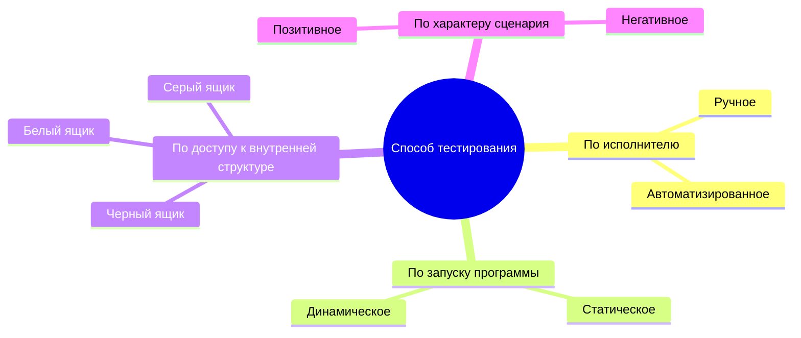
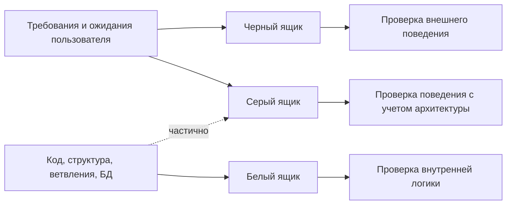

# 21. Классификация тестирования по способу тестирования. Примеры

## Краткий ответ

**Классификация тестирования по способу тестирования** показывает, *как именно* выполняется проверка программного продукта: человеком или инструментом, с запуском программы или без него, с доступом к внутренней структуре системы или только через внешний интерфейс.

На практике чаще всего выделяют четыре взаимодополняющих разреза:

1. **Ручное и автоматизированное тестирование** - по исполнителю проверки.
2. **Статическое и динамическое тестирование** - по факту запуска тестируемого объекта.
3. **Тестирование черного, белого и серого ящика** - по степени знания внутреннего устройства системы.
4. **Позитивное и негативное тестирование** - по характеру входных данных и ожидаемого поведения.

Эти группы не заменяют друг друга. Один и тот же тест может быть, например, **автоматизированным динамическим тестом черного ящика** или **ручной статической проверкой белого ящика**.

## Общая схема классификации

## 1. Ручное и автоматизированное тестирование

### Ручное тестирование

**Ручное тестирование** выполняется человеком без автоматического запуска заранее написанных тестовых скриптов. Тестировщик сам взаимодействует с системой, анализирует результат, замечает визуальные, логические и поведенческие дефекты.

Ручное тестирование особенно полезно, когда:

- функциональность новая и еще часто меняется;
- нужно исследовать продукт без жесткого сценария;
- важны удобство интерфейса, понятность сообщений, визуальная целостность;
- автоматизация будет дороже, чем польза от нее.

**Пример.** Тестировщик вручную проверяет форму регистрации: вводит имя, email и пароль, нажимает кнопку "Зарегистрироваться", оценивает текст ошибок, переходы между полями, отображение подсказок и поведение на мобильном экране.

### Автоматизированное тестирование

**Автоматизированное тестирование** выполняется программными средствами: тестовые сценарии, проверки и подготовка данных описываются в коде или в специальном инструменте. Автотесты удобно запускать регулярно: при сборке, перед релизом, в CI/CD, после изменений в коде.

Автоматизация особенно полезна, когда:

- проверки повторяются часто;
- нужен быстрый регресс;
- важно проверять много комбинаций входных данных;
- результат можно формализовать как точное ожидаемое значение;
- цена ошибки высока, а ручная проверка занимает много времени.

**Пример.** Автотест API отправляет `POST /login` с корректными учетными данными, проверяет код ответа `200`, наличие токена и срок его действия. Затем тот же набор тестов запускается при каждом изменении backend-кода.

### Сравнение ручного и автоматизированного тестирования

| Критерий | Ручное тестирование | Автоматизированное тестирование |
|---|---|---|
| Кто выполняет | Человек | Инструмент, тестовый скрипт, CI |
| Скорость повторного запуска | Низкая или средняя | Высокая |
| Первоначальная стоимость | Обычно ниже | Обычно выше из-за разработки тестов |
| Поддержка при изменениях | Меняется вместе с тест-планом | Требует поддержки тестового кода |
| Лучше подходит для | Исследовательских проверок, UX, новых функций | Регресса, API, стабильной логики, массовых проверок |
| Основной риск | Человеческая ошибка, неповторяемость | Хрупкие тесты, ложное чувство покрытия |

Важно: автоматизация не делает тестирование "лучше" сама по себе. Она ускоряет повторяемые проверки, но не заменяет анализ требований, проектирование тестов и исследовательское мышление.

## 2. Статическое и динамическое тестирование

### Статическое тестирование

**Статическое тестирование** выполняется без запуска тестируемой программы. Проверяется сам артефакт: требования, архитектурное описание, макет, исходный код, конфигурация, SQL-скрипт, документация.

К статическим техникам относятся:

- ревью требований;
- инспекция кода;
- проверка архитектурных решений;
- статический анализ кода;
- анализ стиля, типов, зависимостей, потенциальных уязвимостей;
- проверка полноты и непротиворечивости документации.

**Пример.** До реализации формы оплаты команда проверяет требования и находит противоречие: в одном разделе сказано, что карта обязательна, а в другом разрешена оплата бонусами без карты. Дефект найден до написания кода.

**Пример для кода.** Статический анализатор обнаруживает, что переменная может быть `null`, но далее используется без проверки. Программа при этом не запускалась.

### Динамическое тестирование

**Динамическое тестирование** выполняется с запуском тестируемого объекта. Система получает входные данные, выполняет код, а тестировщик или инструмент сравнивает фактический результат с ожидаемым.

К динамическому тестированию относятся:

- функциональные тесты;
- интеграционные тесты;
- системные тесты;
- приемочные тесты;
- нагрузочные тесты;
- UI- и API-тесты;
- модульные тесты, если они запускают код.

**Пример.** Тест запускает функцию расчета скидки и проверяет, что при сумме заказа `10000` и статусе клиента `Gold` возвращается скидка `10%`.

### Сравнение статического и динамического тестирования

| Критерий | Статическое | Динамическое |
|---|---|---|
| Запускается ли программа | Нет | Да |
| Что проверяется | Артефакты: требования, код, модели, документация | Поведение работающей системы |
| Когда эффективно применять | Рано: до реализации и до запуска | После появления исполняемого компонента |
| Какие дефекты хорошо находит | Противоречия, пропуски, плохие зависимости, потенциальные ошибки | Ошибки поведения, интеграции, производительности, обработки данных |
| Типичный пример | Code review, static analysis | Unit/API/UI/load test |

Статическое тестирование часто дешевле, потому что позволяет находить ошибки раньше. Динамическое необходимо, потому что только запуск системы показывает ее реальное поведение.

## 3. Черный, белый и серый ящик

Этот разрез классифицирует тестирование по тому, насколько тестировщик знает внутреннее устройство системы.

### Тестирование черного ящика

**Тестирование черного ящика** проверяет систему через внешнее поведение без опоры на внутренний код. Тестировщик знает требования, входы, выходы, пользовательские сценарии, API-контракт, но не использует структуру реализации как основу тестов.

Типичные техники:

- классы эквивалентности;
- граничные значения;
- таблицы принятия решений;
- тестирование переходов состояний;
- тестирование по сценариям использования.

**Пример.** Требование: пароль должен быть от 8 до 64 символов. Для черного ящика выбираются значения `7`, `8`, `64`, `65` символов и проверяется, принимает ли форма допустимые значения и отклоняет ли недопустимые.

**Где применяется.** Системное тестирование, приемочное тестирование, API-тестирование по контракту, UI-тестирование.

### Тестирование белого ящика

**Тестирование белого ящика** проектируется с учетом внутренней структуры: исходного кода, ветвлений, циклов, условий, путей выполнения, структуры данных. Цель - проверить, как работает реализация внутри.

Типичные техники:

- покрытие операторов;
- покрытие ветвей;
- покрытие условий;
- покрытие путей;
- проверка обработки исключений;
- тестирование отдельных функций и методов.

**Пример.** В функции расчета доставки есть ветка для обычной доставки, экспресс-доставки и самовывоза. Тесты белого ящика строятся так, чтобы выполнить каждую ветку кода хотя бы один раз, включая ветку ошибки для неизвестного типа доставки.

**Где применяется.** Модульное тестирование, компонентное тестирование, code review, тестирование критичных алгоритмов.

### Тестирование серого ящика

**Тестирование серого ящика** сочетает внешний взгляд на поведение системы с частичным знанием внутреннего устройства. Тестировщик может знать архитектуру, схему базы данных, особенности кэша, очередей, ролей или интеграций, но проверяет систему в основном через внешние интерфейсы.

**Пример.** Тестировщик знает, что после изменения профиля данные попадают в кэш на 5 минут. Он проверяет не только UI, но и сценарий: изменить имя, запросить профиль через API, дождаться обновления кэша или принудительно сбросить его, убедиться, что старые данные больше не возвращаются.

**Где применяется.** Интеграционное тестирование, security testing, тестирование микросервисов, проверка систем с базами данных, очередями и кэшированием.

### Сравнение подходов "ящика"

| Критерий | Черный ящик | Белый ящик | Серый ящик |
|---|---|---|---|
| Знание кода | Не требуется | Требуется | Частичное |
| Основа тестов | Требования, входы и выходы | Структура реализации | Требования + знание архитектуры |
| Главный вопрос | "Что делает система?" | "Как именно это реализовано?" | "Как поведение связано с устройством системы?" |
| Сильная сторона | Близко к пользовательскому поведению | Хорошо находит ошибки в логике кода | Хорошо находит интеграционные и архитектурные дефекты |
| Ограничение | Можно пропустить внутренние ветки | Можно забыть пользовательский смысл | Требует доступа к части технической информации |

## 4. Позитивное и негативное тестирование

Этот разрез часто применяют вместе с черным, белым или серым ящиком.

### Позитивное тестирование

**Позитивное тестирование** проверяет, что система корректно работает на допустимых данных и штатных сценариях.

**Пример.** Пользователь вводит корректный email `user@example.com`, пароль нужной длины и успешно регистрируется.

### Негативное тестирование

**Негативное тестирование** проверяет, как система ведет себя при ошибочных, запрещенных, граничных или неожиданных данных.

**Пример.** Пользователь вводит email без символа `@`, слишком короткий пароль, пустое обязательное поле или пытается оплатить заказ картой с истекшим сроком действия. Ожидаемый результат - понятная ошибка, отсутствие некорректной операции и сохранение целостности данных.

### Сравнение

| Критерий | Позитивное | Негативное |
|---|---|---|
| Данные | Корректные | Некорректные, запрещенные, неожиданные |
| Цель | Убедиться, что штатный сценарий работает | Убедиться, что система устойчиво обрабатывает ошибки |
| Пример | Успешный вход с верным паролем | Вход с неверным паролем или заблокированным аккаунтом |
| Риск при отсутствии | Пользователь не может выполнить основную задачу | Сбои, уязвимости, порча данных, плохие сообщения об ошибках |

## Комбинирование способов тестирования

В реальном проекте способы тестирования комбинируются.

| Сценарий | Классификация |
|---|---|
| Тестировщик вручную изучает новый экран без запуска автотестов | Ручное, динамическое, черный ящик, часто позитивное и негативное |
| Разработчик пишет unit-тест для всех ветвей функции | Автоматизированное, динамическое, белый ящик |
| Команда проводит ревью требований до разработки | Ручное, статическое, черный ящик по отношению к будущей реализации |
| Статический анализатор ищет небезопасные зависимости | Автоматизированное, статическое, белый или серый ящик |
| API-тест проверяет работу сервиса с учетом схемы БД | Автоматизированное, динамическое, серый ящик |
| Тестировщик вводит недопустимые значения в форму | Ручное или автоматизированное, динамическое, черный ящик, негативное |

## Развернутый пример

Пусть есть интернет-магазин с функцией применения промокода.

**Требование.** Промокод `SALE10` дает скидку 10%, действует только для заказов от `3000` рублей и не применяется к товарам из категории "Подарочные карты".

Возможные способы проверки:

| Способ | Пример проверки |
|---|---|
| Ручное динамическое | Тестировщик открывает корзину, вводит `SALE10`, проверяет сумму скидки и текст сообщения |
| Автоматизированное динамическое | API-тест создает корзину на `3500`, применяет промокод и проверяет итоговую сумму |
| Статическое | Ревью требования выявляет, что не описано поведение при заказе ровно на `3000` |
| Черный ящик | Проверяются суммы `2999`, `3000`, `3001` без анализа кода |
| Белый ящик | Тесты покрывают ветки: промокод найден, не найден, истек, запрещенная категория |
| Серый ящик | Проверяется, что промокод нельзя повторно применить после записи использования в БД |
| Позитивное | Корректный промокод применен к допустимому заказу |
| Негативное | Промокод введен для подарочной карты или для суммы меньше `3000` |

## Типичные ошибки при классификации

1. **Считать ручное тестирование "непрофессиональным", а автоматизированное - всегда лучшим.** На самом деле это разные способы решения разных задач. Исследовательская проверка нового интерфейса часто эффективнее вручную.

2. **Путать автоматизированное и динамическое тестирование.** Большинство автотестов действительно динамические, но автоматизация может быть и статической: например, линтер, анализатор типов или сканер зависимостей.

3. **Называть любой API-тест тестом белого ящика.** Если тест проверяет API только по контракту и не использует знание кода, это черный ящик.

4. **Считать белый ящик задачей только разработчика.** Чаще всего он действительно ближе к разработке, но тестировщик тоже может использовать знание структуры кода, логов, БД и архитектуры.

5. **Подменять негативное тестирование хаотичным вводом мусорных данных.** Негативные тесты должны быть спроектированы: недопустимые классы, границы, нарушения бизнес-правил, ошибки прав доступа, неожиданные состояния.

6. **Ограничиваться только позитивными сценариями.** Тогда система может работать "в идеальных условиях", но падать при неверных данных, сетевых сбоях, истекших токенах и конфликтующих операциях.

7. **Считать 100% покрытия кода гарантией качества.** Покрытие показывает, какой код был выполнен тестами, но не доказывает, что проверены все важные бизнес-сценарии и ожидания пользователя.

## Вывод

Классификация по способу тестирования помогает выбрать подходящий метод проверки под конкретную задачу. **Ручное тестирование** дает гибкость и человеческую оценку, **автоматизированное** обеспечивает быстрый повторяемый контроль, **статическое** находит дефекты до запуска программы, **динамическое** проверяет реальное поведение системы. Подходы **черного, белого и серого ящика** различаются степенью знания внутренней структуры, а **позитивные и негативные тесты** показывают, проверяем ли мы штатное или ошибочное поведение.

Хорошая стратегия тестирования обычно сочетает все эти способы: ранние ревью, статический анализ, ручное исследование, автоматизированный регресс, проверки по требованиям и проверки внутренней логики.

## Источники

1. ISTQB Glossary. Термины: *static testing*, *dynamic testing*, *black-box testing*, *white-box testing*, *test automation*. <https://glossary.istqb.org/>
2. ISTQB Certified Tester Foundation Level Syllabus v4.0.1. Разделы о статическом тестировании, техниках тест-дизайна и автоматизации. <https://istqb.org/certifications/certified-tester-foundation-level>
3. IEEE Computer Society. *Guide to the Software Engineering Body of Knowledge (SWEBOK Guide)*, Software Testing chapter. <https://www.computer.org/education/bodies-of-knowledge/software-engineering>
4. NIST Computer Security Resource Center Glossary. Термин *gray box testing*. <https://csrc.nist.gov/glossary>
5. Microsoft Learn. Материалы по unit testing, automated testing и проверкам качества в жизненном цикле разработки. <https://learn.microsoft.com/>
