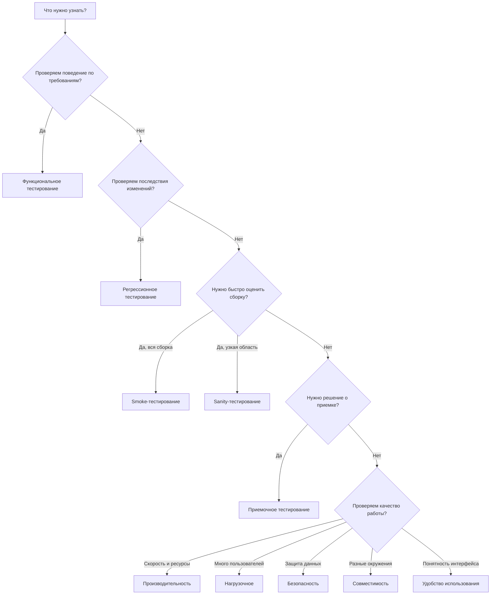

# 22. Классификация тестирования по целям тестирования. Примеры

## Краткое определение

**Классификация тестирования по целям** - это деление видов тестирования по тому, какой вопрос о качестве продукта нужно проверить. Один и тот же программный продукт можно тестировать с разными целями:

- проверить, что функция работает по требованиям;
- убедиться, что исправление не сломало старую функциональность;
- быстро понять, можно ли вообще начинать глубокое тестирование сборки;
- подтвердить, что система готова к приемке заказчиком;
- измерить производительность под нагрузкой;
- найти уязвимости;
- проверить работу на разных устройствах, браузерах и платформах;
- оценить удобство использования для реальных пользователей.

Важно: цель тестирования не всегда совпадает с уровнем тестирования. Например, регрессионное тестирование может быть модульным, интеграционным, системным или end-to-end. Нагрузочное тестирование может выполняться на API, отдельном сервисе или всей системе. Приемочное тестирование может быть ручным, автоматизированным или смешанным.

---

## Общая схема классификации

```mermaid
flowchart TB
    A["Тестирование по целям"] --> B["Функциональное"]
    A --> C["Нефункциональное"]
    A --> D["Проверка изменений"]
    A --> E["Проверка готовности сборки"]
    A --> F["Приемка"]

    B --> B1["Проверка требований"]
    B --> B2["Проверка бизнес-сценариев"]
    B --> B3["Проверка API и UI-функций"]

    C --> C1["Производительность"]
    C --> C2["Нагрузка"]
    C --> C3["Безопасность"]
    C --> C4["Совместимость"]
    C --> C5["Удобство использования"]

    D --> D1["Регрессионное тестирование"]
    D --> D2["Повторное тестирование исправленного дефекта"]

    E --> E1["Smoke-тестирование"]
    E --> E2["Sanity-тестирование"]

    F --> F1["Пользовательская приемка"]
    F --> F2["Операционная приемка"]
    F --> F3["Контрактная или регуляторная приемка"]
```

Такая схема показывает, что тестирование не сводится к поиску ошибок в коде. Оно отвечает на разные управленческие и инженерные вопросы: можно ли выпускать версию, выдержит ли система поток пользователей, безопасна ли обработка данных, удобно ли пользоваться интерфейсом, соответствует ли продукт ожиданиям заказчика.

---

## 1. Функциональное тестирование

**Функциональное тестирование** проверяет, что система делает то, что должна делать по требованиям, пользовательским сценариям, спецификациям, бизнес-правилам и API-контрактам.

Главный вопрос функционального тестирования: **"Правильно ли реализовано поведение системы?"**

### Что проверяется

- корректность бизнес-логики;
- правильность расчетов;
- обработка пользовательского ввода;
- работа кнопок, форм, ссылок, меню;
- взаимодействие модулей через API;
- права доступа к функциям;
- ошибки и граничные случаи;
- соответствие результата требованиям.

### Примеры

| Система | Функция | Что проверяется |
|---|---|---|
| Интернет-магазин | Добавление товара в корзину | Товар появляется в корзине, количество и цена пересчитываются правильно |
| Банк | Перевод между счетами | Деньги списываются с одного счета и зачисляются на другой |
| Госуслуги | Отправка заявления | Заявление получает номер, статус и доступно в личном кабинете |
| Мессенджер | Отправка сообщения | Сообщение доставляется адресату и отображается в истории |
| Сервис авторизации | Вход по паролю | Пользователь входит с верными данными и получает отказ с неверными |

### Типичные техники

- тестирование по требованиям;
- тестирование пользовательских сценариев;
- эквивалентное разбиение;
- анализ граничных значений;
- таблицы принятия решений;
- тестирование состояний;
- pairwise-тестирование;
- API-тестирование.

### Пример тест-кейса

| Поле | Значение |
|---|---|
| Цель | Проверить вход пользователя по логину и паролю |
| Предусловие | Пользователь зарегистрирован и активен |
| Шаги | Открыть форму входа, ввести логин, ввести пароль, нажать "Войти" |
| Ожидаемый результат | Пользователь попадает в личный кабинет |
| Тип тестирования | Функциональное |

---

## 2. Нефункциональное тестирование

**Нефункциональное тестирование** проверяет не то, какие функции есть в системе, а то, **как хорошо** система работает: быстро ли, надежно ли, безопасно ли, удобно ли, совместимо ли с окружением.

Главный вопрос нефункционального тестирования: **"Соответствует ли качество работы системы ожиданиям и ограничениям?"**

### Основные виды нефункционального тестирования

| Вид | Цель | Пример вопроса |
|---|---|---|
| Производительности | Оценить скорость, задержки, пропускную способность | Открывается ли страница быстрее 2 секунд? |
| Нагрузочное | Проверить систему при ожидаемой нагрузке | Выдержит ли API 1000 запросов в секунду? |
| Стрессовое | Найти предел устойчивости | Что будет при нагрузке выше расчетной? |
| Безопасности | Найти уязвимости и риски доступа | Можно ли получить чужие данные? |
| Совместимости | Проверить разные окружения | Работает ли сайт в Chrome, Firefox и Safari? |
| Удобства использования | Оценить понятность и эффективность интерфейса | Может ли пользователь оформить заказ без подсказок? |
| Надежности | Проверить устойчивость к сбоям | Восстановится ли сервис после падения базы? |
| Устанавливаемости | Проверить установку и обновление | Корректно ли проходит обновление версии? |
| Локализации | Проверить языки, форматы, региональные настройки | Правильно ли отображаются даты и валюта? |

### Отличие от функционального тестирования

Функциональный тест может подтвердить, что поиск товаров возвращает правильные результаты. Нефункциональный тест проверит, что поиск работает достаточно быстро, не падает при большом числе пользователей, безопасно обрабатывает запросы и удобен в интерфейсе.

---

## 3. Регрессионное тестирование

**Регрессионное тестирование** проверяет, что ранее работавшая функциональность не сломалась после изменений: исправления дефекта, новой функции, обновления библиотеки, миграции базы данных, изменения конфигурации или рефакторинга.

Главный вопрос регрессионного тестирования: **"Не сломали ли мы то, что уже работало?"**

### Когда нужно регрессионное тестирование

- после исправления дефекта;
- после добавления новой функции;
- после изменения общей бизнес-логики;
- после рефакторинга;
- после обновления зависимостей;
- после изменения инфраструктуры;
- перед релизом;
- после миграции данных.

### Регрессионное тестирование и повторное тестирование

Регрессионное тестирование часто путают с повторным тестированием исправленного дефекта.

| Критерий | Повторное тестирование | Регрессионное тестирование |
|---|---|---|
| Цель | Проверить, что конкретный дефект исправлен | Проверить, что изменения не сломали другое поведение |
| Область | Узкая: дефект и связанные шаги | Шире: затронутые функции и критические сценарии |
| Основание | Баг-репорт | Изменение в системе |
| Пример | Еще раз проверить, что кнопка "Оплатить" работает | Проверить оплату, корзину, заказы, уведомления и возвраты |

### Пример

В интернет-магазине исправили ошибку: скидка не применялась к товарам из категории "Книги". Повторное тестирование проверит, что скидка теперь применяется к книгам. Регрессионное тестирование дополнительно проверит, что скидки для электроники, промокоды, расчет доставки и итоговая сумма заказа не сломались.

---

## 4. Smoke-тестирование

**Smoke-тестирование** - это короткий набор проверок, который показывает, пригодна ли новая сборка для дальнейшего тестирования.

Главный вопрос smoke-тестирования: **"Сборка вообще жизнеспособна?"**

Smoke-тесты обычно проверяют самые критичные сценарии:

- приложение запускается;
- пользователь может войти;
- главные страницы открываются;
- основные API отвечают;
- база данных доступна;
- критическая бизнес-операция проходит без фатального сбоя.

### Пример smoke-набора для интернет-магазина

| Проверка | Ожидаемый результат |
|---|---|
| Открыть главную страницу | Страница загружается без ошибки 500 |
| Авторизоваться | Пользователь попадает в личный кабинет |
| Найти товар | Список товаров отображается |
| Добавить товар в корзину | Товар появляется в корзине |
| Оформить тестовый заказ | Заказ создается в системе |

Если smoke-тесты не проходят, глубокое тестирование обычно не имеет смысла: сборку возвращают на исправление.

---

## 5. Sanity-тестирование

**Sanity-тестирование** - это узкая проверка после небольшого изменения, которая подтверждает, что конкретная область ведет себя разумно и готова к более детальной проверке.

Главный вопрос sanity-тестирования: **"Измененная часть работает достаточно правдоподобно?"**

### Smoke и sanity: различие

| Критерий | Smoke | Sanity |
|---|---|---|
| Цель | Проверить пригодность всей сборки | Проверить конкретную измененную область |
| Область | Широкая, но неглубокая | Узкая, но немного глубже |
| Когда выполняется | После новой сборки | После исправления или локального изменения |
| Пример | Проверить запуск, вход, корзину, заказ | Проверить только новую форму доставки |

### Пример

В банковском приложении изменили маску ввода номера карты. Sanity-тестирование проверит, что номер карты вводится, пробелы расставляются корректно, форма не ломается, валидация срабатывает на очевидно неверных данных. Полный набор тестов оплаты можно запускать позже, если sanity-проверка прошла.

---

## 6. Приемочное тестирование

**Приемочное тестирование** проверяет, готова ли система к использованию с точки зрения заказчика, бизнеса, пользователя, эксплуатации или регулятора.

Главный вопрос приемочного тестирования: **"Можно ли принять продукт или релиз?"**

### Виды приемочного тестирования

| Вид | Кто оценивает | Цель |
|---|---|---|
| Пользовательское приемочное тестирование, UAT | Пользователи, заказчик, бизнес-представители | Проверить, что продукт решает реальные задачи |
| Операционное приемочное тестирование, OAT | Эксплуатация, DevOps, администраторы | Проверить готовность к поддержке и эксплуатации |
| Контрактное приемочное | Заказчик и исполнитель | Проверить соответствие договору и ТЗ |
| Регуляторное приемочное | Ответственные за соответствие нормам | Проверить выполнение законов, стандартов, отраслевых требований |
| Альфа-тестирование | Внутренние пользователи или ограниченная группа | Найти проблемы до внешнего выпуска |
| Бета-тестирование | Реальные внешние пользователи | Получить обратную связь до массового релиза |

### Пример

Для медицинской информационной системы функциональные тесты могут показать, что форма записи пациента работает. Но приемочное тестирование проверит, удобно ли врачу вести прием, хватает ли обязательных полей, соответствует ли процесс регламенту клиники, можно ли выгрузить нужные отчеты и готова ли служба поддержки сопровождать систему.

---

## 7. Тестирование производительности

**Тестирование производительности** оценивает скорость, стабильность и эффективность системы при разных условиях работы.

Главный вопрос: **"Насколько быстро и стабильно работает система?"**

### Основные метрики

| Метрика | Что означает |
|---|---|
| Время отклика | Сколько времени проходит от запроса до ответа |
| Пропускная способность | Сколько операций система выполняет за единицу времени |
| RPS/TPS | Запросы или транзакции в секунду |
| Загрузка CPU | Насколько сильно нагружен процессор |
| Использование памяти | Сколько памяти потребляет система |
| Ошибки под нагрузкой | Доля неуспешных запросов |
| Перцентили | Например, p95 показывает, что 95% запросов быстрее заданного времени |

### Пример

Требование: "Страница каталога должна открываться не дольше 2 секунд для 95% пользователей при 500 одновременных сессиях". Тест производительности проверяет это требование измеримо: запускается сценарий, собираются p95, p99, среднее время ответа, ошибки, загрузка серверов и базы данных.

---

## 8. Нагрузочное тестирование

**Нагрузочное тестирование** проверяет работу системы под ожидаемой или близкой к ожидаемой нагрузкой.

Главный вопрос: **"Выдержит ли система расчетное число пользователей и операций?"**

### Отличие от тестирования производительности

Производительность - более широкое понятие. Она включает измерение скорости и эффективности в разных условиях. Нагрузочное тестирование - один из видов performance-тестирования, где основной акцент на поведении при заданной нагрузке.

| Вид | Цель | Пример |
|---|---|---|
| Performance testing | Измерить скорость и эффективность | API отвечает за 150 мс при обычной нагрузке |
| Load testing | Проверить ожидаемую нагрузку | 1000 пользователей одновременно оформляют заказы |
| Stress testing | Найти предел системы | Увеличивать нагрузку до отказа |
| Spike testing | Проверить резкие всплески | За 1 минуту число пользователей выросло в 10 раз |
| Endurance testing | Проверить длительную работу | Система работает 24 часа под постоянной нагрузкой |

### Пример

Перед началом продаж билетов на концерт сервис проверяют сценарием: 20 000 пользователей заходят на сайт, ищут мероприятие, выбирают места, оплачивают заказ. Цель - убедиться, что сайт не упадет в момент старта продаж.

---

## 9. Тестирование безопасности

**Тестирование безопасности** проверяет, защищена ли система от несанкционированного доступа, утечек данных, нарушения целостности, подмены действий и других угроз.

Главный вопрос: **"Можно ли нарушить конфиденциальность, целостность или доступность системы?"**

### Что проверяется

- аутентификация и авторизация;
- управление сессиями;
- контроль доступа к объектам;
- SQL injection;
- XSS;
- CSRF;
- небезопасная загрузка файлов;
- хранение паролей и токенов;
- шифрование данных;
- логирование чувствительной информации;
- защита API;
- настройки серверов и зависимостей.

### Пример

В личном кабинете пользователь открывает заказ по адресу `/orders/125`. Тест безопасности проверяет, может ли он заменить номер на `/orders/126` и увидеть чужой заказ. Если может, это уязвимость контроля доступа.

---

## 10. Тестирование совместимости

**Тестирование совместимости** проверяет, работает ли система в разных окружениях: браузерах, операционных системах, устройствах, версиях библиотек, сетях, базах данных.

Главный вопрос: **"Работает ли продукт там, где им реально будут пользоваться?"**

### Виды совместимости

| Вид | Пример |
|---|---|
| Браузерная | Chrome, Firefox, Edge, Safari |
| Платформенная | Windows, Linux, macOS, Android, iOS |
| Аппаратная | Разные экраны, процессоры, объем памяти |
| Сетевая | Wi-Fi, мобильная сеть, высокая задержка |
| Версионная | Разные версии API, SDK, драйверов |
| Обратная совместимость | Новая версия работает со старыми данными |
| Прямая совместимость | Старый клиент может работать с новым сервером в допустимых пределах |

### Пример

Веб-приложение может корректно работать в Chrome на desktop, но ломать верстку в Safari на iPhone. Функционально кнопка "Оплатить" есть, но пользователь не может нажать ее из-за перекрытия элементами интерфейса. Это дефект совместимости.

---

## 11. Тестирование удобства использования

**Тестирование удобства использования** проверяет, насколько продукт понятен, удобен, эффективен и не вызывает лишних ошибок у пользователя.

Главный вопрос: **"Может ли пользователь решить свою задачу легко и без лишних затруднений?"**

### Что оценивается

- понятность интерфейса;
- скорость выполнения задачи;
- число ошибок пользователя;
- доступность важных действий;
- читаемость текстов;
- логичность навигации;
- качество обратной связи;
- соответствие ожиданиям целевой аудитории;
- доступность для пользователей с ограничениями.

### Пример

Пользователю дают задачу: "Зарегистрируйтесь на прием к врачу на завтра после 15:00". Наблюдают, сколько времени он потратил, где ошибся, какие элементы не понял, смог ли завершить сценарий без помощи. Если большинство пользователей не находят нужную кнопку, это проблема usability, даже если формально функция работает.

---

## Схема выбора вида тестирования

---

## Восемь практических примеров

### Пример 1. Функциональное тестирование регистрации

В системе есть требование: пользователь должен зарегистрироваться по email и паролю. Тесты проверяют валидный email, неверный email, слишком короткий пароль, повторную регистрацию, отправку письма подтверждения и создание профиля.

**Цель:** проверить соответствие функции требованиям.

### Пример 2. Регрессионное тестирование после исправления оплаты

Разработчик исправил ошибку округления суммы при оплате. Регрессионные тесты проверяют не только округление, но и корзину, промокоды, доставку, возврат платежа, историю заказов и чек.

**Цель:** убедиться, что изменение не сломало связанные сценарии.

### Пример 3. Smoke-тест новой сборки CRM

После ночной сборки команда проверяет запуск приложения, вход администратора, открытие списка клиентов, создание сделки и сохранение комментария.

**Цель:** понять, можно ли отдавать сборку на полноценное тестирование.

### Пример 4. Sanity-тест новой формы адреса

В релизе изменили только форму адреса доставки. Проверяют ввод города, улицы, дома, квартиры, подсказки, обязательные поля и сохранение адреса.

**Цель:** быстро проверить измененную область.

### Пример 5. Приемочное тестирование внутренней системы

Бухгалтерия принимает модуль расчета отпускных. Пользователи проверяют реальные сценарии: расчет отпуска, больничного, перерасчета, печать отчета и выгрузку в учетную систему.

**Цель:** подтвердить, что продукт пригоден для работы бизнеса.

### Пример 6. Нагрузочное тестирование API

Сервис доставки должен принимать 500 заказов в минуту. Нагрузочный тест имитирует клиентов, которые создают заказы, меняют адрес, запрашивают статус и отменяют заказ.

**Цель:** проверить работу под ожидаемым потоком операций.

### Пример 7. Тестирование безопасности личного кабинета

Проверяют, может ли пользователь получить чужие документы через изменение идентификатора в URL, повторное использование токена, прямой запрос к API или обход ограничений роли.

**Цель:** найти риски несанкционированного доступа.

### Пример 8. Тестирование совместимости и удобства мобильного приложения

Приложение проверяют на Android и iOS, на маленьких и больших экранах, при плохой сети. Дополнительно наблюдают, может ли пользователь без подсказок найти нужный раздел и завершить оплату.

**Цель:** проверить работу в реальном пользовательском окружении и удобство сценария.

---

## Сравнение основных видов тестирования

| Вид тестирования | Главная цель | Типичная глубина | Когда применять | Пример результата |
|---|---|---|---|---|
| Функциональное | Проверить функции по требованиям | Средняя или высокая | При разработке и релизе функций | Функция работает или найден дефект |
| Нефункциональное | Проверить характеристики качества | Зависит от риска | Перед релизом, при росте нагрузки, при требованиях к качеству | Метрики скорости, безопасности, удобства |
| Регрессионное | Найти поломки после изменений | От выборочной до полной | После любого значимого изменения | Старые сценарии не сломаны |
| Smoke | Проверить жизнеспособность сборки | Низкая | После новой сборки | Сборку можно или нельзя тестировать дальше |
| Sanity | Быстро проверить измененную область | Низкая или средняя | После локального исправления | Изменение выглядит работоспособным |
| Приемочное | Принять или отклонить продукт | Бизнес-ориентированная | Перед передачей заказчику или выпуском | Решение о приемке |
| Производительности | Измерить скорость и ресурсы | Инженерная, метриками | Перед релизом и при оптимизации | Время ответа, p95, RPS, ресурсы |
| Нагрузочное | Проверить ожидаемую нагрузку | Инженерная, сценарная | Перед пиковыми событиями и масштабированием | Система выдерживает или не выдерживает нагрузку |
| Безопасности | Найти уязвимости | От чек-листа до пентеста | Для систем с данными и доступами | Найдены риски и уязвимости |
| Совместимости | Проверить окружения | Матрица платформ | Для web, mobile, desktop, API | Список поддерживаемых и проблемных окружений |
| Удобства | Проверить пользовательский опыт | Исследовательская | Для пользовательских интерфейсов | Найдены барьеры и ошибки в UX |

---

## Связь с уровнями тестирования

Классификация по целям пересекается с классификацией по уровням.

| Уровень | Какие цели могут применяться |
|---|---|
| Модульное | Функциональное, регрессионное, performance для критичных алгоритмов |
| Интеграционное | Функциональное, регрессионное, совместимость API |
| Системное | Функциональное, нефункциональное, безопасность, нагрузка |
| Приемочное | UAT, OAT, контрактное, регуляторное |

Например, тест авторизации на уровне API может быть функциональным. Тот же сценарий в полном пользовательском интерфейсе может входить в smoke-набор. После исправления ошибки он станет частью регрессионного набора. При проверке заказчиком он может стать приемочным тестом.

---

## Типичные ошибки

### 1. Считать smoke-тестирование заменой полного тестирования

Smoke-тесты проверяют только базовую жизнеспособность сборки. Если они прошли, это не значит, что продукт качественный. Это значит только, что есть смысл тестировать дальше.

### 2. Путать sanity и regression

Sanity - быстрая проверка конкретной измененной области. Регрессия - проверка того, что изменение не сломало старое поведение. Sanity может быть частью регрессионной стратегии, но не заменяет ее.

### 3. Делать регрессию без анализа риска

Полная регрессия после каждого мелкого изменения часто слишком дорогая. Нужен выбор: критические сценарии, затронутые модули, интеграции, высокорисковые функции, автоматизированный набор.

### 4. Проверять нефункциональные требования слишком поздно

Если нагрузку, безопасность и совместимость проверять только перед релизом, исправления могут оказаться дорогими. Например, проблемы архитектуры под нагрузкой часто нельзя быстро исправить простым патчем.

### 5. Формулировать нефункциональные требования без метрик

Фраза "система должна быть быстрой" непроверяема. Лучше: "95% запросов поиска должны выполняться быстрее 700 мс при 300 одновременных пользователях".

### 6. Считать приемочное тестирование задачей только тестировщиков

Приемка должна включать заказчика, пользователей, бизнес-представителей или эксплуатацию. Иначе можно получить систему, которая проходит QA-тесты, но не решает рабочую задачу.

### 7. Проверять безопасность только сканером

Автоматические сканеры полезны, но они не заменяют анализ авторизации, бизнес-логики, ролей, угроз и ручные проверки сложных сценариев.

### 8. Не различать дефект функции и проблему удобства

Функция может работать формально правильно, но быть неудобной. Например, пользователь может оформить заказ, но делает это за 12 шагов, часто ошибается и не понимает статусы. Это не функциональный дефект, а проблема usability.

---

## Короткая шпаргалка

| Если вопрос звучит так | Подходящий вид тестирования |
|---|---|
| "Функция работает по требованиям?" | Функциональное |
| "Старое поведение не сломалось?" | Регрессионное |
| "Сборка вообще пригодна для тестирования?" | Smoke |
| "Локальное исправление выглядит нормально?" | Sanity |
| "Заказчик может принять систему?" | Приемочное |
| "Система достаточно быстрая?" | Производительности |
| "Система выдержит поток пользователей?" | Нагрузочное |
| "Можно ли получить чужие данные или обойти доступ?" | Безопасности |
| "Работает ли в разных браузерах и ОС?" | Совместимости |
| "Пользователю удобно решить задачу?" | Удобства использования |

---

## Вывод

Классификация тестирования по целям помогает выбирать не "какие тесты вообще написать", а **какой риск нужно закрыть**. Функциональное тестирование отвечает за соответствие требованиям, нефункциональное - за характеристики качества, регрессионное - за защиту от поломок после изменений, smoke и sanity - за быструю оценку готовности сборки или области, приемочное - за решение о готовности продукта для заказчика и пользователей.

На практике эти виды комбинируются. Для одного релиза могут быть smoke-тесты новой сборки, функциональные тесты новых требований, регрессия критических сценариев, нагрузочный прогон API, проверки безопасности, совместимости и приемка бизнесом. Хорошая стратегия тестирования строится не по списку модных терминов, а по рискам продукта, требованиям, стоимости ошибки и контексту проекта.

---

## Источники

1. ISTQB Glossary. Термины software testing, functional testing, non-functional testing, regression testing, acceptance testing, smoke testing: <https://glossary.istqb.org/>
2. ISO/IEC/IEEE 29119 Software Testing. Международная серия стандартов по процессам, документации и техникам тестирования ПО: <https://www.iso.org/standard/81291.html>
3. ISO/IEC 25010. Модель качества программного продукта: functional suitability, performance efficiency, compatibility, usability, reliability, security и другие характеристики: <https://iso25000.com/index.php/en/iso-25000-standards/iso-25010>
4. OWASP Web Security Testing Guide. Руководство по тестированию безопасности web-приложений: <https://owasp.org/www-project-web-security-testing-guide/>
5. OWASP Top Ten. Типовые категории рисков безопасности web-приложений: <https://owasp.org/www-project-top-ten/>
6. IEEE Computer Society, SWEBOK Guide. Разделы о software testing и software quality: <https://www.computer.org/education/bodies-of-knowledge/software-engineering>
7. Ministry of Testing. Практические материалы и глоссарий по видам тестирования: <https://www.ministryoftesting.com/>
8. Nielsen Norman Group. Материалы по usability testing и пользовательским исследованиям: <https://www.nngroup.com/topic/user-testing/>
