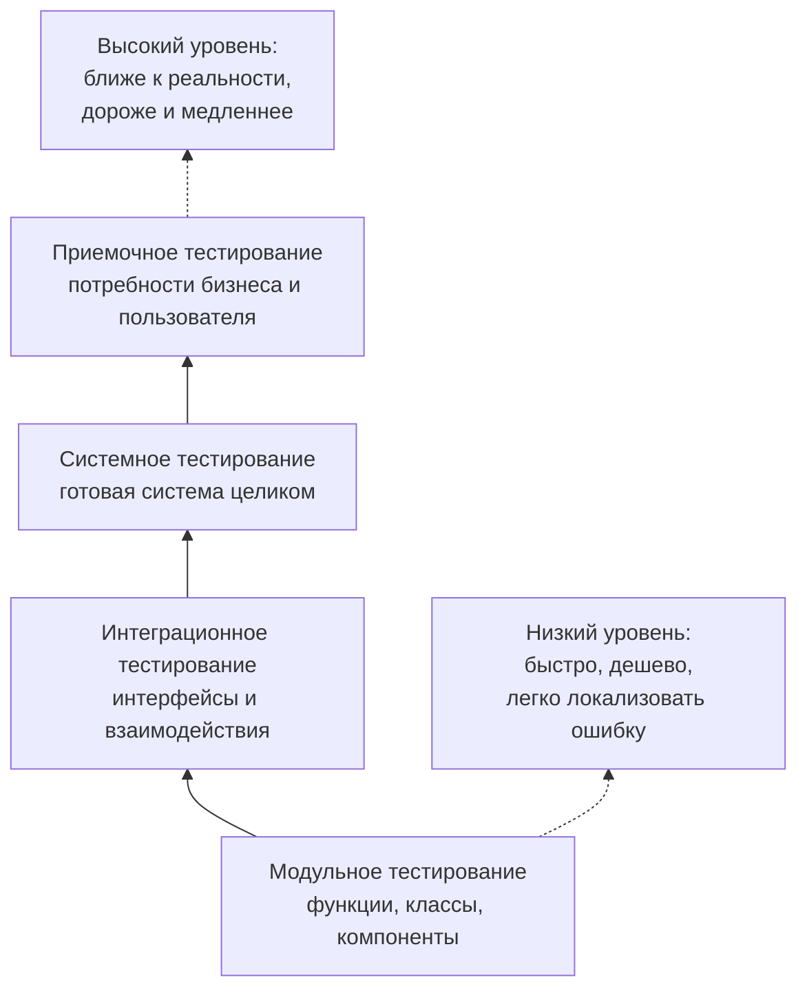
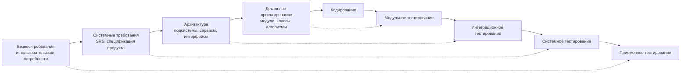
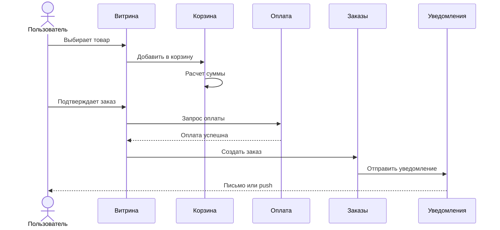
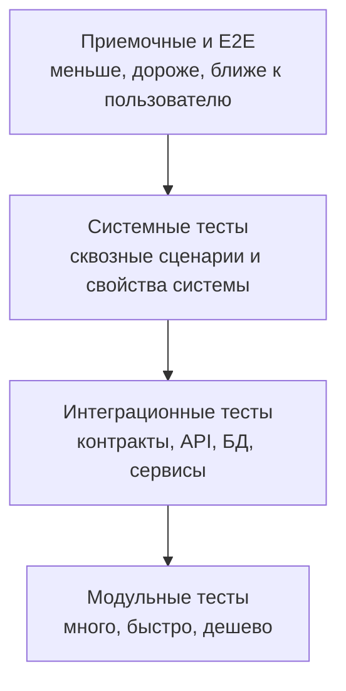

# 23. Классификация тестирования по уровням тестирования. Примеры [8]

## Краткое определение

**Уровень тестирования** - это группа тестовых работ, которая выполняется на определенной стадии разработки и проверяет программный продукт с определенной степенью укрупнения: от отдельной функции или класса до всей системы и ее приемки заказчиком.

Классическая классификация по уровням:

- **модульное тестирование** (unit/component testing) - проверка отдельного модуля, функции, класса, компонента;
- **интеграционное тестирование** (integration testing) - проверка взаимодействий между модулями, сервисами, подсистемами или внешними системами;
- **системное тестирование** (system testing) - проверка полностью интегрированной системы как единого продукта;
- **приемочное тестирование** (acceptance testing) - проверка готовности продукта к использованию заказчиком, пользователем или бизнесом;
- **альфа- и бета-тестирование** - частные формы приемочного или предрелизного тестирования, когда продукт проверяется ограниченной группой пользователей до массового выпуска.

Главная идея: **чем выше уровень тестирования, тем ближе проверка к реальному пользовательскому сценарию, но тем дороже, медленнее и сложнее локализовать дефект**. Поэтому уровни не заменяют друг друга, а дополняют.

---

## Общая схема уровней

На нижних уровнях проверяется техническая корректность небольших частей продукта. На верхних уровнях проверяется, решает ли готовая система реальные задачи пользователя и соответствует ли она требованиям.

Важно не путать **уровни тестирования** и **типы тестирования**:

- уровень отвечает на вопрос: **что по размеру и стадии проверяем?** Например: модуль, интеграцию, систему, приемку;
- тип отвечает на вопрос: **какое свойство проверяем?** Например: функциональность, производительность, безопасность, удобство, совместимость.

Один и тот же тип может выполняться на разных уровнях. Например, безопасность можно проверять на уровне отдельной функции валидации, на уровне API-интеграции и на уровне всей системы.

---

## Связь с V-моделью

V-модель показывает соответствие между стадиями разработки и уровнями тестирования. Левая сторона модели описывает уточнение решения: от требований к архитектуре и коду. Правая сторона описывает проверки, которые подтверждают результаты соответствующих стадий.

Соответствие уровней в V-модели:

| Стадия разработки | Что создается | Соответствующий уровень тестирования | Что проверяется |
|---|---|---|---|
| Бизнес-анализ | бизнес-требования, пользовательские цели, критерии приемки | приемочное тестирование | продукт решает задачу пользователя и может быть принят |
| Системный анализ | системные и функциональные требования | системное тестирование | система соответствует спецификации |
| Архитектурное проектирование | подсистемы, интерфейсы, протоколы, контракты | интеграционное тестирование | части системы корректно взаимодействуют |
| Детальное проектирование | модули, классы, функции, алгоритмы | модульное тестирование | отдельные элементы работают правильно |
| Кодирование | программный код | запуск модульных тестов и статических проверок | реализация не содержит локальных ошибок |

V-модель не означает, что тестирование начинается только после кодирования. Хорошая практика - проектировать тесты и критерии приемки уже во время анализа требований и проектирования.

---

## 1. Модульное тестирование

**Модульное тестирование** - это проверка минимальных логически изолированных частей программы: функций, методов, классов, компонентов, процедур, небольших модулей. В англоязычной терминологии часто используются названия **unit testing** и **component testing**.

### Цель

Цель модульного тестирования - быстро убедиться, что отдельная единица кода работает правильно в разных условиях:

- корректно обрабатывает типовые входные данные;
- правильно работает на граничных значениях;
- возвращает ожидаемые ошибки при некорректном вводе;
- не ломается при пустых, нулевых, минимальных и максимальных значениях;
- соблюдает локальные бизнес-правила.

### Кто обычно выполняет

Чаще всего модульные тесты пишут разработчики, потому что они лучше всего знают внутреннюю структуру кода. Тестировщик может участвовать в проектировании проверок, анализе покрытия, выборе граничных случаев и ревью тестовых сценариев.

### Особенности

- выполняются быстро;
- хорошо автоматизируются;
- запускаются часто, например при каждом коммите в CI;
- легко показывают, где примерно находится ошибка;
- обычно используют заглушки, моки и фейки для замены внешних зависимостей;
- не доказывают, что вся система работает правильно.

### Примеры

Пример 1. Интернет-магазин:

- функция `calculateDiscount(price, userStatus)` должна вернуть скидку 10% для постоянного клиента;
- функция не должна принимать отрицательную цену;
- при цене `0` итоговая сумма должна быть `0`;
- округление итоговой суммы должно выполняться по установленному правилу.

Пример 2. Банковское приложение:

- метод расчета комиссии должен возвращать `0`, если перевод между своими счетами бесплатный;
- метод должен вернуть ошибку, если сумма перевода больше остатка;
- функция маскирования карты должна превращать `1234567812345678` в `1234 **** **** 5678`.

Пример 3. Веб-приложение:

- валидатор email должен принимать `user@example.com`;
- валидатор должен отклонять строку без домена;
- функция преобразования даты должна одинаково работать в разных часовых поясах, если это важно для требований.

### Что не является хорошим модульным тестом

Плохой модульный тест зависит от реальной базы данных, внешнего платежного сервиса, нестабильной сети или порядка запуска других тестов. Такие проверки обычно относятся уже к интеграционному или системному уровню.

---

## 2. Интеграционное тестирование

**Интеграционное тестирование** проверяет взаимодействие между частями системы: модулями, компонентами, сервисами, API, базами данных, очередями сообщений, внешними системами.

Модуль может работать корректно сам по себе, но ошибка возникает на стыке: неверный формат данных, несовпадающий контракт API, неправильный порядок вызовов, потеря сообщения, различия в обработке ошибок.

### Цель

Цель интеграционного тестирования - обнаружить дефекты взаимодействия:

- несовместимые интерфейсы;
- неверные форматы запросов и ответов;
- ошибки сериализации и десериализации;
- неправильную работу транзакций;
- проблемы авторизации между сервисами;
- ошибки обработки сетевых сбоев;
- несогласованность данных между подсистемами.

### Виды интеграционного тестирования

| Подход | Суть | Когда полезен |
|---|---|---|
| Снизу вверх | сначала объединяются низкоуровневые модули, затем более крупные подсистемы | когда базовые компоненты уже готовы и стабильны |
| Сверху вниз | сначала проверяется верхний уровень логики, нижние части заменяются заглушками | когда важно рано проверить общий сценарий |
| Большой взрыв | все части объединяются сразу | редко оправдан, повышает риск сложной диагностики |
| Инкрементальный | компоненты добавляются постепенно | наиболее управляемый вариант для большинства проектов |
| Контрактное тестирование | проверяется соответствие API-контракту между поставщиком и потребителем | полезно для микросервисов и внешних API |

### Примеры

Пример 1. Интернет-магазин:

- сервис корзины передает заказ в сервис оплаты;
- платежный сервис возвращает статус `paid`;
- сервис заказов меняет статус заказа на `Оплачен`;
- сервис уведомлений отправляет письмо клиенту.

Проверяется не только каждый сервис отдельно, а цепочка их взаимодействия.

Пример 2. API и база данных:

- REST API принимает запрос на создание пользователя;
- данные сохраняются в базе;
- повторный запрос с тем же email возвращает ошибку уникальности;
- ответ API содержит корректный идентификатор созданной записи.

Пример 3. Микросервисы:

- сервис доставки ожидает поле `address.fullName`;
- сервис заказов отправляет поле `recipientName`;
- модульные тесты обоих сервисов могут быть зелеными, но интеграционный тест обнаружит несовпадение контракта.

### Компонентная и системная интеграция

В современных схемах часто различают:

- **component integration testing** - интеграция компонентов внутри одной системы;
- **system integration testing** - интеграция всей системы с другими системами, например CRM, платежным шлюзом, внешним государственным сервисом, SSO, почтовым шлюзом.

Например, проверка взаимодействия `OrderService` и `PaymentService` внутри продукта - это компонентная интеграция. Проверка взаимодействия продукта с внешним банком-эквайером - системная интеграция.

---

## 3. Системное тестирование

**Системное тестирование** - это проверка полностью интегрированной системы как единого целого. На этом уровне тестировщик смотрит на продукт не как на набор модулей, а как на готовую систему с интерфейсом, бизнес-процессами, данными, ролями пользователей и окружением.

### Цель

Цель системного тестирования - подтвердить, что система соответствует системным требованиям:

- реализует заявленные функции;
- корректно поддерживает сквозные пользовательские сценарии;
- соблюдает нефункциональные требования;
- работает в нужных окружениях;
- корректно обрабатывает ошибки и исключительные ситуации;
- не ломает уже существующие функции после изменений.

### Что проверяют на системном уровне

На системном уровне могут выполняться разные типы тестирования:

- функциональное тестирование;
- регрессионное тестирование;
- smoke- и sanity-тестирование;
- тестирование производительности;
- нагрузочное тестирование;
- тестирование безопасности;
- тестирование удобства использования;
- тестирование совместимости;
- тестирование установки и обновления;
- тестирование восстановления после сбоев.

Это показывает, что **системное тестирование - уровень**, а функциональное, нагрузочное или безопасностное тестирование - **типы проверок**, которые могут выполняться на этом уровне.

### Примеры

Пример 1. Интернет-магазин:

- пользователь регистрируется;
- находит товар через поиск;
- добавляет товар в корзину;
- применяет промокод;
- выбирает доставку;
- оплачивает заказ;
- получает уведомление;
- видит заказ в личном кабинете.

Это системный сценарий, потому что он проходит через UI, каталог, корзину, оплату, доставку, уведомления и личный кабинет.

Пример 2. Больничная информационная система:

- врач создает направление на анализ;
- лаборатория принимает материал;
- результат попадает в электронную карту пациента;
- врач видит результат;
- система сохраняет историю действий.

Здесь проверяется не отдельный модуль, а целостный медицинский процесс.

Пример 3. Нефункциональная проверка:

- 1000 пользователей одновременно открывают главную страницу;
- 200 пользователей оформляют заказ;
- среднее время ответа API не должно превышать установленный порог;
- система не должна терять заказы при пиковом трафике.

Это системное нагрузочное тестирование.

---

## 4. Приемочное тестирование

**Приемочное тестирование** проверяет, можно ли принять продукт с точки зрения заказчика, бизнеса, пользователя, регулятора или эксплуатации. Его фокус - не внутренняя структура системы, а соответствие продукта потребностям и критериям приемки.

### Цель

Цель приемочного тестирования - получить обоснованный ответ на вопрос: **готов ли продукт к использованию или передаче заказчику?**

Проверяются:

- бизнес-требования;
- пользовательские сценарии;
- критерии приемки;
- договорные обязательства;
- готовность эксплуатационной документации;
- соответствие регламентам;
- готовность поддержки и сопровождения.

### Основные виды приемочного тестирования

| Вид | Кто выполняет | Что проверяется |
|---|---|---|
| Пользовательское приемочное тестирование, UAT | представители пользователей, заказчик, бизнес | продукт решает реальные пользовательские задачи |
| Операционное приемочное тестирование, OAT | эксплуатация, DevOps, поддержка | система готова к установке, мониторингу, резервному копированию, восстановлению |
| Контрактное приемочное тестирование | заказчик и исполнитель | выполнение условий договора и технического задания |
| Регуляторное приемочное тестирование | ответственные за соответствие требованиям | выполнение законов, стандартов, отраслевых правил |
| Альфа-тестирование | внутренняя команда или ограниченная группа пользователей у разработчика | ранняя проверка продукта до внешнего выпуска |
| Бета-тестирование | внешние пользователи в реальной или близкой к реальной среде | выявление проблем перед массовым релизом |

### Примеры

Пример 1. UAT для CRM:

- менеджер создает клиента;
- фиксирует звонок;
- создает сделку;
- переводит сделку по воронке продаж;
- формирует отчет для руководителя.

Критерий приемки: менеджер может выполнить рабочий процесс без обращения к старой системе и без ручного дублирования данных.

Пример 2. Контрактная приемка:

- в техническом задании указано, что отчет должен строиться за период, выбранный пользователем;
- отчет должен выгружаться в `.xlsx`;
- время формирования отчета не должно превышать 10 секунд для заданного объема данных;
- приемочный тест подтверждает выполнение этих условий.

Пример 3. Операционная приемка:

- система устанавливается по инструкции;
- логи попадают в централизованный мониторинг;
- резервная копия создается автоматически;
- восстановление из резервной копии проходит успешно;
- есть инструкция для службы поддержки.

---

## Альфа- и бета-тестирование

Альфа- и бета-тестирование не всегда выделяют как самостоятельные уровни. Чаще их рассматривают как формы приемочного, пользовательского или предрелизного тестирования.

### Альфа-тестирование

**Альфа-тестирование** обычно проводится внутри организации-разработчика или с участием ограниченной доверенной группы пользователей. Продукт еще может быть нестабильным, часть функций может быть неполной, но команда уже хочет проверить пользовательские сценарии целиком.

Примеры альфа-проверок:

- сотрудники компании пробуют новую версию личного кабинета;
- внутренняя команда поддержки проверяет административную панель;
- ограниченная группа тестировщиков проходит основные сценарии мобильного приложения.

### Бета-тестирование

**Бета-тестирование** проводится внешними пользователями в реальной или близкой к реальной среде перед массовым выпуском. Его цель - обнаружить проблемы, которые трудно найти в лабораторных условиях: различия устройств, сетей, привычек пользователей, данных и окружений.

Примеры бета-проверок:

- часть клиентов получает новую версию мобильного приложения;
- SaaS-сервис включает новую функцию для выбранных компаний;
- игра выпускается для ограниченного круга игроков перед релизом.

Различие:

| Критерий | Альфа | Бета |
|---|---|---|
| Участники | внутренняя команда или доверенные пользователи | реальные внешние пользователи |
| Среда | чаще контролируемая | ближе к реальной эксплуатации |
| Стабильность продукта | может быть ниже | обычно выше, ближе к релизу |
| Главная цель | найти грубые дефекты и проверить основные сценарии | проверить продукт на реальных пользователях и окружениях |

---

## Сравнение уровней тестирования

| Уровень | Объект проверки | Главный вопрос | Типичные исполнители | Среда | Примеры дефектов |
|---|---|---|---|---|---|
| Модульное | функция, метод, класс, компонент | правильно ли работает отдельная часть кода? | разработчики | локальная или CI | ошибка в формуле, неверная обработка `null`, неправильное округление |
| Интеграционное | связи между модулями, сервисами, API, БД | правильно ли части взаимодействуют? | разработчики, тестировщики | тестовое окружение, стенды интеграции | несовпадение формата JSON, ошибка транзакции, неверный статус API |
| Системное | вся система целиком | соответствует ли система спецификации? | тестировщики, QA, иногда разработчики | системный тестовый стенд | нарушен сквозной сценарий, ошибка роли, плохая производительность |
| Приемочное | продукт в контексте бизнеса | можно ли принять и использовать продукт? | заказчик, бизнес, пользователи, эксплуатация | приемочное или предпродуктивное окружение | не выполнен критерий приемки, неудобный бизнес-процесс, нет инструкции |
| Альфа/бета | почти готовый продукт | как продукт ведет себя у ограниченной группы пользователей? | внутренняя группа или внешние пользователи | контролируемая или реальная среда | неожиданные пользовательские сценарии, проблемы совместимости, UX-проблемы |

---

## Сквозной пример: интернет-магазин

Одна и та же функция "оформить заказ" проверяется на разных уровнях по-разному.

| Уровень | Пример проверки |
|---|---|
| Модульное | функция расчета итоговой суммы учитывает цену, скидку, доставку и налог |
| Интеграционное | корзина передает заказ в платежный сервис, а платежный сервис возвращает корректный статус |
| Системное | пользователь проходит полный путь: выбор товара, корзина, оплата, доставка, уведомление |
| Приемочное | заказчик подтверждает, что процесс оформления соответствует бизнес-правилам магазина |
| Бета | ограниченная группа реальных покупателей оформляет заказы в новой версии перед полным релизом |

Диаграмма прохождения сценария:

На модульном уровне проверяется, например, `Cart->>Cart: Расчет суммы`. На интеграционном - обмен между корзиной, оплатой и заказами. На системном - весь путь пользователя. На приемочном - соответствие этого пути бизнес-ожиданиям.

---

## Пирамида тестирования и уровни

Практически уровни часто связывают с пирамидой тестирования: внизу много быстрых модульных тестов, выше меньше интеграционных, еще выше меньше системных и end-to-end проверок.

Смысл пирамиды не в том, что верхние уровни не нужны. Смысл в балансе: массовые проверки логики выгоднее держать на нижних уровнях, а верхние уровни использовать для наиболее важных пользовательских и бизнес-сценариев.

---

## Типичные ошибки при классификации

### Ошибка 1. Считать, что системное тестирование заменяет модульное

Если проверять только готовую систему, дефекты находятся поздно. Ошибка в одной функции может проявиться в длинном пользовательском сценарии, но ее будет сложно локализовать.

Правильно: критичную локальную логику покрывать модульными тестами, а системными тестами проверять сквозные сценарии.

### Ошибка 2. Называть любой API-тест интеграционным

API-тест может быть системным, если он проверяет поведение всей системы через внешний интерфейс. Он может быть интеграционным, если фокус именно на взаимодействии двух компонентов или сервисов.

Критерий: важен не инструмент, а объект проверки.

### Ошибка 3. Путать уровни и типы тестирования

Функциональное, нагрузочное, безопасностное и usability-тестирование - это не уровни, а типы. Они могут выполняться на разных уровнях.

Например, нагрузку можно проверять на уровне отдельного API-метода, подсистемы или всей системы.

### Ошибка 4. Считать приемочное тестирование простым повторением системного

Системное тестирование отвечает на вопрос: "соответствует ли система спецификации?" Приемочное отвечает на вопрос: "может ли заказчик принять продукт и использовать его для своей задачи?"

Иногда система формально соответствует спецификации, но не проходит приемку, потому что сценарий неудобен, не закрывает реальный бизнес-процесс или не выполнены эксплуатационные требования.

### Ошибка 5. Использовать только E2E-тесты

End-to-end тесты полезны, но они дорогие, медленные и хрупкие. Если всю проверку строить только на них, команда получает долгую обратную связь и сложную диагностику.

Правильно: держать баланс между модульными, интеграционными, системными и приемочными проверками.

### Ошибка 6. Игнорировать тестовые данные и окружение

На интеграционном, системном и приемочном уровнях качество окружения критично. Неверная версия внешнего сервиса, грязные тестовые данные или нестабильная база могут давать ложные дефекты.

Правильно: управлять тестовыми данными, версиями стендов, конфигурациями и зависимостями.

---

## Как выбрать нужный уровень для проверки

Общее правило: проверку стоит размещать на самом низком уровне, где она дает достоверный результат.

| Что нужно проверить | Подходящий уровень |
|---|---|
| формулу расчета, валидацию, локальное бизнес-правило | модульный |
| контракт между сервисами | интеграционный |
| сохранение данных через API и БД | интеграционный или системный, зависит от фокуса |
| полный пользовательский путь через UI | системный или приемочный |
| соответствие продукта критериям заказчика | приемочный |
| поведение продукта на реальных пользователях перед релизом | бета-тестирование |
| готовность мониторинга, резервного копирования и восстановления | операционная приемка |

Пример: если нужно проверить, что скидка постоянного клиента равна 10%, достаточно модульного теста. Если нужно проверить, что скидка отображается в корзине, сохраняется в заказе и передается в оплату, нужен интеграционный или системный тест. Если нужно проверить, устраивает ли такая схема скидок бизнес-заказчика, это приемочный уровень.

---

## Краткие ответы для экзамена

**Модульное тестирование** проверяет отдельные единицы кода. Пример: тест функции расчета комиссии.

**Интеграционное тестирование** проверяет взаимодействие компонентов. Пример: сервис заказов корректно вызывает платежный сервис и обрабатывает его ответ.

**Системное тестирование** проверяет готовую систему целиком. Пример: пользователь регистрируется, оформляет и оплачивает заказ через веб-интерфейс.

**Приемочное тестирование** проверяет готовность продукта к использованию и соответствие критериям заказчика. Пример: представитель бизнеса подтверждает, что CRM поддерживает полный процесс обработки заявки.

**Альфа-тестирование** проводится до внешнего релиза внутри организации или доверенной группой. **Бета-тестирование** проводится ограниченной группой реальных внешних пользователей перед массовым выпуском.

---

## Вывод

Классификация тестирования по уровням показывает, на какой степени готовности и укрупнения проверяется программный продукт. Модульное тестирование быстро находит локальные ошибки в коде. Интеграционное выявляет дефекты на стыках компонентов и систем. Системное проверяет продукт как единое целое по спецификации. Приемочное подтверждает, что продукт можно использовать и принять с точки зрения заказчика или пользователя. Альфа- и бета-тестирование помогают проверить почти готовый продукт до массового релиза.

Эффективная стратегия качества строится не на выборе одного уровня, а на их сочетании. Нижние уровни дают быструю и дешевую обратную связь, верхние - уверенность в реальных пользовательских и бизнес-сценариях.

---

## Источники

1. ISTQB. **Certified Tester Foundation Level Syllabus v4.0.1**. Разделы о test levels, test types, V-model и test pyramid. URL: <https://istqb.org/wp-content/uploads/2024/11/ISTQB_CTFL_Syllabus_v4.0.1.pdf>
2. ISTQB Glossary. **Software Testing Glossary**: термины component testing, integration testing, system testing, acceptance testing, alpha testing, beta testing. URL: <https://glossary.istqb.org/>
3. ISO/IEC/IEEE 29119 series. **Software testing standards**: общие понятия, процессы и документация тестирования. URL: <https://committee.iso.org/sites/jtc1sc7/home/projects/flagship-standards/isoiecieee-29119-series.html>
4. IEEE Standards Association. **ISO/IEC/IEEE 29119 Software and systems engineering - Software testing series**. URL: <https://standards.ieee.org/wp-content/uploads/import/documents/tocs/ISO_IEC_IEEE_29119.pdf>
5. ISO/IEC/IEEE 29119-1:2013 page. **Software and systems engineering - Software testing - Part 1: Concepts and definitions**. URL: <https://standards.iteh.ai/catalog/standards/iso/2ad5cf1e-ec59-4c7f-921c-fac45f6b533b/iso-iec-ieee-29119-1-2013>
6. SWEBOK Guide. **Software Engineering Body of Knowledge**, раздел Software Testing. URL: <https://www.computer.org/education/bodies-of-knowledge/software-engineering>
