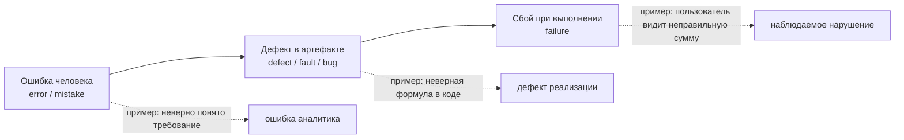
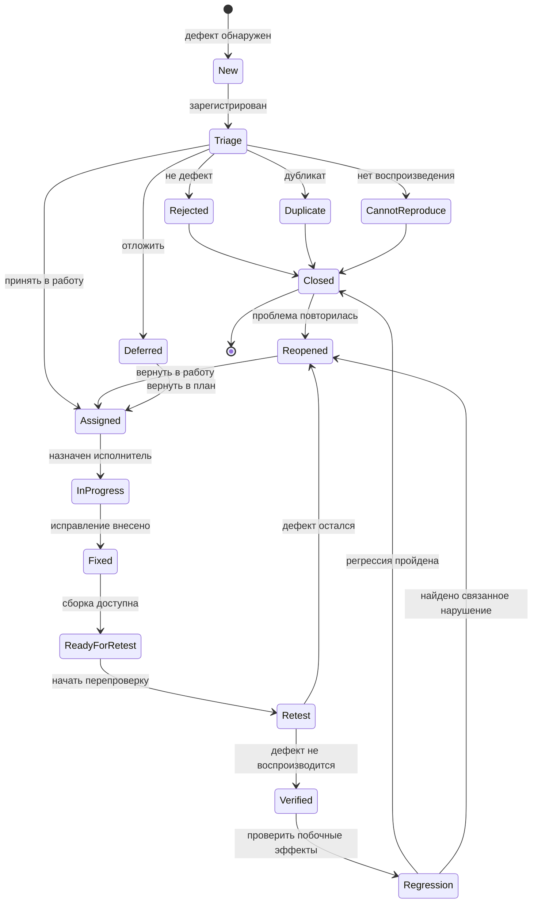
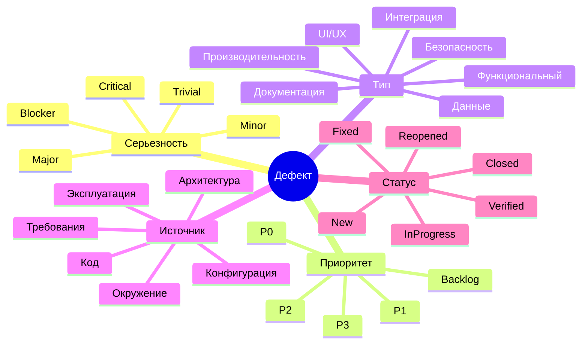

# 24. Классификация дефектов и жизненный цикл дефекта. Схема [8]

## Краткое определение

**Дефект** - это несоответствие в программном продукте, документации, требованиях, архитектуре, коде, данных или процессе, которое может привести к неправильному поведению системы. В повседневной речи дефект часто называют багом, но в инженерном смысле важно различать несколько близких понятий:

- **ошибка человека** (error, mistake) - неправильное действие или решение человека: аналитик неверно понял требование, разработчик написал неверное условие, тестировщик ошибся в ожидаемом результате;
- **дефект** (defect, fault, bug) - результат ошибки, закрепленный в артефакте: неправильное требование, ошибка в коде, некорректная настройка, неверная схема БД;
- **сбой** (failure) - наблюдаемое неправильное поведение системы во время выполнения: приложение упало, платеж списался дважды, отчет показал неверную сумму.

Связь между ними можно выразить так: **ошибка человека может породить дефект, а дефект при определенных условиях может проявиться как сбой**. Не каждый дефект сразу приводит к сбою: он может находиться в редко используемой ветке кода, проявляться только при особых данных или быть обнаружен на ревью до запуска программы.

Пример:

- аналитик ошибся и записал, что скидка постоянного клиента равна `5%`, хотя бизнес-правило требует `10%`;
- в требовании появился дефект;
- разработчик реализовал расчет по дефектному требованию;
- пользователь оформил заказ и получил неверную скидку;
- неверная скидка в интерфейсе и заказе - это сбой.

Главная идея темы: **дефект нужно не только найти, но и правильно описать, классифицировать, приоритизировать, исправить, проверить и закрыть**. Для этого используют жизненный цикл дефекта и набор классификаций.

---

## Дефект, ошибка и сбой

| Понятие | Где находится | Что означает | Пример |
|---|---|---|---|
| Ошибка человека | В действии или решении человека | Человек сделал что-то неверно | Разработчик перепутал `>` и `>=` |
| Дефект | В артефакте: требовании, коде, тесте, конфигурации, данных | В продукте или документации есть несоответствие | В коде не учитывается последний день скидочной акции |
| Сбой | В наблюдаемом поведении системы | Система повела себя неправильно при выполнении | В последний день акции пользователь не получил скидку |

Эти понятия связаны, но не равны:

- дефект может существовать без видимого сбоя, если условие его проявления не наступило;
- сбой может быть вызван не только кодом, но и дефектом требований, окружения, данных, инфраструктуры;
- ошибка в тесте тоже может создать ложный дефект, если ожидаемый результат указан неверно;
- один дефект может порождать много сбоев в разных сценариях;
- один сбой может быть следствием цепочки дефектов.



---

## Зачем классифицировать дефекты

Классификация нужна не для формальности. Она помогает команде принимать управленческие решения:

- какие дефекты исправлять немедленно, а какие можно отложить;
- кто должен анализировать проблему: разработчик, аналитик, DevOps, дизайнер, владелец продукта;
- блокирует ли дефект релиз;
- насколько опасен дефект для пользователя, бизнеса, безопасности и данных;
- где в процессе чаще всего появляются проблемы;
- какие проверки добавить, чтобы дефекты не повторялись.

Минимальный набор полей в дефект-репорте обычно включает:

| Поле | Назначение |
|---|---|
| Заголовок | Кратко описывает наблюдаемую проблему |
| Описание | Что произошло и почему это считается дефектом |
| Шаги воспроизведения | Как повторить сбой |
| Фактический результат | Что система сделала на самом деле |
| Ожидаемый результат | Что должно было произойти |
| Окружение | Версия, стенд, браузер, ОС, конфигурация, тестовые данные |
| Серьезность | Насколько опасны последствия дефекта |
| Приоритет | Как срочно нужно исправлять |
| Статус | Где дефект находится в жизненном цикле |
| Ответственный | Кто сейчас выполняет следующее действие |
| Вложения | Логи, скриншоты, видео, дампы, трассировки |

---

## Классификация по серьезности

**Серьезность** (severity) показывает степень влияния дефекта на систему, пользователя, данные, безопасность или бизнес-процесс. Это характеристика последствий дефекта, а не очередности работы.

| Уровень | Смысл | Пример |
|---|---|---|
| Blocker / Блокирующий | Невозможно продолжать ключевую работу или тестирование | Приложение не запускается, невозможно авторизоваться, тестовый стенд полностью недоступен |
| Critical / Критический | Нарушена ключевая функция, есть риск потери данных, денег или безопасности | Платеж списывается дважды, пользователь видит чужие персональные данные |
| Major / Значительный | Важная функция работает неправильно, но есть обходной путь или затронут не весь процесс | Заказ нельзя отредактировать из интерфейса, но можно отменить и создать заново |
| Minor / Незначительный | Ошибка не ломает основной сценарий и слабо влияет на пользователя | Неверная сортировка во второстепенной таблице |
| Trivial / Cosmetic / Косметический | Опечатка, визуальный дефект, небольшой недочет интерфейса | Неровный отступ, лишний пробел, ошибка в тексте подсказки |

Серьезность обычно оценивают тестировщик, аналитик, разработчик или технический лидер. В спорных случаях решение принимает владелец продукта или ответственный за качество, потому что влияние может быть не только техническим, но и бизнесовым.

Важно: косметический дефект может иметь высокий приоритет, если он находится на главной странице перед публичным запуском. И наоборот, критический по природе дефект может получить низкий приоритет, если он находится в модуле, который выводится из эксплуатации.

---

## Классификация по приоритету

**Приоритет** (priority) показывает, насколько срочно дефект нужно исправить с учетом планов релиза, бизнес-ценности, рисков, доступности обходного пути и стоимости исправления.

| Уровень | Смысл | Пример |
|---|---|---|
| P0 / Immediate | Нужно исправлять немедленно, работа или релиз заблокированы | Продакшен не принимает платежи |
| P1 / High | Нужно исправить в ближайшем цикле, дефект серьезно влияет на релиз или пользователей | Новый тариф нельзя подключить за день до запуска |
| P2 / Medium | Исправление важно, но может быть запланировано в обычную очередь | Ошибка в фильтре отчетов при редкой комбинации параметров |
| P3 / Low | Можно отложить без существенного риска | Небольшой визуальный дефект в редко используемом разделе |
| P4 / Backlog | Исправление желательно, но не обязательно в текущем горизонте | Улучшение текста, спорный UX-недочет |

Различие между серьезностью и приоритетом удобно помнить так:

- **серьезность** отвечает на вопрос: "Насколько плохо, если дефект проявится?";
- **приоритет** отвечает на вопрос: "Когда это нужно исправить?".

Примеры сочетаний:

| Серьезность | Приоритет | Ситуация |
|---|---|---|
| Critical | P0 | В продакшене пользователи не могут оплатить заказ |
| Critical | P3 | Критическая ошибка в старой версии, которую больше не поддерживают и скоро отключают |
| Minor | P1 | Опечатка в названии компании на публичной лендинговой странице перед запуском |
| Major | P2 | Ошибка в важной функции, но есть понятный временный обходной путь |

---

## Классификация по типу дефекта

Тип дефекта показывает, какая характеристика продукта нарушена или где проявилась проблема.

| Тип | Описание | Пример |
|---|---|---|
| Функциональный | Система делает не то, что должна по требованиям | При отмене заказа статус остается `Оплачен` |
| Логический / алгоритмический | Неверная формула, условие, ветвление, расчет | Комиссия считается от суммы без НДС вместо суммы с НДС |
| UI / визуальный | Проблемы интерфейса, верстки, отображения | Кнопка перекрывает текст на мобильном экране |
| UX / usability | Пользователю трудно выполнить сценарий, даже если формально система работает | Нельзя понять, какая ошибка мешает отправить форму |
| Производительность | Система работает слишком медленно или не выдерживает нагрузку | Поиск клиентов выполняется 20 секунд вместо 2 |
| Надежность | Падения, зависания, нестабильное поведение | Приложение периодически падает при импорте файла |
| Безопасность | Нарушение конфиденциальности, целостности, доступности или контроля доступа | Пользователь может открыть чужой заказ по прямой ссылке |
| Совместимость | Ошибка зависит от браузера, ОС, устройства, версии API | Форма не работает в Safari |
| Интеграционный | Неверное взаимодействие между компонентами или внешними системами | Сервис заказов неверно обрабатывает ответ платежного шлюза |
| Данные / миграции | Проблемы в структуре, целостности, миграции или интерпретации данных | После миграции у части клиентов потерялись настройки уведомлений |
| Локализация | Ошибки перевода, форматов дат, валют, часовых поясов | Для русской локали дата отображается в американском формате |
| Документация | Документация не соответствует системе или неполна | API-документация обещает поле, которого нет в ответе |
| Требования | Требования противоречивы, неполны или неверны | В одном разделе указано, что заказ можно отменить до оплаты, в другом - после оплаты |
| Конфигурация / окружение | Проблема связана с настройками стенда, инфраструктуры, переменных окружения | На тестовом стенде указан неверный URL внешнего сервиса |

Один дефект может иметь несколько признаков. Например, неверный контроль доступа в интерфейсе является и функциональным, и security-дефектом. В таких случаях основной тип выбирают по главному риску.

---

## Классификация по источнику

Источник дефекта показывает, на какой стадии или в каком артефакте он был внесен. Это важно для анализа причин и улучшения процесса.

| Источник | Как появляется | Пример |
|---|---|---|
| Требования | Неполнота, противоречие, неоднозначность, неверное бизнес-правило | Не указано, что делать с заказом при частичном возврате |
| Анализ предметной области | Неверно понято реальное бизнес-ограничение | Система разрешает скидку, запрещенную регламентом |
| Архитектура | Неверное разделение ответственности, слабый контракт, неподходящий паттерн | Сервис кэширует данные, которые должны быть строго актуальными |
| Проектирование | Ошибка в структуре модулей, API, БД, алгоритмах | Схема БД не позволяет хранить несколько адресов клиента |
| Кодирование | Ошибка реализации | Неверный оператор сравнения, забытая проверка `null` |
| Интеграция | Неверное взаимодействие между системами | Одна система отправляет сумму в копейках, другая ожидает рубли |
| Тесты | Неверный тестовый сценарий или ожидаемый результат | Автотест падает из-за устаревшего локатора, хотя продукт работает |
| Данные | Ошибочные справочники, миграции, тестовые данные | В справочнике неверный налоговый код |
| Конфигурация | Неверные настройки приложения или окружения | В продакшене включен тестовый платежный шлюз |
| Эксплуатация | Ошибка в деплое, мониторинге, правах, регламенте | После релиза не выполнена миграция БД |

Если фиксировать источник дефекта, команда может видеть системные проблемы. Например, если большая часть дефектов приходит из требований, нужно усиливать анализ, ревью требований и критерии приемки. Если много дефектов из интеграции, нужны контрактные тесты, стабильные тестовые стенды и лучшее управление версиями API.

---

## Классификация по статусу

Статус показывает, что сейчас происходит с дефектом и какое действие ожидается дальше.

| Статус | Значение |
|---|---|
| New / Новый | Дефект зарегистрирован, но еще не разобран |
| Open / Открыт | Дефект принят в работу или ожидает назначения |
| Assigned / Назначен | За дефект назначен ответственный |
| In Progress / В работе | Исправление анализируется или реализуется |
| Fixed / Исправлен | Разработчик внес исправление, нужна проверка |
| Ready for Retest / Готов к перепроверке | Исправленная сборка доступна тестировщику |
| Retest / На перепроверке | Тестировщик проверяет конкретное исправление |
| Verified / Подтверждено исправление | Дефект больше не воспроизводится в указанной версии |
| Closed / Закрыт | Работа по дефекту завершена |
| Reopened / Переоткрыт | Дефект воспроизводится снова или исправлен неполно |
| Duplicate / Дубликат | Уже есть другой дефект по той же проблеме |
| Rejected / Отклонен | Это не дефект или описание некорректно |
| Cannot Reproduce / Не воспроизводится | Команда не смогла повторить проблему по описанию |
| Won't Fix / Не будет исправляться | Дефект признан известным, но исправление нецелесообразно |
| Deferred / Отложен | Исправление перенесено на будущий релиз |

Набор статусов зависит от процесса и инструмента: Jira, YouTrack, Azure DevOps, GitLab Issues и другие системы позволяют настраивать workflow. Но смысл обычно один: дефект проходит путь от обнаружения до решения и закрытия.

---

## Жизненный цикл дефекта

**Жизненный цикл дефекта** - это последовательность состояний, через которые проходит дефект от обнаружения до закрытия. Он нужен, чтобы было понятно, кто отвечает за следующий шаг, какие решения уже приняты и можно ли считать проблему решенной.

Типовой жизненный цикл:

1. **Обнаружение**. Тестировщик, пользователь, разработчик, мониторинг или аналитик замечает неправильное поведение.
2. **Регистрация**. Создается дефект-репорт с шагами, фактическим и ожидаемым результатом, окружением, вложениями.
3. **Первичный анализ**. Проверяется полнота описания, воспроизводимость, дубликаты, принадлежность к продукту.
4. **Классификация и приоритизация**. Назначаются серьезность, приоритет, тип, компонент, версия, ответственный.
5. **Назначение**. Дефект передается владельцу компонента, разработчику, аналитику или другой роли.
6. **Анализ причины**. Исполнитель ищет root cause: ошибка в коде, требовании, данных, конфигурации, интеграции.
7. **Исправление**. Вносятся изменения в код, требования, данные, конфигурацию или документацию.
8. **Сборка и передача на проверку**. Исправление попадает в доступную тестовую версию.
9. **Перепроверка**. Проверяется, что конкретный дефект больше не воспроизводится.
10. **Регрессионное тестирование**. Проверяется, что исправление не сломало соседнюю функциональность.
11. **Закрытие**. Дефект закрывается, если исправление подтверждено и нет новых проблем.
12. **Переоткрытие**. Если дефект воспроизводится снова или исправлен частично, он возвращается в работу.



Эта схема не единственно возможная. В небольших командах статусы могут быть проще: `New -> In Progress -> Fixed -> Verified -> Closed`. В регулируемых или крупных проектах workflow часто детальнее: добавляют статусы `Need Info`, `Code Review`, `Ready for Build`, `Ready for Release`, `Known Issue`, `Resolved`.

---

## Роли в жизненном цикле

| Роль | Что делает |
|---|---|
| Тестировщик | Обнаруживает, описывает, воспроизводит, проверяет исправление и регрессию |
| Разработчик | Анализирует причину, исправляет дефект, добавляет проверки |
| Аналитик | Уточняет требования и ожидаемое поведение |
| Владелец продукта | Определяет бизнес-приоритет и допустимость обходного пути |
| Тимлид / архитектор | Помогает с техническим риском, архитектурной причиной, сложными решениями |
| DevOps / SRE | Разбирает дефекты окружения, деплоя, инфраструктуры, мониторинга |
| Поддержка | Передает пользовательские обращения и помогает собрать контекст |

Ответственность за дефект в каждый момент должна быть однозначной. Если дефект висит без владельца, жизненный цикл формально существует, но процесс не работает.

---

## Примеры классификации

### Пример 1. Интернет-магазин: двойное списание оплаты

Пользователь нажимает "Оплатить", платежный шлюз отвечает с задержкой, пользователь повторно нажимает кнопку, и система создает два списания.

| Поле | Значение |
|---|---|
| Тип | Функциональный, интеграционный, финансовый |
| Серьезность | Critical |
| Приоритет | P0, если дефект есть в продакшене |
| Источник | Проектирование или кодирование: нет идемпотентности платежной операции |
| Статус после регистрации | New / Triage |
| Ожидаемое исправление | Блокировка повторной отправки, идемпотентный ключ, корректная обработка повторного ответа шлюза |

### Пример 2. Опечатка на странице справки

В справочном разделе слово "доставка" написано с ошибкой.

| Поле | Значение |
|---|---|
| Тип | Документация / косметический |
| Серьезность | Trivial |
| Приоритет | P3 или P4 |
| Источник | Документация |
| Возможное решение | Исправить текст в ближайшем редакционном обновлении |

Если та же опечатка находится на главном экране крупной рекламной кампании, приоритет может стать высоким, хотя серьезность останется низкой.

### Пример 3. Утечка персональных данных

Пользователь может изменить `userId` в URL и увидеть профиль другого пользователя.

| Поле | Значение |
|---|---|
| Тип | Безопасность, контроль доступа, функциональный |
| Серьезность | Critical |
| Приоритет | P0 или P1 |
| Источник | Требования, архитектура или кодирование: не проверяются права доступа |
| Дополнительные действия | Анализ затронутых данных, аудит логов, security-регрессия |

### Пример 4. Дефект тестового окружения

На тестовом стенде не отправляются письма, потому что указан неверный SMTP-сервер. В продакшен-конфигурации ошибки нет.

| Поле | Значение |
|---|---|
| Тип | Конфигурация / окружение |
| Серьезность | Major для тестирования, но не обязательно для продукта |
| Приоритет | P1, если блокирует проверку релиза |
| Источник | Конфигурация |
| Решение | Исправить настройки стенда и добавить проверку конфигурации |

---

## Как выглядит хороший дефект-репорт

Хороший дефект-репорт должен позволять другому человеку быстро понять проблему и воспроизвести ее.

Пример структуры:

```text
Заголовок:
При повторном нажатии "Оплатить" создаются два платежа для одного заказа

Предусловия:
Пользователь авторизован.
В корзине есть товар стоимостью 1000 руб.
Платежный шлюз отвечает с задержкой больше 5 секунд.

Шаги:
1. Открыть корзину.
2. Нажать "Оформить заказ".
3. Выбрать оплату картой.
4. Нажать "Оплатить".
5. Не дожидаясь ответа, нажать "Оплатить" повторно.

Фактический результат:
Создаются два платежа и две операции списания для одного заказа.

Ожидаемый результат:
Повторное нажатие не создает второй платеж.
Система показывает состояние ожидания или возвращает статус уже созданной операции.

Окружение:
staging, build 1.42.0, Chrome 125, тестовый шлюз PayTest.

Вложения:
Видео, network-log, order_id, payment_id, server logs.
```

Признаки качественного описания:

- есть точные шаги воспроизведения;
- указана версия продукта и окружение;
- фактический и ожидаемый результат разделены;
- приложены доказательства: скриншоты, видео, логи, ID сущностей;
- заголовок описывает симптом, а не предположение;
- серьезность и приоритет не подменяют друг друга;
- дефект привязан к компоненту, версии и ответственному.

---

## Типичные ошибки при работе с дефектами

### Ошибка 1. Писать слишком общий заголовок

Плохо: "Оплата не работает".

Лучше: "Повторное нажатие кнопки `Оплатить` создает два платежа для одного заказа".

Конкретный заголовок ускоряет триаж и поиск дубликатов.

### Ошибка 2. Не указывать ожидаемый результат

Фактическое поведение само по себе не всегда доказывает дефект. Нужно показать, как система должна работать по требованию, макету, бизнес-правилу или здравому смыслу.

### Ошибка 3. Путать серьезность и приоритет

Серьезность - про влияние, приоритет - про срочность. Если ставить всем неприятным дефектам `Critical / P0`, очередь перестает отражать реальные риски.

### Ошибка 4. Закрывать дефект без перепроверки

Статус `Fixed` означает только, что исполнитель внес исправление. Пока тестировщик или ответственный не проверил исправленную сборку, дефект нельзя считать подтвержденно решенным.

### Ошибка 5. Не выполнять регрессионную проверку

Исправление одного дефекта может сломать соседний сценарий. Например, исправление скидки для постоянных клиентов может повлиять на промокоды, возвраты или расчет налогов.

### Ошибка 6. Создавать дубликаты без поиска

Перед регистрацией стоит искать похожие дефекты по компоненту, симптомам, ошибкам в логах и ключевым словам. Дубликаты размывают статистику и усложняют коммуникацию.

### Ошибка 7. Описывать предположение вместо наблюдаемого факта

Плохо: "Метод `createPayment` неправильно работает".

Лучше: "При повторном клике создаются две платежные операции для одного заказа". Причину установят в анализе; в дефект-репорте сначала фиксируют наблюдаемое поведение.

### Ошибка 8. Игнорировать источник дефекта

Если закрывать дефекты только исправлением кода, команда теряет возможность улучшать процесс. Повторяющиеся дефекты требований лечатся не только кодом, а ревью требований, примерами, критериями приемки и согласованием бизнес-правил.

---

## Краткая схема классификации



---

## Метрики дефектов

Классификация дефектов дает данные для управления качеством. Часто используют такие метрики:

| Метрика | Что показывает |
|---|---|
| Количество дефектов по серьезности | Насколько рискован текущий релиз |
| Количество дефектов по компонентам | Где продукт наиболее проблемный |
| Доля переоткрытых дефектов | Насколько качественно исправляются и проверяются дефекты |
| Среднее время до исправления | Как быстро команда устраняет проблемы |
| Среднее время в статусе | Где дефекты застревают в процессе |
| Defect leakage / утечка дефектов | Сколько дефектов ушло на следующий уровень тестирования или в продакшен |
| Плотность дефектов | Количество дефектов на модуль, функциональность или объем кода |
| Распределение по источникам | На какой стадии процесса дефекты чаще всего вносятся |

Метрики нельзя использовать механически. Большое количество найденных дефектов может означать плохое качество продукта, но также может означать эффективное тестирование. Малое количество дефектов может означать стабильный продукт, но может означать и слабое покрытие проверками.

---

## Краткие ответы для экзамена

**Дефект** - это несоответствие в артефакте программной системы, которое может привести к неправильному поведению. **Ошибка** - действие человека, породившее неправильность. **Сбой** - наблюдаемое проявление дефекта при выполнении системы.

**Серьезность** показывает влияние дефекта на систему и пользователя: blocker, critical, major, minor, trivial. **Приоритет** показывает срочность исправления: P0, P1, P2, P3, backlog.

**Тип дефекта** описывает характер проблемы: функциональный, UI/UX, производительность, безопасность, интеграция, данные, совместимость, документация, требования, конфигурация.

**Источник дефекта** показывает, где он был внесен: требования, анализ, архитектура, проектирование, кодирование, интеграция, тесты, данные, конфигурация, эксплуатация.

**Статус дефекта** показывает положение в workflow: new, assigned, in progress, fixed, ready for retest, verified, closed, reopened, duplicate, rejected, cannot reproduce, deferred.

**Жизненный цикл дефекта** обычно выглядит так: обнаружение, регистрация, триаж, назначение, анализ причины, исправление, передача на перепроверку, retest, регрессия, закрытие. Если проблема сохраняется, дефект переоткрывается.

---

## Вывод

Классификация дефектов и жизненный цикл дефекта превращают хаотичные сообщения об ошибках в управляемый инженерный процесс. Серьезность показывает влияние, приоритет - срочность, тип - характер проблемы, источник - место возникновения, статус - текущее состояние работы. Жизненный цикл обеспечивает контроль: дефект должен быть зарегистрирован, разобран, назначен, исправлен, перепроверен и только после этого закрыт.

Для качества продукта важно не только исправлять отдельные баги, но и анализировать причины их появления. Если команда видит, где дефекты возникают чаще всего, она может улучшать требования, архитектуру, код-ревью, тестовые данные, автоматизацию, деплой и мониторинг. Поэтому дефект-менеджмент является не вспомогательной бюрократией, а частью управления качеством программной инженерии.

---

## Источники

1. ISTQB. **Certified Tester Foundation Level Syllabus v4.0.1**: термины defect, error, failure, основы тестирования и управления дефектами. URL: <https://istqb.org/wp-content/uploads/2024/11/ISTQB_CTFL_Syllabus_v4.0.1.pdf>
2. ISTQB Glossary. **Software Testing Glossary**: определения defect, error, failure, severity, priority, defect report. URL: <https://glossary.istqb.org/>
3. IEEE. **IEEE Std 1044-2009: IEEE Standard Classification for Software Anomalies**: классификация программных аномалий и дефектов. URL: <https://standards.ieee.org/ieee/1044/4483/>
4. ISO/IEC/IEEE 29119 series. **Software and systems engineering - Software testing**: процессы, документация и понятия тестирования. URL: <https://committee.iso.org/sites/jtc1sc7/home/projects/flagship-standards/isoiecieee-29119-series.html>
5. SWEBOK Guide. **Guide to the Software Engineering Body of Knowledge**, разделы Software Quality и Software Testing. URL: <https://www.computer.org/education/bodies-of-knowledge/software-engineering>
6. Atlassian. **Bug tracking and issue management guidance**: практические подходы к жизненному циклу и приоритизации дефектов в issue tracker. URL: <https://www.atlassian.com/agile/software-development/bug-tracking>
