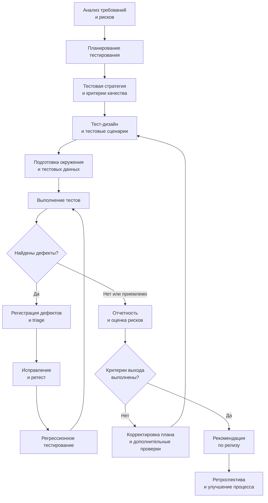
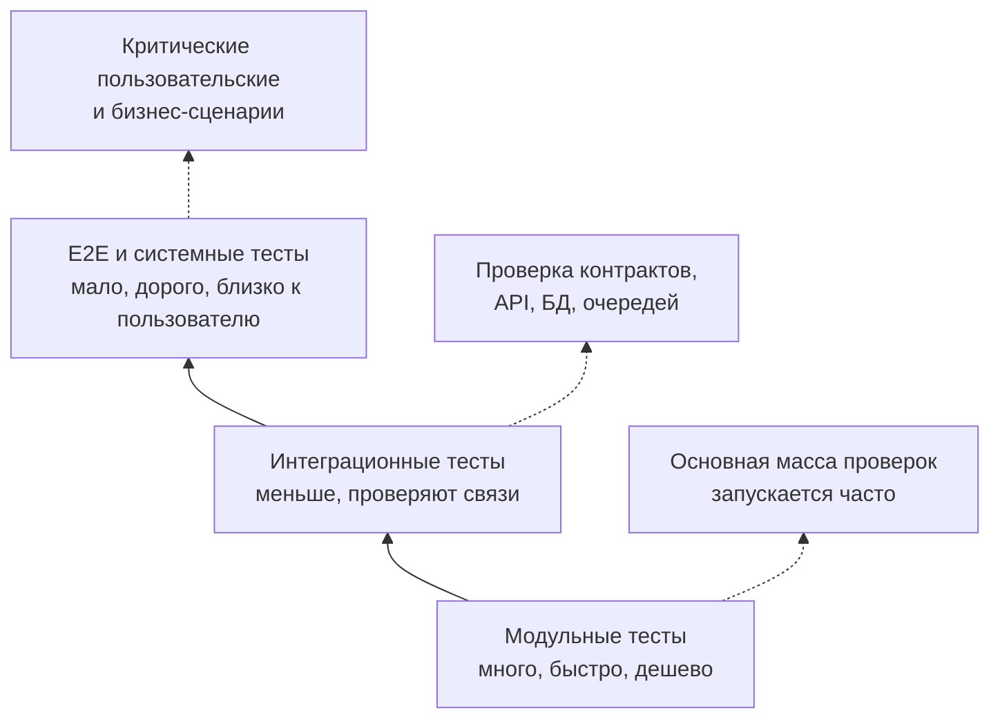
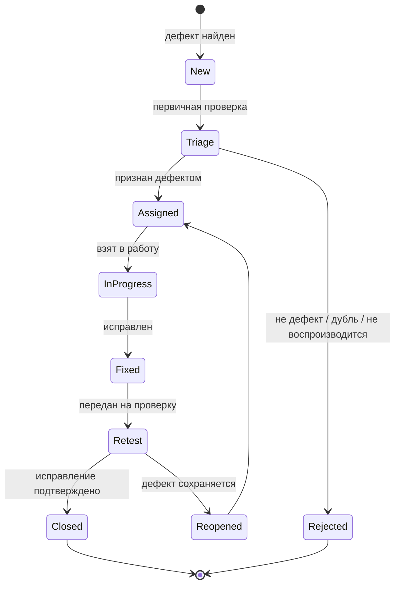
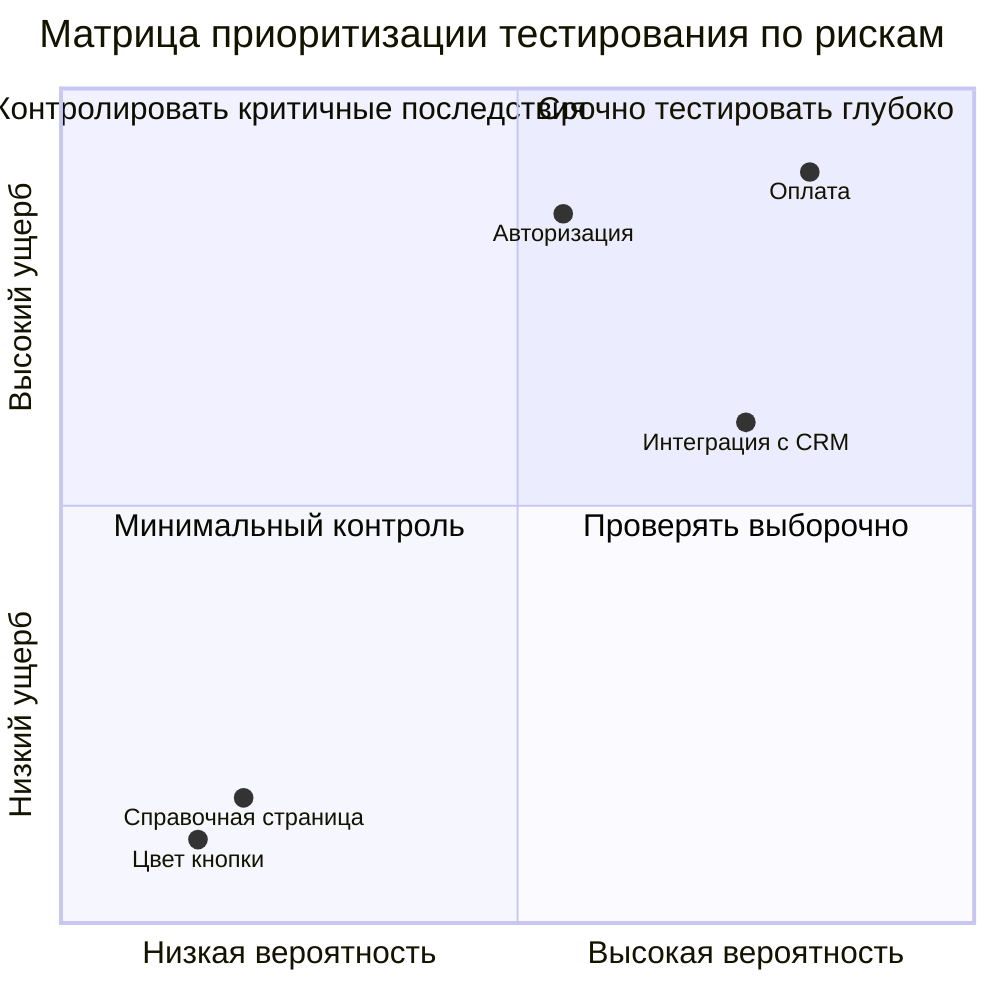
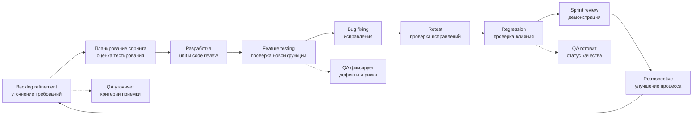

# 25. Организация и управление процессом тестирования. Схемы [8]

## Краткое определение

**Организация и управление процессом тестирования** - это совокупность управленческих и инженерных действий, с помощью которых команда определяет, что именно нужно проверить, как это проверить, кем, когда, на каких данных и окружениях, с какими критериями завершения и как использовать результаты тестирования для принятия решений о качестве продукта.

Процесс тестирования включает не только выполнение тестов. В него входят:

- анализ требований и рисков;
- планирование тестирования;
- выбор тестовой стратегии;
- проектирование тестов и тестовых данных;
- подготовка окружений, инструментов и доступов;
- выполнение ручных и автоматизированных проверок;
- регистрация, приоритизация и контроль исправления дефектов;
- мониторинг прогресса, отчетность и метрики;
- оценка готовности продукта к релизу;
- улучшение процесса после итерации или проекта.

Главная мысль: **тестирование управляется как процесс, потому что время, люди, окружения и риски ограничены**. Нельзя проверить абсолютно все, поэтому команда должна осознанно выбирать приоритеты, фиксировать критерии качества и давать заинтересованным сторонам понятную информацию для решений.

---

## Зачем управлять тестированием

Если тестирование не организовано, оно быстро превращается в хаотичный набор проверок: одни сценарии дублируются, другие не покрываются вообще, дефекты теряются, окружения ломаются, а решение о релизе принимается по ощущениям.

Управление тестированием решает несколько задач:

- **прозрачность** - команда понимает, что уже проверено, что не проверено и почему;
- **приоритизация** - самые рискованные и важные функции проверяются первыми;
- **повторяемость** - проверки можно воспроизвести при регрессии, релизе и аудите;
- **контроль качества** - есть критерии входа, выхода, приемки и блокировки релиза;
- **управление рисками** - тестирование направлено на области, где возможный ущерб максимален;
- **управление ресурсами** - роли, сроки, окружения и инструменты распределены заранее;
- **обратная связь** - результаты тестирования помогают улучшать требования, архитектуру, код и процесс разработки.

В зрелом процессе тестирование начинается не после завершения разработки, а уже на этапе анализа требований: тестировщики участвуют в уточнении критериев приемки, выявляют неоднозначности и помогают предотвратить дефекты до появления кода.

---

## Общая схема процесса тестирования



Эта схема показывает итерационный характер процесса. Тестирование редко идет строго линейно: дефекты возвращают команду к исправлениям и регрессии, изменение требований требует пересмотра тест-дизайна, а проблемы окружения могут менять план работ.

---

## 1. Планирование тестирования

**Планирование тестирования** - этап, на котором определяются цели, объем, подход, ресурсы, сроки, риски, критерии начала и завершения тестирования.

Планирование отвечает на вопросы:

- что тестируем;
- что не тестируем;
- зачем тестируем;
- какие риски закрываем;
- какие виды и уровни тестирования нужны;
- кто выполняет работы;
- какие окружения, данные и инструменты требуются;
- когда начинаем и заканчиваем;
- по каким критериям принимаем результат;
- как будем отчитываться о статусе.

### Содержание тест-плана

Типичный тест-план включает:

| Раздел | Что фиксируется |
|---|---|
| Объект тестирования | Система, модуль, API, мобильное приложение, интеграция, релизная сборка |
| Объем тестирования | Какие функции, требования, платформы и сценарии входят в проверку |
| Вне объема | Что сознательно не проверяется, чтобы избежать ложных ожиданий |
| Цели | Например: подтвердить готовность релиза, найти критические дефекты, проверить совместимость |
| Риски | Технические, бизнес-риски, риски сроков, данных, окружений, интеграций |
| Стратегия | Подход к тестированию: риск-ориентированный, регрессионный, автоматизированный, исследовательский |
| Уровни тестирования | Модульное, интеграционное, системное, приемочное |
| Типы тестирования | Функциональное, нефункциональное, регрессионное, smoke, security, performance и др. |
| Роли | Ответственные за тест-дизайн, выполнение, автоматизацию, окружения, triage |
| Окружения | DEV, QA, STAGE, UAT, production-like стенды |
| Данные | Наборы тестовых данных, правила анонимизации, генерации и очистки |
| Инструменты | Test management, bug tracker, CI/CD, автотесты, нагрузочные инструменты |
| Расписание | Спринты, окна тестирования, даты regression, UAT, release candidate |
| Критерии входа | Условия, при которых тестирование можно начинать |
| Критерии выхода | Условия, при которых тестирование можно завершить |
| Отчетность | Формат ежедневных статусов, итогового отчета, метрик и dashboard |

### Критерии входа

**Критерии входа** показывают, что объект готов к тестированию. Например:

- требования описаны и доступны команде;
- есть согласованные критерии приемки;
- сборка установлена на тестовое окружение;
- smoke-тесты сборки прошли;
- доступы, роли и тестовые учетные записи созданы;
- внешние интеграции доступны или заменены стабами;
- тестовые данные подготовлены;
- известные блокирующие дефекты отсутствуют или приняты как ограничение.

Если критерии входа не выполнены, тестирование может начаться, но план должен явно учитывать риск: часть проверок будет невозможна, результаты будут неполными, сроки могут увеличиться.

### Критерии выхода

**Критерии выхода** определяют, когда тестирование можно считать достаточным для текущей цели. Например:

- выполнены все критичные тесты;
- покрыты основные бизнес-сценарии;
- нет открытых дефектов severity `Blocker` и `Critical`;
- количество известных дефектов средней и низкой критичности находится в согласованных пределах;
- регрессионный набор пройден с допустимым уровнем успешности;
- тестовое покрытие требований достигло заданного порога;
- отчет о рисках подготовлен;
- product owner, QA lead и технические ответственные согласовали остаточные риски.

Важно: критерии выхода не означают абсолютного отсутствия дефектов. Они означают, что команда собрала достаточно информации для решения о дальнейшем шаге: релиз, доработка, дополнительное тестирование или перенос поставки.

---

## 2. Тестовая стратегия

**Тестовая стратегия** - это общий подход к тестированию продукта или проекта. Если тест-план отвечает на вопрос "что делаем в конкретном релизе", то стратегия отвечает на вопрос "как в принципе организуем тестирование для данного продукта".

Стратегия задает:

- приоритеты качества;
- баланс ручного и автоматизированного тестирования;
- распределение проверок по уровням;
- подход к регрессии;
- требования к окружениям и данным;
- правила управления дефектами;
- набор метрик;
- quality gates в pipeline;
- подход к тестированию рисковых областей.

### Риск-ориентированный подход

На практике часто применяется **риск-ориентированное тестирование**. Команда оценивает каждую область продукта по двум параметрам:

- вероятность дефекта;
- ущерб, если дефект попадет к пользователю.

Чем выше риск, тем глубже и раньше тестирование.

| Область | Вероятность дефекта | Ущерб | Приоритет тестирования |
|---|---:|---:|---|
| Оплата заказа | Высокая | Высокий | Максимальный |
| Авторизация | Средняя | Высокий | Высокий |
| Справочная страница | Низкая | Низкий | Низкий |
| Интеграция с внешней CRM | Высокая | Средний | Высокий |
| Смена цвета кнопки | Низкая | Низкий | Минимальный |

Пример: в интернет-магазине сначала проверяют оформление заказа, оплату, расчет доставки, остатки на складе и возвраты. Проверка декоративных элементов интерфейса важна, но она не должна вытеснять сценарии, влияющие на деньги, данные и юридические обязательства.

### Пирамида тестирования

Стратегия также определяет баланс между уровнями тестирования. Часто используют идею тестовой пирамиды: много быстрых модульных тестов, меньше интеграционных, еще меньше дорогих end-to-end проверок.



Нарушение пирамиды приводит к проблемам. Если почти все проверки являются тяжелыми end-to-end тестами, регрессия становится медленной, нестабильной и дорогой. Если есть только модульные тесты, команда может пропустить ошибки интеграции и пользовательских сценариев.

### Виды тестирования в стратегии

В зависимости от продукта стратегия может включать:

- **smoke testing** - быстрая проверка, что сборка пригодна для дальнейшего тестирования;
- **sanity testing** - точечная проверка после небольшого изменения или исправления;
- **регрессионное тестирование** - проверка, что старый функционал не сломан новыми изменениями;
- **интеграционное тестирование** - проверка взаимодействия модулей, сервисов, API, очередей, БД;
- **системное тестирование** - проверка системы целиком;
- **приемочное тестирование** - проверка готовности с точки зрения заказчика или бизнеса;
- **нагрузочное тестирование** - проверка производительности под ожидаемой и пиковой нагрузкой;
- **security testing** - проверка уязвимостей, прав доступа, утечек данных;
- **usability testing** - проверка удобства использования;
- **compatibility testing** - проверка браузеров, устройств, ОС, версий API;
- **exploratory testing** - исследовательские проверки без жесткого заранее заданного сценария.

---

## 3. Тест-дизайн

**Тест-дизайн** - это проектирование тестов: преобразование требований, рисков и моделей поведения системы в конкретные тестовые условия, сценарии, чек-листы и данные.

На этом этапе тестировщик отвечает на вопросы:

- какие условия нужно проверить;
- какие входные данные использовать;
- какие шаги выполнить;
- какой результат ожидается;
- какие негативные и граничные случаи важны;
- какие тесты можно автоматизировать;
- какие тесты стоит оставить ручными.

### Артефакты тест-дизайна

| Артефакт | Назначение |
|---|---|
| Тестовое условие | Что именно нужно проверить, например "пользователь может оплатить заказ картой" |
| Тест-кейс | Формальный сценарий со шагами, данными и ожидаемым результатом |
| Чек-лист | Краткий список проверок без детального описания каждого шага |
| Тестовый набор | Группа тестов для smoke, regression, release, UAT |
| Матрица трассируемости | Связь требований, тестов и дефектов |
| Тестовые данные | Конкретные значения, учетные записи, файлы, состояния БД |
| Автотест | Исполняемая проверка в коде или low-code инструменте |

### Пример тест-дизайна

Требование: "Пользователь может оформить заказ, если в корзине есть хотя бы один товар, выбран способ доставки и успешно выполнена оплата".

Из этого требования можно получить проверки:

| Проверка | Тип | Ожидаемый результат |
|---|---|---|
| Один товар, доставка курьером, успешная оплата | Позитивная | Заказ создан, статус "Оплачен" |
| Корзина пуста | Негативная | Кнопка оформления недоступна или показана ошибка |
| Не выбран способ доставки | Негативная | Система требует выбрать доставку |
| Оплата отклонена банком | Негативная | Заказ не оплачен, пользователю показана причина |
| Товар закончился перед оплатой | Граничная бизнес-ситуация | Система не списывает деньги или возвращает пользователя к корзине |
| Повторный клик по кнопке оплаты | Защита от дублей | Не создаются два заказа |

### Техники тест-дизайна

В управляемом процессе тесты не придумываются случайно. Используются техники:

- **эквивалентное разбиение** - входные данные делятся на классы, внутри которых система должна вести себя одинаково;
- **анализ граничных значений** - проверяются значения на границах диапазонов;
- **таблицы принятия решений** - применяются для комбинаций условий и правил;
- **переходы состояний** - полезны для заказов, заявок, платежей, workflow;
- **попарное тестирование** - уменьшает число комбинаций параметров;
- **тестирование по сценариям использования** - проверяет реальные пользовательские пути;
- **исследовательское тестирование** - помогает найти проблемы, которые не были заранее формализованы.

Хороший тест-дизайн дает не максимальное количество тестов, а достаточный набор проверок, который покрывает требования и риски без лишнего дублирования.

---

## 4. Подготовка окружения и тестовых данных

Даже хорошие тесты бесполезны, если нет стабильного окружения и корректных данных.

### Тестовое окружение

**Тестовое окружение** - это совокупность инфраструктуры, приложений, настроек, версий, интеграций, баз данных, доступов и инструментов, на которых выполняются проверки.

Обычно используют несколько сред:

| Среда | Назначение |
|---|---|
| DEV | Быстрые проверки разработчиков, нестабильная среда |
| QA/Test | Основное функциональное и регрессионное тестирование |
| STAGE/Preprod | Максимально близкая к production среда для релизной проверки |
| UAT | Приемочное тестирование бизнесом или заказчиком |
| PROD | Реальная эксплуатация, обычно только мониторинг и осторожные production checks |

### Что нужно подготовить

Перед выполнением тестов проверяют:

- версию сборки и конфигурации;
- доступность сервисов, БД, очередей, файловых хранилищ;
- подключение внешних систем или стабов;
- тестовые учетные записи и роли;
- права доступа;
- версию схемы БД и миграций;
- логи и мониторинг;
- тестовые данные;
- возможность очистки или восстановления состояния;
- ограничения по персональным данным и безопасности.

### Тестовые данные

Тестовые данные должны покрывать:

- типовые случаи;
- граничные значения;
- невалидные значения;
- редкие бизнес-ситуации;
- разные роли пользователей;
- разные состояния объектов;
- исторические данные;
- данные для интеграций.

Пример для банковского приложения:

| Данные | Зачем нужны |
|---|---|
| Клиент с активной картой | Позитивные платежи и переводы |
| Клиент с заблокированной картой | Проверка отказов |
| Счет с нулевым балансом | Граничный случай |
| Счет с недостаточным балансом | Негативный сценарий |
| Клиент с несколькими ролями | Проверка прав доступа |
| Операция в иностранной валюте | Проверка конвертации |

Важное правило: реальные персональные данные в тестовых средах должны быть запрещены или обезличены. Если используются данные, похожие на реальные, нужны маскирование, анонимизация и контроль доступа.

---

## 5. Выполнение тестов

**Выполнение тестов** - это запуск тестовых сценариев, фиксация фактических результатов, сравнение с ожидаемыми результатами и регистрация отклонений.

### Основные действия

При выполнении тестов команда:

- выбирает тестовый набор по цели: smoke, regression, feature testing, UAT;
- проверяет готовность окружения;
- запускает ручные и автоматизированные проверки;
- фиксирует статусы тестов;
- собирает логи, скриншоты, трассировки, HTTP-запросы, дампы;
- регистрирует дефекты;
- выполняет ретест исправлений;
- обновляет отчетность и метрики.

### Статусы тестов

| Статус | Значение |
|---|---|
| Not run | Тест еще не выполнялся |
| Passed | Фактический результат соответствует ожидаемому |
| Failed | Есть отклонение от ожидаемого результата |
| Blocked | Тест нельзя выполнить из-за внешней причины |
| Skipped | Тест пропущен по согласованной причине |
| In progress | Проверка выполняется |

Статус `Blocked` особенно важен для управления. Он показывает не качество продукта напрямую, а проблему процесса: нет данных, стенд недоступен, внешняя система не работает, требование неясно, сборка не установлена.

### Ручное и автоматизированное выполнение

| Критерий | Ручное тестирование | Автоматизированное тестирование |
|---|---|---|
| Сильная сторона | Гибкость, исследование, оценка UX, новые функции | Скорость повторного запуска, регрессия, стабильные проверки |
| Слабая сторона | Медленно повторять, зависит от человека | Требует разработки и сопровождения |
| Лучше применять | Новые сценарии, exploratory, визуальная оценка, UAT | Smoke, regression, API, unit, стабильные бизнес-критичные пути |
| Риск | Пропуски и человеческий фактор | Ложная уверенность при плохом покрытии или нестабильных тестах |

Автоматизация не заменяет управление тестированием. Автотесты также нужно планировать, проектировать, поддерживать, анализировать и связывать с рисками.

---

## 6. Управление дефектами

**Дефект** - это несоответствие фактического результата ожидаемому результату, требованию, спецификации, бизнес-правилу или разумному ожиданию пользователя.

Управление дефектами включает:

- регистрацию;
- классификацию;
- приоритизацию;
- назначение ответственного;
- исправление;
- ретест;
- регрессию;
- закрытие;
- анализ причин.

### Жизненный цикл дефекта



### Что должно быть в хорошем баг-репорте

Хороший баг-репорт помогает быстро воспроизвести и исправить проблему. В нем обычно есть:

- краткий и точный заголовок;
- окружение и версия сборки;
- предусловия;
- шаги воспроизведения;
- фактический результат;
- ожидаемый результат;
- частота воспроизведения;
- severity и priority;
- вложения: скриншоты, видео, логи, запросы, ответы API;
- ссылки на требования, тест-кейс, задачу или релиз.

Пример:

```text
Заголовок: При повторном нажатии "Оплатить" создаются два заказа

Окружение: QA, build 1.18.0-rc3, Chrome
Предусловия: в корзине один товар, пользователь авторизован
Шаги:
1. Открыть корзину
2. Выбрать доставку
3. Перейти к оплате
4. Дважды быстро нажать "Оплатить"

Фактический результат:
Созданы два заказа с разными номерами, оба имеют статус "Ожидает оплаты".

Ожидаемый результат:
Создается только один заказ, повторное нажатие игнорируется или кнопка блокируется.

Severity: Critical
Priority: High
```

### Severity и Priority

**Severity** показывает техническую или пользовательскую серьезность дефекта. **Priority** показывает срочность исправления с точки зрения бизнеса и планов релиза.

| Severity | Пример |
|---|---|
| Blocker | Система не запускается, тестирование невозможно |
| Critical | Нельзя оформить заказ, оплатить, войти в систему, нарушена безопасность |
| Major | Важная функция работает неверно, но есть обходной путь |
| Minor | Небольшая функциональная ошибка без серьезного влияния |
| Trivial | Опечатка, косметическая проблема |

| Priority | Пример |
|---|---|
| High | Нужно исправить до ближайшего релиза |
| Medium | Исправить в плановом порядке |
| Low | Можно отложить |

Не всегда высокая severity означает высокий priority. Например, критический дефект в функции, которая не входит в текущий релиз, может иметь высокий severity, но средний priority. И наоборот, заметная опечатка на главной странице перед публичным запуском может иметь низкую severity, но высокий priority.

### Triage дефектов

**Defect triage** - регулярное обсуждение дефектов, на котором команда решает:

- является ли проблема дефектом;
- насколько она критична;
- нужно ли исправлять ее сейчас;
- кто отвечает за исправление;
- блокирует ли она релиз;
- нужен ли workaround;
- какие риски остаются, если дефект не исправлять.

В triage обычно участвуют QA lead, разработчики, product owner, аналитик, иногда support, DevOps и security-специалисты.

---

## 7. Отчетность и коммуникация

Отчетность нужна не для формальности, а для управления решением. Хороший отчет отвечает на вопрос: **что мы знаем о качестве продукта и какие риски остаются**.

### Текущий статус тестирования

Ежедневный или итерационный статус может включать:

- версию сборки;
- что проверено;
- что не проверено;
- сколько тестов пройдено, провалено, заблокировано;
- новые дефекты;
- критические открытые дефекты;
- проблемы окружения;
- риски сроков;
- план на следующий период.

Пример краткого статуса:

```text
Релиз 2.4.0, сборка rc2.
Выполнено 86 из 120 регрессионных тестов.
Passed: 72, Failed: 9, Blocked: 5.
Открыто 2 Critical дефекта: оплата картой и расчет доставки.
Основной риск: внешний платежный sandbox нестабилен, часть сценариев оплаты заблокирована.
Рекомендация: не выпускать релиз до ретеста оплаты и прохождения smoke на rc3.
```

### Итоговый отчет

Итоговый отчет по тестированию обычно содержит:

- цель тестирования;
- объект и версию;
- объем выполненных проверок;
- отклонения от плана;
- результаты по тестовым наборам;
- список критических дефектов;
- остаточные риски;
- оценку готовности к релизу;
- рекомендации;
- приложения: метрики, ссылки на тест-раны, дефекты, логи.

### Матрица трассируемости

Матрица трассируемости связывает требования, тесты и дефекты. Она помогает понять, какие требования покрыты проверками, а какие остаются без контроля.

| Требование | Тесты | Дефекты | Статус |
|---|---|---|---|
| REQ-01: вход по email и паролю | TC-01, TC-02, TC-03 | BUG-17 | Частично пройдено |
| REQ-02: оформление заказа | TC-10, TC-11, TC-12 | BUG-21, BUG-22 | Не готово |
| REQ-03: просмотр истории заказов | TC-20, TC-21 | Нет | Пройдено |

Без трассируемости легко получить ситуацию, когда выполнено много тестов, но важное требование вообще не проверено.

---

## 8. Метрики тестирования

**Метрики** нужны для наблюдения за процессом и качеством, но они опасны, если превращаются в самоцель. Хорошая метрика помогает принять решение, плохая метрика стимулирует имитацию работы.

### Основные метрики

| Метрика | Что показывает | Ограничение |
|---|---|---|
| Количество выполненных тестов | Прогресс выполнения | Не показывает важность тестов |
| Процент passed/failed/blocked | Текущее состояние набора | Может скрывать критичность проваленных проверок |
| Покрытие требований тестами | Насколько требования связаны с проверками | Не гарантирует качество самих тестов |
| Количество дефектов по severity | Серьезность найденных проблем | Зависит от правил классификации |
| Defect density | Число дефектов на модуль, функцию или объем кода | Требует аккуратного контекста |
| Defect leakage | Дефекты, ушедшие в production | Важная метрика зрелости, но видна поздно |
| Mean time to detect | Среднее время до обнаружения дефекта | Полезно для анализа процесса |
| Mean time to repair | Среднее время исправления дефекта | Зависит от сложности и очереди задач |
| Доля автоматизированных проверок | Уровень автоматизации | Высокая доля не равна высокому качеству |
| Flaky tests rate | Доля нестабильных автотестов | Показывает надежность тестового набора |

### Пример интерпретации метрик

Плохая интерпретация: "Мы выполнили 95% тестов, значит релиз готов".

Хорошая интерпретация: "Мы выполнили 95% тестов, но 3 из 5 невыполненных сценариев относятся к оплате, а один Critical дефект еще не прошел ретест. Релизный риск остается высоким".

### Метрики для релизного решения

Для решения о релизе полезны:

- открытые дефекты по severity и business impact;
- покрытие критических бизнес-сценариев;
- статус smoke и regression;
- доля заблокированных проверок;
- результаты тестирования интеграций;
- стабильность окружения;
- результаты нагрузочных и security-проверок, если они важны для продукта;
- список принятых остаточных рисков.

---

## 9. Роли в процессе тестирования

Организация тестирования требует распределения ответственности. В небольшой команде один человек может совмещать несколько ролей, но сами зоны ответственности должны быть понятны.

| Роль | Ответственность |
|---|---|
| QA lead / Test manager | Планирование, стратегия, ресурсы, риски, отчетность, координация |
| Test analyst / QA engineer | Анализ требований, тест-дизайн, выполнение тестов, дефекты |
| Automation QA | Автоматизация проверок, поддержка фреймворка, CI-интеграция |
| Developer | Unit-тесты, исправление дефектов, участие в triage, поддержка тестируемости |
| Business analyst | Уточнение требований, критерии приемки, бизнес-правила |
| Product owner | Приоритеты, приемка, решение об остаточных рисках |
| DevOps / SRE | Окружения, деплой, мониторинг, логи, доступность стендов |
| Security specialist | Проверки безопасности, threat modeling, анализ уязвимостей |
| Support / Customer success | Информация о production-дефектах и пользовательских проблемах |

### RACI-пример

RACI помогает определить участие ролей:

- `R` - Responsible, выполняет работу;
- `A` - Accountable, несет итоговую ответственность;
- `C` - Consulted, консультирует;
- `I` - Informed, получает информацию.

| Активность | QA lead | QA engineer | Developer | PO | DevOps |
|---|---|---|---|---|---|
| Тест-план | A/R | C | C | C | C |
| Тест-дизайн | A | R | C | C | I |
| Подготовка окружения | C | C | C | I | A/R |
| Выполнение тестов | A | R | C | I | C |
| Исправление дефекта | I | C | A/R | I | C |
| Релизное решение | C | I | C | A | C |

---

## 10. Управление рисками

Тестирование всегда связано с рисками, потому что полная проверка невозможна. Управление рисками помогает решить, где тестировать глубже, а где допустима меньшая детализация.

### Типовые риски

| Риск | Пример | Как управлять |
|---|---|---|
| Неясные требования | Непонятно, как считать скидку | Уточнять критерии приемки, проводить review требований |
| Нехватка времени | Релиз через два дня, регрессия на неделю | Риск-ориентированный отбор тестов |
| Нестабильное окружение | QA-стенд часто недоступен | Мониторинг стенда, SLA, отдельный владелец окружения |
| Нет тестовых данных | Нельзя проверить редкие состояния | Генераторы данных, фикстуры, seed-скрипты |
| Внешние интеграции недоступны | Sandbox платежной системы не работает | Стабы, контракты, отдельные интеграционные окна |
| Нестабильные автотесты | Тесты падают случайно | Анализ flaky tests, изоляция, улучшение ожиданий |
| Изменение требований | Сценарии устаревают | Контроль версий требований, traceability, impact analysis |
| Слабая коммуникация | Дефект исправлен, но QA не знает | Единый bug tracker, уведомления, triage |

### Матрица рисков



Риск-ориентированный подход особенно важен при сжатых сроках. Он не отменяет проверку менее важных областей, но помогает не потратить все время на низкорисковые сценарии.

---

## 11. Схема управления тестированием в итерационной разработке

В Agile и итерационной разработке тестирование встроено в каждый спринт или инкремент. QA участвует не только в конце, но и при планировании, refinement, review и ретроспективе.



В такой схеме качество не "проверяется в конце", а постепенно формируется на протяжении всей итерации.

---

## 12. Пример организации тестирования релиза

Допустим, команда выпускает релиз интернет-магазина с новой функцией промокодов.

### Исходные условия

Изменения:

- пользователь может вводить промокод в корзине;
- промокод может давать процентную или фиксированную скидку;
- промокоды ограничены датой, количеством использований и категорией товаров;
- скидка должна корректно передаваться в оплату, чек и CRM.

### План тестирования

| Область | Проверки |
|---|---|
| Функциональность | Валидный промокод, неверный промокод, истекший срок, лимит использований |
| Границы | Скидка 0%, 100%, сумма скидки больше суммы заказа |
| Интеграции | Передача скидки в платежную систему, CRM, чек |
| Регрессия | Оформление заказа без промокода, возвраты, расчет доставки |
| Безопасность | Нельзя применить чужой персональный промокод |
| Производительность | Массовое применение промокодов в период акции |

### Критерии выхода

- все critical business scenarios пройдены;
- нет открытых `Blocker` и `Critical`;
- дефекты `Major` по расчету суммы исправлены или релиз заблокирован;
- smoke на release candidate пройден;
- интеграция с CRM проверена хотя бы на stage;
- PO принял остаточные риски по косметическим дефектам.

### Итоговое решение

Если найден дефект "скидка не передается в платежную систему", релиз нельзя считать готовым, даже если большинство UI-тестов прошло. Если осталась только опечатка в подсказке к промокоду, команда может принять риск и выпустить релиз, если бизнес считает это допустимым.

---

## 13. Типовые ошибки в организации тестирования

### Ошибка 1. Начинать тестирование только после разработки

Последствие: дефекты требований обнаруживаются поздно, исправление стоит дороже.

Как лучше: подключать QA к анализу требований, критериям приемки, review макетов и архитектурных решений.

### Ошибка 2. Тестировать без приоритетов

Последствие: команда тратит время на малозначимые проверки, а критичные сценарии остаются непроверенными.

Как лучше: использовать риск-ориентированное планирование и явно выделять критические бизнес-сценарии.

### Ошибка 3. Считать количество тестов главным показателем качества

Последствие: появляется много слабых тестов, которые не закрывают реальные риски.

Как лучше: оценивать покрытие требований, критичность сценариев, открытые дефекты и остаточные риски.

### Ошибка 4. Плохо описывать дефекты

Последствие: разработчик тратит время на уточнения, дефекты закрываются как "не воспроизводится".

Как лучше: фиксировать шаги, окружение, фактический и ожидаемый результат, доказательства.

### Ошибка 5. Игнорировать заблокированные тесты

Последствие: отчет выглядит хорошим, но часть важных проверок фактически не была выполнена.

Как лучше: отдельно отслеживать `Blocked`, причины блокировок и владельцев устранения.

### Ошибка 6. Автоматизировать все подряд

Последствие: тестовый набор становится дорогим в поддержке, автотесты нестабильны, команда теряет доверие к результатам.

Как лучше: автоматизировать повторяемые, стабильные, важные проверки; исследовательское и UX-тестирование выполнять вручную.

### Ошибка 7. Не делать ретест и регрессию

Последствие: исправление одного дефекта ломает соседнюю функциональность.

Как лучше: после исправления выполнять ретест конкретного дефекта и регрессионные проверки затронутой области.

---

## 14. Связь с управлением качеством

Тестирование является частью контроля качества, но не всей системой качества. Управление процессом тестирования связано с QA и QC:

- QA задает процесс, стандарты, критерии, практики предотвращения дефектов;
- QC проверяет артефакты и продукт на соответствие требованиям;
- тестирование является одним из основных методов QC;
- результаты тестирования возвращаются в QA-процесс для улучшения требований, разработки, review, CI/CD и релизного управления.

Пример: если метрики показывают, что большинство production-дефектов связано с неясными требованиями, решение не в том, чтобы "больше тестировать в конце". Более правильное улучшение - усилить анализ требований, критерии приемки, review пользовательских сценариев и трассируемость.

---

## 15. Мини-чек-лист для экзамена

Если нужно кратко раскрыть вопрос на экзамене, можно идти по такой логике:

1. Дать определение: управление тестированием - это планирование, организация, контроль и улучшение тестовых работ.
2. Назвать этапы: анализ требований, план, стратегия, тест-дизайн, данные и окружение, выполнение, дефекты, отчетность, завершение.
3. Объяснить планирование: объем, цели, ресурсы, критерии входа и выхода.
4. Объяснить стратегию: уровни, виды тестирования, риск-ориентированный подход, автоматизация.
5. Описать управление дефектами: регистрация, triage, исправление, ретест, закрытие.
6. Назвать метрики: passed/failed/blocked, покрытие требований, дефекты по severity, defect leakage, flaky tests.
7. Назвать роли: QA lead, QA engineer, automation QA, developer, analyst, PO, DevOps.
8. Указать риски: требования, сроки, окружения, данные, интеграции, нестабильные тесты.
9. Сделать вывод: тестирование нужно не для "поиска всех ошибок", а для управляемой оценки качества и рисков.

---

## Вывод

Организация и управление процессом тестирования превращают набор отдельных проверок в управляемую инженерную деятельность. Команда заранее определяет цели, стратегию, объем, роли, окружения, данные, критерии входа и выхода. Затем она проектирует тесты, выполняет проверки, управляет дефектами, собирает метрики и готовит отчетность.

Ключевой принцип - тестирование должно быть связано с требованиями и рисками. Проверять все невозможно, поэтому важно проверять прежде всего то, что критично для пользователя, бизнеса, безопасности и надежности системы. Хороший процесс тестирования дает не иллюзию полного отсутствия ошибок, а обоснованную информацию: что проверено, какие дефекты найдены, какие риски остаются и можно ли принимать решение о релизе.

---

## Источники

1. ISTQB. *Certified Tester Foundation Level Syllabus* - разделы о test process, test planning, monitoring and control, test analysis, design, implementation, execution and completion: <https://www.istqb.org/certifications/certified-tester-foundation-level>
2. ISO/IEC/IEEE 29119 Software Testing - международная серия стандартов по процессам, документации и техникам тестирования: <https://www.iso.org/standard/45142.html>
3. IEEE 829, *Standard for Software and System Test Documentation* - исторический стандарт по тестовой документации, тест-планам и отчетам: <https://standards.ieee.org/ieee/829/3787/>
4. SWEBOK Guide, Software Testing knowledge area - обзор уровней, техник, процесса и управления тестированием: <https://www.computer.org/education/bodies-of-knowledge/software-engineering>
5. Rex Black. *Managing the Testing Process* - практики планирования, контроля, метрик и управления дефектами в тестировании.
6. Glenford J. Myers, Corey Sandler, Tom Badgett. *The Art of Software Testing* - базовые принципы проектирования тестов и поиска дефектов.
7. Cem Kaner, Jack Falk, Hung Q. Nguyen. *Testing Computer Software* - практические подходы к дефектам, тест-дизайну и организации тестирования.
8. Материалы лекций по программной инженерии: темы QA/QC, уровни тестирования, тестовый процесс, управление дефектами и метрики качества.
