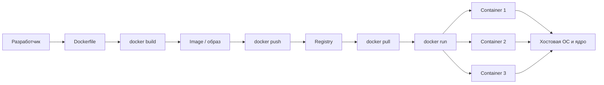
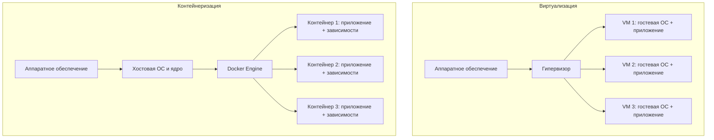

# 26. Функциональное назначение Docker. Контейнеризация и виртуализация

## Краткий ответ

**Docker** - это платформа и набор инструментов для разработки, упаковки, распространения и запуска приложений в виде **контейнеров**. Контейнер содержит приложение и его пользовательские зависимости, но использует ядро операционной системы хоста. За счет этого контейнеры обычно запускаются быстрее и требуют меньше ресурсов, чем полноценные виртуальные машины.

Главная идея Docker: приложение описывается как воспроизводимый артефакт - **image** (образ), запускается как **container** (контейнер), собирается по инструкции **Dockerfile** и распространяется через **registry**.

## Функциональное назначение Docker

Docker решает несколько практических задач программной инженерии.

1. **Упаковка приложения вместе с окружением.**  
   Приложение, библиотеки, системные пакеты, настройки запуска и переменные окружения описываются в образе. Это уменьшает проблему "у меня работает, а у тебя нет".

2. **Воспроизводимый запуск.**  
   Один и тот же образ можно запустить на рабочей станции разработчика, в тестовой среде, на сервере или в облаке. При корректной настройке результат запуска будет одинаковым.

3. **Изоляция процессов.**  
   Контейнеры изолируют процессы, файловую систему, сеть и часть ресурсов. Изоляция не равна полной виртуализации, но достаточна для большинства прикладных сервисов.

4. **Быстрая доставка и CI/CD.**  
   Docker удобно использовать в конвейерах сборки: собрать образ, прогнать тесты, отправить образ в registry, затем развернуть тот же артефакт в production.

5. **Масштабирование сервисов.**  
   Контейнер является удобной единицей запуска. Несколько экземпляров одного образа можно поднимать параллельно, балансировать между ними нагрузку и управлять ими через Docker Compose, Kubernetes, Nomad и другие системы.

6. **Упрощение локальной разработки.**  
   Разработчик может поднять базу данных, брокер сообщений, backend, frontend и вспомогательные сервисы одной командой через `docker compose up`.

## Основные понятия Docker

### Image

**Image** (образ) - неизменяемый шаблон для создания контейнеров. Он содержит файловую систему приложения, зависимости, настройки, метаданные и команду запуска.

Пример:

```bash
docker pull nginx:alpine
```

Здесь `nginx:alpine` - образ Nginx, основанный на компактном Linux-дистрибутиве Alpine.

Особенности образов:

- образ не запускается сам по себе, из него создается контейнер;
- образ состоит из слоев;
- слои кэшируются, поэтому повторная сборка часто выполняется быстрее;
- один образ может породить много контейнеров.

### Container

**Container** (контейнер) - запущенный экземпляр образа. Контейнер является процессом или группой процессов, изолированных средствами ОС.

Пример:

```bash
docker run --name web -p 8080:80 nginx:alpine
```

Команда создает и запускает контейнер `web`, пробрасывая порт `8080` хоста на порт `80` внутри контейнера.

Контейнер можно:

- запустить: `docker start`;
- остановить: `docker stop`;
- удалить: `docker rm`;
- посмотреть логи: `docker logs`;
- подключить к сети;
- подключить к volume для постоянного хранения данных.

### Dockerfile

**Dockerfile** - текстовый файл с инструкциями сборки образа.

Пример простого `Dockerfile` для Python-приложения:

```dockerfile
FROM python:3.12-slim

WORKDIR /app

COPY requirements.txt .
RUN pip install --no-cache-dir -r requirements.txt

COPY . .

EXPOSE 8000
CMD ["python", "app.py"]
```

Смысл основных инструкций:

| Инструкция | Назначение |
|---|---|
| `FROM` | задает базовый образ |
| `WORKDIR` | задает рабочий каталог внутри образа |
| `COPY` | копирует файлы из проекта в образ |
| `RUN` | выполняет команду на этапе сборки |
| `ENV` | задает переменную окружения |
| `EXPOSE` | документирует порт приложения |
| `USER` | задает пользователя, от имени которого будет работать приложение |
| `CMD` | задает команду запуска контейнера |

### Registry

**Registry** - хранилище Docker-образов. Самый известный публичный registry - **Docker Hub**, но в организациях часто используют частные registry: GitLab Container Registry, GitHub Container Registry, Harbor, Amazon ECR, Google Artifact Registry, Azure Container Registry.

Типичный цикл:

```bash
docker build -t registry.example.com/team/app:1.0.0 .
docker push registry.example.com/team/app:1.0.0
docker pull registry.example.com/team/app:1.0.0
docker run registry.example.com/team/app:1.0.0
```

## Общая схема работы Docker



Эта схема показывает, что Dockerfile используется для сборки образа, образ публикуется в registry, а затем на его основе запускаются один или несколько контейнеров.

## Контейнеризация

**Контейнеризация** - способ изолированного запуска приложений, при котором контейнеры разделяют ядро операционной системы хоста, но имеют собственное пользовательское окружение: процессы, файловую систему, сетевые настройки, переменные окружения и зависимости.

Контейнер обычно включает:

- приложение;
- runtime, например Node.js, Python, JVM или Go binary;
- библиотеки и системные зависимости;
- конфигурацию запуска;
- минимальную файловую систему.

Контейнер обычно не включает:

- отдельное ядро ОС;
- полноценную гостевую операционную систему;
- гипервизор внутри контейнера.

Изоляция контейнеров в Linux основана на механизмах ядра, например namespaces и cgroups:

- **namespaces** разделяют видимость процессов, сети, mount-точек, пользователей и других ресурсов;
- **cgroups** ограничивают и учитывают потребление CPU, памяти и других ресурсов.

## Виртуализация

**Виртуализация** - способ запуска нескольких изолированных виртуальных машин на одном физическом сервере. Каждая виртуальная машина имеет собственную гостевую операционную систему и собственное ядро. Между физическим оборудованием и виртуальными машинами обычно находится **гипервизор**.

Примеры гипервизоров и платформ:

- VMware ESXi;
- Microsoft Hyper-V;
- KVM/QEMU;
- VirtualBox;
- Xen.

Виртуальная машина ближе к отдельному компьютеру: у нее есть виртуальные CPU, память, диск, сеть и ОС. Поэтому VM тяжелее контейнера, но обеспечивает более сильную изоляцию и позволяет запускать разные ОС с разными ядрами на одном физическом хосте.

## Контейнеризация vs виртуализация

### Архитектурная схема



### Сравнение

| Критерий | Контейнеризация | Виртуализация |
|---|---|---|
| Единица запуска | Контейнер | Виртуальная машина |
| ОС | Используется ядро хоста | У каждой VM своя гостевая ОС |
| Размер | Обычно мегабайты или сотни мегабайт | Обычно гигабайты |
| Скорость запуска | Секунды или доли секунды | Обычно секунды или минуты |
| Изоляция | На уровне процессов и ядра хоста | На уровне виртуального оборудования и гостевой ОС |
| Накладные расходы | Ниже | Выше |
| Плотность размещения | Больше контейнеров на одном хосте | Меньше VM на одном хосте |
| Разные ядра ОС | Обычно нет | Да |
| Типичное применение | Микросервисы, CI/CD, dev/test, облачные приложения | Полная изоляция ОС, legacy-системы, разные ОС, инфраструктурная виртуализация |
| Управление | Docker, Docker Compose, Kubernetes | VMware, Hyper-V, KVM, облачные VM |

## Когда лучше использовать Docker

Docker особенно полезен, когда:

- приложение должно одинаково запускаться у разных разработчиков;
- нужно быстро поднимать тестовые окружения;
- сервисы имеют разные версии зависимостей;
- проект состоит из нескольких компонентов: backend, frontend, database, cache, queue;
- требуется автоматизировать CI/CD;
- нужно масштабировать stateless-сервисы;
- нужно быстро переносить приложение между серверами или облаками.

Пример локального окружения через Docker Compose:

```yaml
services:
  app:
    build: .
    ports:
      - "8080:8080"
    depends_on:
      - postgres

  postgres:
    image: postgres:16
    environment:
      POSTGRES_DB: app
      POSTGRES_USER: app
      POSTGRES_PASSWORD: secret
    volumes:
      - pgdata:/var/lib/postgresql/data

volumes:
  pgdata:
```

Такой файл позволяет поднять приложение и базу данных одной командой:

```bash
docker compose up
```

## Когда виртуальная машина лучше контейнера

Виртуальная машина предпочтительнее, когда:

- нужна полноценная гостевая ОС со своим ядром;
- требуется запуск другой ОС, например Windows-гостя на Linux-хосте;
- нужна максимально сильная инфраструктурная изоляция;
- приложение зависит от системных компонентов, которые сложно или невозможно контейнеризировать;
- нужно эмулировать целую машину для тестирования драйверов, системных служб или старого ПО;
- политика безопасности запрещает совместное использование ядра хоста.

## Примеры использования Docker

### 1. Веб-приложение

Backend на Python, Node.js или Java упаковывается в образ. В production запускается несколько контейнеров за балансировщиком.

```bash
docker build -t my-api:1.0 .
docker run -d --name api-1 -p 8080:8080 my-api:1.0
```

### 2. База данных для разработки

Разработчику не нужно устанавливать PostgreSQL локально:

```bash
docker run --name dev-postgres \
  -e POSTGRES_PASSWORD=secret \
  -p 5432:5432 \
  -d postgres:16
```

### 3. CI/CD

Pipeline может собирать образ, запускать тесты и публиковать версионированный артефакт:

```bash
docker build -t registry.example.com/app:${COMMIT_SHA} .
docker run --rm registry.example.com/app:${COMMIT_SHA} pytest
docker push registry.example.com/app:${COMMIT_SHA}
```

### 4. Микросервисная архитектура

Каждый сервис поставляется как отдельный образ: `users-service`, `billing-service`, `notification-service`. Это упрощает независимую сборку, тестирование и деплой.

### 5. Обучение и эксперименты

Docker удобен для запуска временных окружений:

```bash
docker run --rm -it ubuntu:24.04 bash
```

После выхода контейнер удаляется, не загрязняя основную систему.

## Преимущества Docker

- **Воспроизводимость.** Окружение описано в Dockerfile и может быть собрано повторно.
- **Переносимость.** Образ можно запускать на разных хостах с Docker-совместимой средой.
- **Быстрый запуск.** Контейнер стартует быстрее VM, потому что не загружает отдельную ОС.
- **Экономия ресурсов.** Нет отдельного ядра и полной гостевой ОС для каждого приложения.
- **Удобство разработки.** Зависимости проекта не конфликтуют с зависимостями хоста.
- **Простота доставки.** Registry выступает единым хранилищем версий приложения.
- **Масштабируемость.** Контейнеры легко размножать горизонтально.
- **Интеграция с DevOps.** Docker хорошо встраивается в CI/CD, Kubernetes и облачные платформы.

## Ограничения Docker

- **Не полная замена VM.** Контейнеры используют ядро хоста, поэтому они не дают той же степени изоляции, что VM.
- **Безопасность требует настройки.** Нельзя бездумно запускать контейнеры от `root`, давать `--privileged` или монтировать критичные каталоги хоста.
- **Состояние нужно проектировать отдельно.** Контейнеры часто пересоздаются, поэтому данные нужно хранить в volumes, внешних БД или объектных хранилищах.
- **Сетевые настройки могут быть нетривиальными.** Нужно понимать bridge-сети, проброс портов, DNS внутри Compose-сетей.
- **Образы могут быть слишком большими.** Неудачный Dockerfile приводит к гигабайтным образам и медленному деплою.
- **Не все приложения удобно контейнеризировать.** Особенно сложны старые монолитные системы, GUI-приложения, приложения с жесткой привязкой к ОС.
- **Docker Desktop на Windows и macOS использует виртуализацию.** Linux-контейнеры на этих системах обычно запускаются внутри вспомогательной Linux VM, хотя пользователь работает с ними через Docker.

## Типичные ошибки при работе с Docker

1. **Считать контейнер полноценной виртуальной машиной.**  
   Контейнер - это не VM. В нем обычно должен работать один основной процесс, а не вся система с `systemd`, SSH и множеством фоновых служб.

2. **Хранить данные внутри контейнера.**  
   Если контейнер удалить, его изменяемый слой тоже исчезнет. Для БД и файлов нужно использовать volumes или внешнее хранилище.

3. **Использовать тег `latest` в production.**  
   `latest` не гарантирует стабильную версию. Лучше указывать конкретные версии: `postgres:16.3`, `nginx:1.27-alpine`, `my-app:1.4.2`.

4. **Запускать контейнер от root без необходимости.**  
   Если приложение скомпрометировано, root внутри контейнера повышает риск. Лучше задавать непривилегированного пользователя через `USER`.

5. **Копировать в образ лишние файлы.**  
   Без `.dockerignore` в образ могут попасть `.git`, временные файлы, секреты, локальные зависимости и артефакты сборки.

6. **Вшивать секреты в образ.**  
   Пароли, токены и ключи нельзя записывать в Dockerfile или копировать в образ. Их нужно передавать через secrets, переменные окружения или защищенные хранилища.

7. **Плохо упорядочивать слои Dockerfile.**  
   Если сначала копировать весь проект, а потом устанавливать зависимости, кэш будет часто сбрасываться. Обычно сначала копируют файлы зависимостей, устанавливают пакеты, затем копируют код.

8. **Не ограничивать ресурсы.**  
   Контейнер без лимитов может занять слишком много памяти или CPU. В production следует задавать ограничения и мониторинг.

9. **Путать `EXPOSE` и публикацию порта.**  
   `EXPOSE` только документирует порт образа. Чтобы открыть порт наружу, нужен `-p`, например `-p 8080:80`.

10. **Считать контейнеры stateless по умолчанию, но проектировать приложение как stateful.**  
    Если сервис хранит состояние в локальной файловой системе контейнера, масштабирование и пересоздание контейнеров становятся проблемой.

## Мини-пример полного цикла

Файлы приложения:

```text
project/
  app.py
  requirements.txt
  Dockerfile
  .dockerignore
```

Dockerfile:

```dockerfile
FROM python:3.12-slim

WORKDIR /app
COPY requirements.txt .
RUN pip install --no-cache-dir -r requirements.txt

COPY app.py .

RUN useradd -r appuser
USER appuser

EXPOSE 8000
CMD ["python", "app.py"]
```

Сборка и запуск:

```bash
docker build -t demo-app:1.0 .
docker run --rm -p 8000:8000 demo-app:1.0
```

Публикация:

```bash
docker tag demo-app:1.0 registry.example.com/demo-app:1.0
docker push registry.example.com/demo-app:1.0
```

## Итог

Docker предназначен для стандартизированной упаковки, доставки и запуска приложений в контейнерах. Он делает окружение приложения воспроизводимым, ускоряет разработку и деплой, упрощает масштабирование и хорошо подходит для современных сервисных архитектур.

Контейнеризация и виртуализация решают похожую задачу изоляции, но делают это на разных уровнях. Виртуальная машина содержит полноценную гостевую ОС и обеспечивает более сильную изоляцию ценой больших накладных расходов. Контейнер использует ядро хоста, поэтому легче, быстрее и удобнее для массового запуска приложений, но требует внимательного отношения к безопасности, хранению данных и настройке окружения.

## Источники

- Docker Docs. **What is Docker?** https://docs.docker.com/engine/docker-overview/
- Docker Docs. **What is a container?** https://docs.docker.com/get-started/docker-concepts/the-basics/what-is-a-container/
- Docker Docs. **What is an image?** https://docs.docker.com/get-started/docker-concepts/the-basics/what-is-an-image/
- Docker Docs. **Dockerfile overview.** https://docs.docker.com/build/concepts/dockerfile/
- Docker Docs. **Writing a Dockerfile.** https://docs.docker.com/get-started/docker-concepts/building-images/writing-a-dockerfile/
- Docker Docs. **Build, tag, and publish an image.** https://docs.docker.com/get-started/docker-concepts/building-images/build-tag-and-publish-an-image/
- Docker Docs. **Container security FAQs.** https://docs.docker.com/security/faqs/containers/
