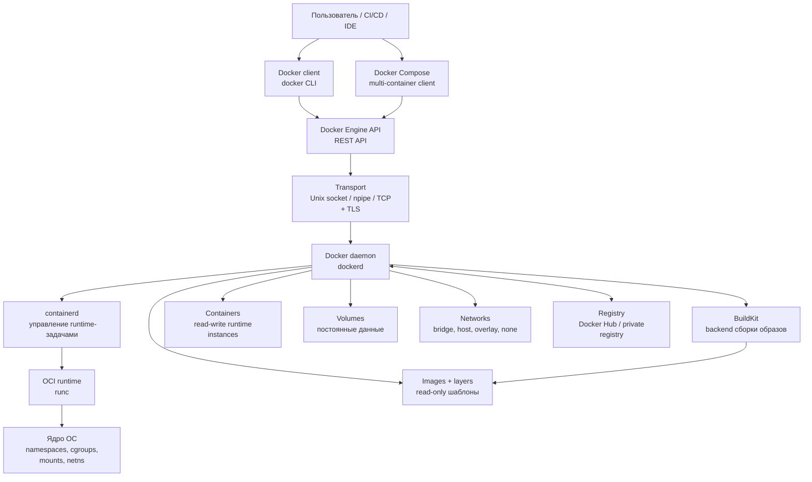
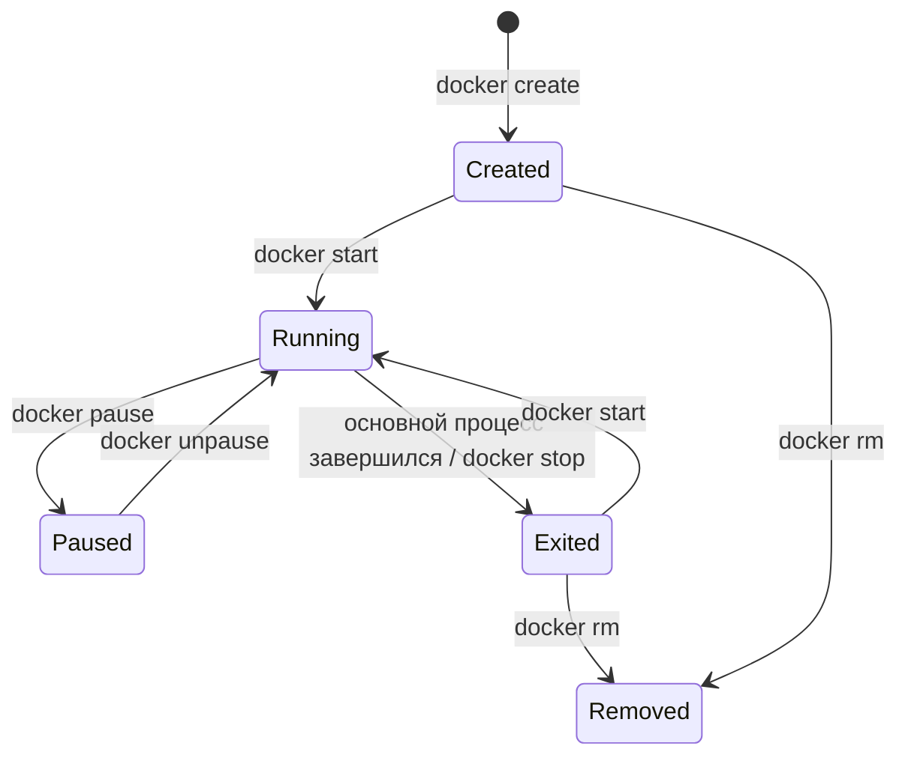
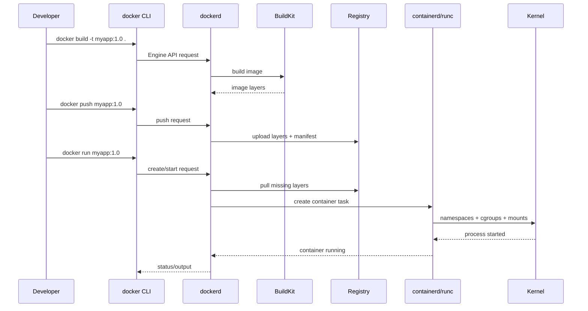

# 27. Архитектура платформы контейнеризации Docker

## Краткий ответ

**Docker** - это платформа контейнеризации, в которой приложение упаковывается в **image** (образ), запускается как **container** (контейнер), управляется через **Docker Engine**, а распространяется через **registry** (реестр образов).

Архитектурно Docker построен как **client-server система**:

- пользователь работает с клиентом `docker` или `docker compose`;
- клиент отправляет команды в **Docker daemon** (`dockerd`);
- daemon принимает запросы через **Docker Engine API**;
- связь обычно идет через Unix socket `/var/run/docker.sock`, named pipe на Windows или TCP-соединение;
- daemon управляет образами, контейнерами, сетями, томами, сборкой и взаимодействием с registry;
- для низкоуровневого запуска контейнеров daemon использует container runtime, обычно через `containerd` и OCI-runtime `runc`.

Главная идея архитектуры: Docker скрывает сложную работу с namespaces, cgroups, layered filesystem, сетевыми правилами и хранилищем за единым API и CLI.

---

## Общая схема архитектуры Docker



---

## Docker Engine

**Docker Engine** - центральная часть платформы Docker. Он отвечает за создание, запуск, остановку, удаление и инспекцию контейнеров, работу с образами, сетями, томами и registry.

В состав Docker Engine входят:

| Компонент | Назначение |
|---|---|
| **Docker daemon (`dockerd`)** | Серверная часть. Принимает API-запросы и управляет Docker-объектами. |
| **Docker client (`docker`)** | CLI-клиент. Преобразует команды пользователя в запросы к Docker API. |
| **Docker Engine API** | REST API, через который клиенты управляют daemon. |
| **containerd / runtime** | Низкоуровневый слой, который запускает контейнерные процессы. |
| **BuildKit** | Современный backend сборки образов. |

Важно: Docker Engine - не только команда `docker`. Команда `docker run nginx` является клиентским вызовом. Реальное создание контейнера выполняет daemon.

---

## Client-server архитектура

Docker использует архитектуру **клиент - сервер**.

### Docker client

**Docker client** - это основной интерфейс пользователя. Обычно это команда `docker`, например:

```bash
docker run -d --name web -p 8080:80 nginx:alpine
docker ps
docker logs web
docker stop web
```

Клиент сам не запускает контейнеры. Он:

1. разбирает аргументы командной строки;
2. формирует запрос к Docker Engine API;
3. отправляет запрос daemon;
4. получает ответ и показывает результат пользователю.

Один Docker client может работать с разными daemon через **Docker contexts** или переменную окружения `DOCKER_HOST`.

Пример подключения к удаленному daemon:

```bash
docker context create prod --docker "host=ssh://admin@example.com"
docker context use prod
docker ps
```

### Docker daemon

**Docker daemon** (`dockerd`) - постоянный серверный процесс. Он выполняет основную работу:

- слушает Docker Engine API;
- хранит и скачивает images;
- создает containers;
- управляет volumes и networks;
- применяет настройки ресурсов;
- взаимодействует с container runtime;
- выполняет сборки через BuildKit;
- отправляет и получает образы из registries.

Пример: команда

```bash
docker run hello-world
```

обычно приводит к цепочке:

1. клиент отправляет daemon запрос на создание контейнера из образа `hello-world`;
2. daemon проверяет, есть ли образ локально;
3. если образа нет, daemon скачивает его из registry;
4. daemon создает контейнерную файловую систему;
5. daemon настраивает сеть, mounts, environment, entrypoint;
6. через runtime запускается процесс контейнера;
7. клиент получает вывод.

---

## REST API, socket и транспорт

Docker Engine API - это REST API. Клиенты Docker взаимодействуют с daemon через API, а транспорт может быть разным:

| Транспорт | Где используется | Особенности |
|---|---|---|
| **Unix socket** `unix:///var/run/docker.sock` | Linux по умолчанию | Локальный IPC-сокет. Доступ к нему почти равен root-доступу к хосту. |
| **Named pipe** | Windows | Локальный канал для Docker Desktop / Windows Engine. |
| **TCP socket** | Удаленное управление | Требует TLS и контроля доступа. Открытый `tcp://0.0.0.0:2375` опасен. |
| **SSH context** | Администрирование удаленного хоста | Более безопасный и удобный вариант удаленной работы. |

Пример обращения к API через Unix socket:

```bash
curl --unix-socket /var/run/docker.sock http://localhost/containers/json
```

Пример опасной конфигурации:

```bash
dockerd -H tcp://0.0.0.0:2375
```

Почему опасно: любой, кто может обратиться к этому порту, фактически получает возможность создавать привилегированные контейнеры, монтировать файловую систему хоста и управлять Docker daemon. Если нужен TCP-доступ, используют TLS, firewall, VPN или SSH context.

---

## Images и layers

### Image

**Docker image** - read-only шаблон для создания контейнеров. Образ содержит:

- файловую систему приложения;
- зависимости и системные пакеты;
- метаданные;
- переменные окружения;
- рабочую директорию;
- команду запуска (`CMD` / `ENTRYPOINT`);
- информацию об открываемых портах и volumes.

Образ обычно строится по `Dockerfile`:

```dockerfile
FROM node:22-alpine
WORKDIR /app
COPY package*.json ./
RUN npm ci --omit=dev
COPY . .
CMD ["node", "server.js"]
```

### Layers

Docker image состоит из **слоев**. Каждая инструкция `RUN`, `COPY`, `ADD` обычно создает новый слой. Слои:

- неизменяемые;
- переиспользуются между образами;
- кешируются при сборке;
- хранятся как content-addressed данные;
- позволяют не скачивать и не пересобирать одинаковые части образа.

Пример:

```dockerfile
FROM ubuntu:24.04       # базовый слой
RUN apt-get update      # слой с изменениями после команды
RUN apt-get install -y nginx
COPY index.html /usr/share/nginx/html/index.html
```

Если меняется только `index.html`, Docker может переиспользовать слои с Ubuntu и nginx, а пересобрать только слой `COPY`.

### Writable layer контейнера

Когда запускается контейнер, Docker не изменяет сам image. Поверх read-only слоев образа создается тонкий **read-write слой контейнера**.

```text
container writable layer  <-- изменения во время выполнения
image layer: COPY app
image layer: install deps
image layer: base OS
```

Если контейнер удалить, его writable layer удаляется вместе с ним. Поэтому данные, которые должны пережить пересоздание контейнера, нужно хранить в volumes или bind mounts.

---

## Containers

**Container** - запущенный или созданный экземпляр image. Контейнер включает:

- процесс или группу процессов;
- собственное пространство имен процессов;
- изолированную файловую систему;
- сетевой namespace;
- настройки ресурсов через cgroups;
- environment variables;
- mounts;
- параметры запуска.

Контейнер не является маленькой виртуальной машиной. Обычно в нем запускается один основной процесс приложения, например `nginx`, `postgres`, `node server.js`.

Пример запуска:

```bash
docker run -d \
  --name web \
  -p 8080:80 \
  -v web-data:/usr/share/nginx/html \
  nginx:alpine
```

Что делает команда:

- `-d` запускает контейнер в фоне;
- `--name web` задает имя;
- `-p 8080:80` публикует порт контейнера `80` на порт хоста `8080`;
- `-v web-data:/usr/share/nginx/html` подключает volume;
- `nginx:alpine` указывает image.

Жизненный цикл контейнера:



---

## Registries

**Registry** - сервис хранения и распространения Docker images.

Примеры:

- Docker Hub;
- GitHub Container Registry;
- GitLab Container Registry;
- Harbor;
- private registry внутри компании.

Базовые операции:

```bash
docker pull nginx:alpine
docker tag myapp:1.0 registry.example.com/team/myapp:1.0
docker push registry.example.com/team/myapp:1.0
```

Образ идентифицируется именем, тегом и digest:

```text
nginx:alpine
postgres:16
registry.example.com/backend/api:2026.06.03
nginx@sha256:...
```

Тег удобен человеку, но может быть переиспользован. Digest фиксирует конкретное содержимое образа и лучше подходит для воспроизводимых production-развертываний.

---

## Volumes

Контейнерный writable layer недолговечен. Поэтому Docker использует отдельные механизмы хранения данных.

**Volume** - постоянное хранилище, создаваемое и управляемое Docker. Volumes применяют для баз данных, пользовательских файлов, кешей и других данных, которые должны сохраняться после удаления контейнера.

Пример:

```bash
docker volume create pg-data

docker run -d \
  --name postgres \
  -e POSTGRES_PASSWORD=secret \
  -v pg-data:/var/lib/postgresql/data \
  postgres:16
```

Виды подключений:

| Вид | Пример | Когда использовать |
|---|---|---|
| **Named volume** | `pg-data:/var/lib/postgresql/data` | Постоянные данные, которыми управляет Docker. |
| **Bind mount** | `./src:/app/src` | Локальная разработка, когда нужны файлы хоста. |
| **tmpfs mount** | `tmpfs:/tmp` | Временные данные в памяти. |

Типичная рекомендация: для production-данных использовать named volumes или внешние volume drivers, а bind mounts оставлять для разработки и специальных сценариев.

---

## Networks

Docker создает сетевую изоляцию и сетевое взаимодействие контейнеров через network drivers.

Основные drivers:

| Driver | Назначение |
|---|---|
| **bridge** | Сеть по умолчанию для контейнеров на одном Docker host. |
| **host** | Контейнер использует сеть хоста без сетевой изоляции. |
| **none** | Контейнер без сетевого доступа, кроме loopback. |
| **overlay** | Сеть между несколькими Docker hosts, часто в Swarm-сценариях. |
| **macvlan / ipvlan** | Контейнер получает адрес в физической сети и выглядит как отдельный узел. |

Пример пользовательской bridge-сети:

```bash
docker network create app-net

docker run -d --name db --network app-net postgres:16
docker run -d --name api --network app-net -p 8080:8080 my-api:latest
```

В пользовательской сети контейнеры могут обращаться друг к другу по именам:

```text
api -> db:5432
```

Важное отличие:

- `EXPOSE 8080` в Dockerfile документирует порт внутри образа;
- `-p 8080:8080` реально публикует порт на хосте.

---

## BuildKit

**BuildKit** - современный backend сборки Docker images. Он заменяет старый builder и улучшает:

- скорость сборки;
- параллельное выполнение независимых стадий;
- работу с кешем;
- передачу build context;
- multi-stage builds;
- секреты и SSH mounts во время сборки;
- экспорт кеша в registry или локальное хранилище.

Пример multi-stage Dockerfile:

```dockerfile
FROM golang:1.23-alpine AS build
WORKDIR /src
COPY go.mod go.sum ./
RUN go mod download
COPY . .
RUN go build -o /out/app ./cmd/app

FROM alpine:3.20
COPY --from=build /out/app /usr/local/bin/app
CMD ["app"]
```

Архитектурно BuildKit важен потому, что сборка образа - это не просто последовательное выполнение строк Dockerfile. BuildKit строит граф зависимостей, кеширует операции и пропускает ненужные стадии.

Пример сборки:

```bash
docker build -t my-api:1.0 .
docker buildx build --platform linux/amd64,linux/arm64 -t registry.example.com/my-api:1.0 --push .
```

---

## Docker Compose

**Docker Compose** - клиентский инструмент для описания и запуска multi-container приложений. Compose не заменяет Docker Engine: он читает `compose.yaml` и отправляет команды в тот же Docker daemon через Docker API.

Пример:

```yaml
services:
  api:
    build: .
    ports:
      - "8080:8080"
    environment:
      DB_HOST: db
    depends_on:
      - db

  db:
    image: postgres:16
    environment:
      POSTGRES_PASSWORD: secret
    volumes:
      - pg-data:/var/lib/postgresql/data

volumes:
  pg-data:
```

Запуск:

```bash
docker compose up -d
docker compose ps
docker compose logs api
docker compose down
```

Compose удобен для:

- локальной разработки;
- интеграционных тестов;
- демо-окружений;
- простых deployment-сценариев;
- описания сервисов, сетей и volumes в одном YAML-файле.

Но Compose - не полноценный оркестратор уровня Kubernetes. Он не решает сам по себе сложные задачи autoscaling, self-healing кластера, rolling updates на множестве узлов и service mesh.

---

## Как Docker запускает контейнер на уровне ОС

Docker использует возможности ядра Linux и совместимые runtime-механизмы.

Ключевые технологии:

| Технология | Роль |
|---|---|
| **namespaces** | Изолируют процессы, сеть, mount points, hostname, пользователей и IPC. |
| **cgroups** | Ограничивают и учитывают CPU, RAM, PIDs, I/O. |
| **union filesystem / storage driver** | Позволяет собирать файловую систему контейнера из слоев. |
| **capabilities** | Ограничивают root-права внутри контейнера. |
| **seccomp / AppArmor / SELinux** | Дополнительные политики безопасности. |
| **containerd + runc** | Низкоуровневый запуск и сопровождение контейнерных процессов. |

Пример ограничения ресурсов:

```bash
docker run -d \
  --name api \
  --memory 512m \
  --cpus 1.5 \
  my-api:latest
```

Контейнер может быть root внутри своего namespace, но это не должно восприниматься как абсолютная безопасность. Ошибки в конфигурации, privileged-режим, доступ к Docker socket и небезопасные capabilities могут привести к компрометации хоста.

---

## Сквозной пример: от Dockerfile до running container

1. Разработчик пишет `Dockerfile`.
2. Команда `docker build -t myapp:1.0 .` отправляет build context в daemon / BuildKit.
3. BuildKit строит image из слоев.
4. Image сохраняется локально.
5. Команда `docker push registry.example.com/myapp:1.0` отправляет image в registry.
6. На сервере команда `docker pull registry.example.com/myapp:1.0` скачивает image.
7. Команда `docker run` создает контейнер из image.
8. Daemon настраивает filesystem, сеть, volumes, limits.
9. containerd/runc запускают основной процесс.
10. Приложение работает как изолированный процесс на ядре хоста.



---

## Типичные ошибки и заблуждения

### 1. "Контейнер - это виртуальная машина"

Контейнер не содержит собственного полноценного ядра ОС. Он использует ядро хоста и изолирует процессы средствами ОС. Поэтому контейнер легче VM, но не является полной заменой VM по модели безопасности.

### 2. "Если контейнер удален, данные останутся"

Данные в writable layer контейнера исчезают после удаления контейнера. Для постоянных данных нужны volumes:

```bash
docker run -v pg-data:/var/lib/postgresql/data postgres:16
```

### 3. "Можно открыть Docker socket в контейнер без риска"

Монтирование Docker socket:

```bash
-v /var/run/docker.sock:/var/run/docker.sock
```

дает контейнеру возможность управлять daemon. Это фактически доступ к хосту. Такой подход допустим только при ясной модели доверия.

### 4. "Тег latest означает последнюю стабильную версию"

`latest` - просто тег. Он не гарантирует свежесть, стабильность или совместимость. Для production лучше фиксировать версии:

```bash
postgres:16.4
nginx:1.27-alpine
```

или digest:

```bash
nginx@sha256:...
```

### 5. "EXPOSE публикует порт наружу"

`EXPOSE` только описывает порт в metadata образа. Для публикации нужен `-p`:

```bash
docker run -p 8080:80 nginx
```

### 6. "В контейнер можно складывать логи и состояние"

Контейнер лучше считать одноразовой runtime-единицей. Логи следует отдавать в stdout/stderr или logging driver, а состояние хранить во внешнем хранилище или volume.

### 7. "Compose гарантирует готовность зависимостей"

`depends_on` задает порядок старта, но приложение все равно должно уметь ждать готовности базы данных, брокера или другого сервиса. Для этого используют healthchecks, retry-логику и корректную обработку ошибок подключения.

### 8. "Открытый daemon TCP API удобен для администрирования"

Открытый Docker API без TLS и авторизации опасен. Через него можно запустить контейнер с монтированием `/` хоста и получить полный контроль над системой.

---

## Что важно сказать на экзамене

Короткая формулировка:

> Docker имеет client-server архитектуру. Пользовательский клиент `docker` или `docker compose` обращается к Docker daemon через Docker Engine REST API, обычно через Unix socket. Daemon управляет объектами Docker: images, containers, volumes, networks и registries. Образы состоят из неизменяемых слоев, контейнер является запускаемым экземпляром образа с собственным writable layer. Для постоянных данных используются volumes, для взаимодействия контейнеров - Docker networks. Сборка образов выполняется современным backend BuildKit, а Compose описывает multi-container приложение и также работает через Docker Engine API.

---

## Вывод

Архитектура Docker разделяет пользовательский интерфейс, управляющий daemon, API, runtime-слой и объекты контейнерной платформы. Такое разделение делает Docker удобным для локальной разработки, CI/CD и эксплуатации: один и тот же image можно собрать, сохранить в registry и запустить в разных окружениях. При этом Docker не отменяет инженерные вопросы безопасности, хранения данных и сетевой конфигурации: Docker socket, volumes, exposed ports, root-права и теги образов нужно настраивать осознанно.

---

## Источники

1. Docker Docs. **What is Docker? Docker architecture** - https://docs.docker.com/get-started/docker-overview/
2. Docker Docs. **Docker Engine API** - https://docs.docker.com/reference/api/engine/
3. Docker Docs. **dockerd CLI reference** - https://docs.docker.com/reference/cli/dockerd/
4. Docker Docs. **Volumes** - https://docs.docker.com/engine/storage/volumes/
5. Docker Docs. **Network drivers** - https://docs.docker.com/engine/network/drivers/
6. Docker Docs. **BuildKit** - https://docs.docker.com/build/buildkit/
7. Docker Docs. **Docker Compose** - https://docs.docker.com/compose/
8. Open Container Initiative. **Runtime Specification** - https://github.com/opencontainers/runtime-spec
