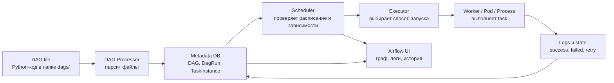
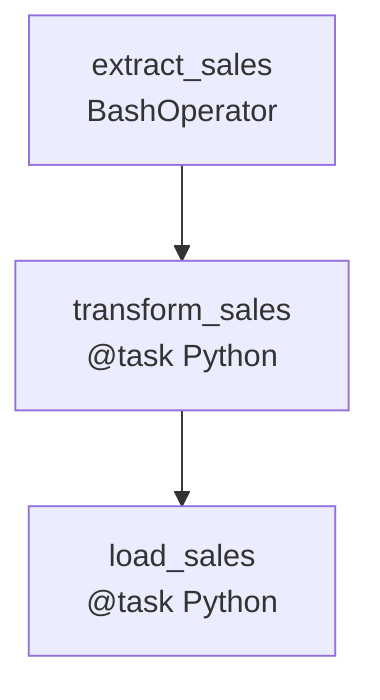
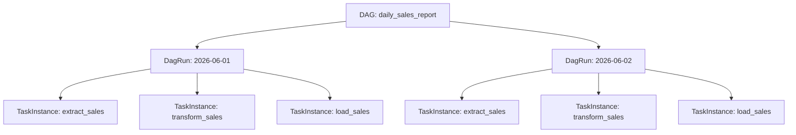
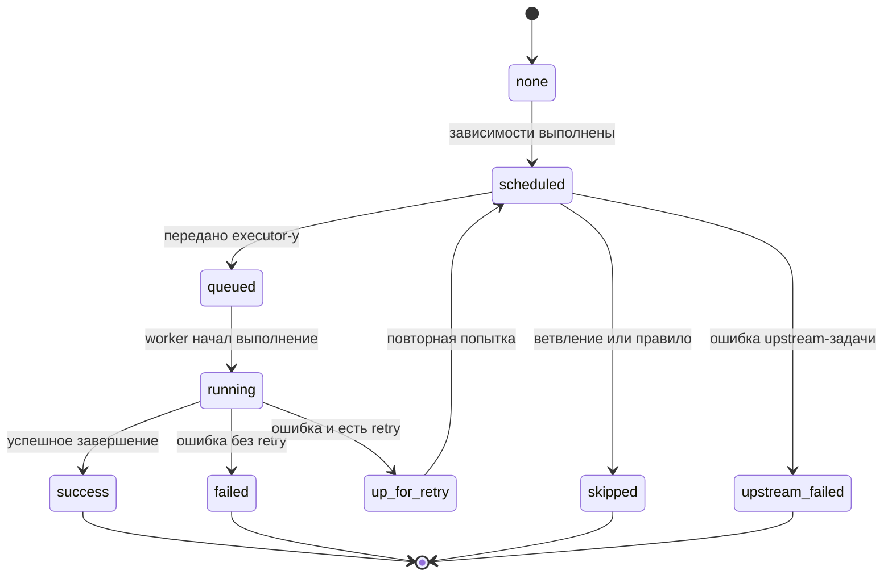

# 28. Назначение Apache Airflow. Понятие DAG файла, задачи (task), операторов

## Краткий ответ

**Apache Airflow** - это платформа для программного описания, планирования, запуска и мониторинга рабочих процессов. В Airflow рабочий процесс описывается как **DAG**: направленный ациклический граф задач, где вершины - это отдельные работы, а ребра - зависимости между ними.

Главная идея Airflow: pipeline хранится не как набор ручных инструкций, а как код на Python. Такой код можно версионировать, тестировать, переиспользовать, запускать по расписанию, отслеживать через веб-интерфейс и масштабировать через разные исполнители.

Типичный пример применения Airflow - ETL/ELT-конвейер:

1. забрать данные из API или базы;
2. обработать и проверить данные;
3. загрузить результат в хранилище;
4. отправить уведомление;
5. показать состояние выполнения в UI.

---

## Назначение Apache Airflow

Airflow нужен не для выполнения одной отдельной команды, а для **оркестрации** набора связанных действий. Оркестрация означает управление порядком, условиями, расписанием, повторными попытками, логами и состояниями задач.

Airflow решает несколько практических задач.

1. **Планирование запусков.**  
   DAG можно запускать по расписанию: каждый час, каждый день, по cron-выражению, по набору датасетов или вручную.

2. **Управление зависимостями.**  
   Можно явно указать, что задача `load_to_dwh` должна стартовать только после успешного завершения `extract` и `transform`.

3. **Повторяемость и контроль.**  
   Каждый запуск DAG фиксируется как отдельный `DagRun`, а каждая задача внутри запуска - как `TaskInstance` со своим состоянием, логами и временем выполнения.

4. **Автоматические повторы и отказоустойчивость.**  
   Для задач можно задать `retries`, `retry_delay`, `execution_timeout`, правила срабатывания и обработчики ошибок.

5. **Наблюдаемость.**  
   Airflow UI показывает граф задач, историю запусков, логи, длительность, статусы, пропущенные и упавшие задачи.

6. **Интеграция с внешними системами.**  
   Через операторы и провайдеры Airflow работает с Bash, Python, SQL, HTTP, Docker, Kubernetes, S3, BigQuery, Spark, Slack, почтой и другими сервисами.

7. **Масштабирование выполнения.**  
   Executor определяет, где и как физически выполнять задачи: локально, на workers, в Kubernetes-подах и т.д.

Airflow особенно полезен там, где есть регулярные, зависимые и наблюдаемые процессы: загрузка данных, ML-pipelines, отчеты, синхронизации, регламентные операции, обработка файлов, проверки качества данных.

---

## Основные понятия

### DAG

**DAG** расшифровывается как **Directed Acyclic Graph** - направленный ациклический граф.

- **Directed** - у зависимостей есть направление: `extract -> transform -> load`.
- **Acyclic** - в графе не должно быть циклов: задача не может прямо или косвенно зависеть сама от себя.
- **Graph** - workflow представлен вершинами и ребрами.

В Airflow DAG - это модель workflow. Он описывает:

- какие задачи входят в процесс;
- в каком порядке они должны выполняться;
- когда запускать процесс;
- сколько раз повторять задачи при ошибках;
- какие ограничения, теги, владельцы, параметры и уведомления использовать.

Важно: сам DAG обычно не выполняет бизнес-логику. Он описывает структуру и правила выполнения. Бизнес-логика находится в задачах, скриптах, SQL-запросах, Python-функциях или внешних сервисах.

### DAG file

**DAG file** - это Python-файл, лежащий в папке DAG-ов Airflow, обычно в директории `dags/`. Scheduler и DAG Processor периодически читают такие файлы, импортируют Python-код и ищут в нем объявленные DAG-и.

Пример имени файла:

```text
dags/daily_sales_report.py
```

Внутри DAG-файла обычно находятся:

- импорты Airflow и операторов;
- аргументы по умолчанию;
- объявление объекта `DAG` или функция с декоратором `@dag`;
- создание задач;
- описание зависимостей между задачами.

DAG-файл должен быстро импортироваться. Если на верхнем уровне файла выполнять тяжелые запросы в БД, обращаться к API или читать большие файлы, это будет замедлять парсинг и мешать scheduler-у.

### Task

**Task** - базовая единица выполнения в Airflow. Это конкретный шаг внутри DAG.

Примеры задач:

- скачать файл;
- выполнить SQL-запрос;
- запустить Python-функцию;
- вызвать HTTP endpoint;
- дождаться появления файла;
- отправить уведомление.

Когда DAG запускается, каждая задача превращается в **TaskInstance** - экземпляр задачи для конкретного запуска и конкретного интервала данных. Например, задача `load_sales` может существовать как описание в DAG, а `load_sales` за 2026-06-01 - это уже конкретный экземпляр выполнения.

Основные состояния `TaskInstance`:

- `none` - задача еще не поставлена в очередь;
- `scheduled` - scheduler решил, что зависимость выполнена и задачу пора запускать;
- `queued` - задача передана executor-у и ожидает worker;
- `running` - задача выполняется;
- `success` - задача завершилась успешно;
- `failed` - задача завершилась ошибкой;
- `up_for_retry` - задача упала, но будет повторена;
- `skipped` - задача пропущена из-за ветвления или правила выполнения;
- `upstream_failed` - выше по графу была ошибка, поэтому задача не стартовала.

### Operator

**Operator** - это шаблон задачи, то есть готовый класс, который знает, как выполнить определенный тип работы. Когда оператор создается внутри DAG-файла, он становится задачей.

Примеры операторов:

- `BashOperator` - выполняет shell-команду;
- `PythonOperator` или `@task` - выполняет Python-код;
- `SQLExecuteQueryOperator` - выполняет SQL;
- `HttpOperator` - вызывает HTTP API;
- `DockerOperator` - запускает команду в контейнере;
- `KubernetesPodOperator` - запускает задачу в Kubernetes-поде;
- `EmailOperator` - отправляет письмо;
- sensors - специальные операторы, которые ждут внешнее событие.

Разница между task и operator:

- **operator** - класс или шаблон, описывающий способ выполнения;
- **task** - конкретный шаг workflow, созданный из оператора или декоратора `@task`.

Например, `BashOperator` - тип оператора, а `extract_sales` - конкретная задача на его основе.

---

## Зависимости между задачами

Зависимости определяют порядок выполнения задач. В Airflow обычно используют операторы `>>` и `<<`.

```python
extract >> transform >> load
```

Это означает:

```text
extract сначала, затем transform, затем load
```

Можно задавать разветвления:

```python
extract >> [validate, transform]
validate >> load
transform >> load
```

Здесь `validate` и `transform` могут выполняться после `extract`, а `load` начнется только после выполнения нужных upstream-задач, если не изменены правила срабатывания.

Термины:

- **upstream task** - задача выше по графу, от которой зависит текущая;
- **downstream task** - задача ниже по графу, которая зависит от текущей;
- **dependency** - связь между задачами;
- **trigger rule** - правило, по которому задача считается готовой к запуску, например после успеха всех upstream-задач или после успеха хотя бы одной.

По умолчанию задача запускается, когда все ее непосредственные upstream-задачи завершились успешно.

---

## Scheduler, executor, workers и metadata database

Airflow состоит из нескольких ключевых компонентов.

### Scheduler

**Scheduler** - компонент, который отвечает за планирование. Он:

- читает и парсит DAG-файлы;
- определяет, какие DAG-и должны быть запущены по расписанию;
- создает `DagRun`;
- проверяет зависимости задач;
- переводит задачи в состояние `scheduled`;
- передает готовые задачи executor-у.

Scheduler сам не обязательно выполняет всю пользовательскую работу. Его основная функция - принять решение, что и когда должно быть запущено.

### Executor

**Executor** - механизм, через который Airflow запускает экземпляры задач. Он получает задачу от scheduler-а и организует ее фактическое выполнение.

Примеры executor-ов:

- `LocalExecutor` - выполняет задачи локально, подходит для небольших установок;
- `CeleryExecutor` - отправляет задачи в очередь, workers забирают их и выполняют;
- `KubernetesExecutor` - запускает каждую задачу в отдельном Kubernetes-поде;
- гибридные и пользовательские executor-ы - для специальных сценариев.

Executor выбирают в зависимости от масштаба, инфраструктуры и требований к изоляции.

### Worker

**Worker** - процесс или контейнер, который реально выполняет код задачи. При `CeleryExecutor` это Celery worker, при `KubernetesExecutor` - pod, при локальном выполнении - процесс на той же машине.

### Metadata database

**Metadata database** хранит служебное состояние Airflow:

- DAG-и и их параметры;
- запуски DAG-ов;
- состояния задач;
- логи метаданных;
- connections, variables, pools;
- расписания и историю выполнения.

Без metadata database Airflow не сможет отслеживать, что уже запускалось, что упало и что нужно запустить дальше.

---

## Веб-интерфейс Airflow

**Airflow UI** - веб-интерфейс для наблюдения и управления workflow.

Через UI можно:

- увидеть список DAG-ов;
- включать и выключать DAG-и;
- запускать DAG вручную;
- смотреть граф задач;
- анализировать историю запусков;
- читать логи конкретной task instance;
- повторно запускать упавшие задачи;
- смотреть длительность задач и узкие места;
- управлять variables, connections, pools и permissions, если это разрешено правами.

UI особенно важен в эксплуатации: он позволяет быстро понять, где именно остановился pipeline и почему.

---

## Схема архитектуры и выполнения



Упрощенный цикл работы:

1. Разработчик кладет Python-файл с DAG в папку `dags/`.
2. Airflow парсит файл и регистрирует DAG.
3. Scheduler проверяет расписание и создает `DagRun`.
4. Scheduler определяет задачи, зависимости которых выполнены.
5. Executor передает задачи на выполнение.
6. Worker выполняет код задачи.
7. Результат, статус и логи сохраняются и отображаются в UI.

---

## Пример DAG-кода

Ниже пример современного DAG для ежедневного отчета. Он показывает DAG-файл, задачи, операторы, зависимости и использование шаблонной переменной `{{ ds }}`.

```python
import datetime as dt

from airflow.sdk import DAG, task
from airflow.providers.standard.operators.bash import BashOperator


with DAG(
    dag_id="daily_sales_report",
    description="Daily ETL pipeline for sales report",
    start_date=dt.datetime(2026, 1, 1),
    schedule="@daily",
    catchup=False,
    tags=["sales", "etl"],
    default_args={
        "retries": 2,
        "retry_delay": dt.timedelta(minutes=5),
    },
) as dag:
    extract = BashOperator(
        task_id="extract_sales",
        bash_command="python /opt/airflow/jobs/extract_sales.py --date {{ ds }}",
    )

    @task(task_id="transform_sales")
    def transform_sales() -> int:
        # В реальном pipeline здесь могла бы быть обработка данных.
        rows_processed = 1250
        return rows_processed

    @task(task_id="load_sales")
    def load_sales(rows_count: int) -> None:
        print(f"Loaded {rows_count} rows to the warehouse")

    transformed_rows = transform_sales()
    loaded = load_sales(transformed_rows)

    extract >> transformed_rows >> loaded
```

Что здесь происходит:

- `with DAG(...) as dag` объявляет workflow;
- `dag_id="daily_sales_report"` задает уникальный идентификатор DAG;
- `schedule="@daily"` задает ежедневный запуск;
- `catchup=False` запрещает автоматический догон всех пропущенных интервалов с `start_date`;
- `BashOperator` создает задачу `extract_sales`;
- декоратор `@task` создает Python-задачи `transform_sales` и `load_sales`;
- `{{ ds }}` - Jinja-шаблон Airflow, обычно дата логического интервала в формате `YYYY-MM-DD`;
- `extract >> transformed_rows >> loaded` задает порядок выполнения.

Схема этого DAG:



---

## Как Airflow воспринимает DAG-файл

DAG-файл - это не просто конфигурация, а исполняемый Python-код. Airflow импортирует файл и получает из него объекты DAG.

Из этого следуют важные правила:

- код верхнего уровня должен быть быстрым;
- нельзя выполнять тяжелую бизнес-логику при импорте файла;
- задача должна выполнять работу во время task execution, а не во время parsing;
- идентификаторы `dag_id` и `task_id` должны быть стабильными;
- DAG должен быть детерминированным: при каждом парсинге структура графа должна быть предсказуемой.

Плохой пример:

```python
# Плохо: запрос выполняется при каждом парсинге DAG-файла
rows = database.query("select * from huge_table")
```

Хороший подход:

```python
@task
def read_rows():
    return database.query("select * from huge_table")
```

Во втором случае работа выполняется как задача Airflow, а не как побочный эффект импорта DAG-файла.

---

## DAG Run, Task Instance и интервал данных

При каждом запуске DAG создается **DagRun**. Это конкретный запуск workflow.

Например, DAG `daily_sales_report` может иметь запуски:

- `daily_sales_report` за 2026-06-01;
- `daily_sales_report` за 2026-06-02;
- `daily_sales_report` за 2026-06-03.

Внутри каждого `DagRun` для каждой задачи создается своя **TaskInstance**.



Это важно: описание задачи одно, но экземпляров выполнения может быть много, потому что DAG запускается много раз.

---

## Операторы, хуки, провайдеры и sensors

В Airflow есть несколько связанных понятий.

**Operator** описывает действие: выполнить Bash, Python, SQL, HTTP-запрос, контейнер и т.д.

**Hook** инкапсулирует подключение к внешней системе: базе данных, облаку, API, хранилищу. Операторы часто используют hooks внутри себя.

**Provider package** - пакет интеграции с конкретной платформой или технологией. Например, провайдеры для Amazon, Google, Microsoft, Snowflake, Docker, Kubernetes.

**Sensor** - разновидность оператора, которая ждет событие:

- появления файла;
- доступности API;
- завершения внешней задачи;
- появления записи или данных.

Sensors полезны, но ими легко перегрузить систему, если они часто проверяют условие и долго занимают worker. Для долгого ожидания лучше использовать `reschedule` mode или deferrable operators, если они доступны.

---

## Типичные ошибки при работе с Airflow

1. **Путать Airflow с системой обработки данных.**  
   Airflow оркестрирует процесс, но не заменяет Spark, Flink, базу данных или приложение обработки. Тяжелые вычисления обычно лучше выполнять во внешнем движке, а Airflow использовать для запуска и контроля.

2. **Выполнять тяжелую работу на уровне импорта DAG-файла.**  
   Запросы к БД, API-вызовы и чтение больших файлов на верхнем уровне замедляют scheduler и могут ломать парсинг.

3. **Использовать `datetime.now()` как `start_date`.**  
   `start_date` должен быть стабильным. Динамический `start_date` может привести к тому, что DAG никогда нормально не стартует или будет вести себя непредсказуемо.

4. **Не понимать `catchup`.**  
   Если `catchup=True`, Airflow может создать много запусков за прошлые интервалы. Это полезно для исторической загрузки, но опасно, если pipeline не рассчитан на массовый backfill.

5. **Передавать большие данные через XCom.**  
   XCom предназначен для небольших метаданных, идентификаторов, путей и параметров. Большие таблицы, датафреймы и файлы лучше хранить во внешнем хранилище.

6. **Делать задачи неидемпотентными.**  
   Задача может перезапускаться из-за retry или ручного rerun. Если повторный запуск дублирует данные или ломает состояние, pipeline становится ненадежным.

7. **Создавать циклы зависимостей.**  
   DAG не может содержать цикл. Конструкция вида `a >> b >> c >> a` невозможна.

8. **Менять `task_id` без учета истории.**  
   Airflow воспринимает новый `task_id` как новую задачу. История старой задачи останется отдельно, а старые task instances могут стать `removed`.

9. **Писать слишком много бизнес-логики прямо в DAG.**  
   DAG-файл должен быть читаемым описанием процесса. Сложную логику лучше выносить в отдельные модули, скрипты или сервисы.

10. **Игнорировать ограничения параллелизма.**  
    Без настройки pools, concurrency, `max_active_runs` и лимитов можно перегрузить базу, API или workers.

11. **Неправильно выбирать executor.**  
    Для локального учебного стенда достаточно локального executor-а, но для production с большим числом задач часто нужны Celery, Kubernetes или другой удаленный вариант.

12. **Не смотреть логи task instance.**  
    Ошибка DAG-а и ошибка конкретной задачи - разные вещи. Для диагностики обычно нужно открыть логи именно упавшей task instance.

13. **Путать логическую дату с фактическим временем запуска.**  
    Airflow работает с интервалами данных. DAG, который обрабатывает данные за 2026-06-01, может физически запуститься позже.

---

## Сравнение ключевых терминов

| Термин | Что означает | Пример |
|---|---|---|
| DAG | Описание workflow и зависимостей | `daily_sales_report` |
| DAG file | Python-файл, где объявлен DAG | `dags/daily_sales_report.py` |
| Task | Конкретный шаг в DAG | `extract_sales` |
| Operator | Шаблон задачи, способ выполнения | `BashOperator`, `SQLExecuteQueryOperator` |
| Sensor | Оператор ожидания события | ожидание файла в S3 |
| DagRun | Конкретный запуск DAG | запуск за 2026-06-01 |
| TaskInstance | Конкретное выполнение задачи в конкретном DagRun | `extract_sales` за 2026-06-01 |
| Scheduler | Планирует DAG-и и задачи | решает, что пора запускать |
| Executor | Запускает задачи выбранным способом | `LocalExecutor`, `KubernetesExecutor` |
| Worker | Фактически выполняет task | Celery worker, Kubernetes pod |
| UI | Веб-интерфейс контроля | граф, логи, история |

---

## Короткая схема жизненного цикла задачи



---

## Вывод

Apache Airflow - это инструмент оркестрации workflow. Его назначение состоит в том, чтобы описывать сложные процессы как код, запускать их по расписанию, соблюдать зависимости между шагами, контролировать повторы и показывать состояние выполнения.

Ключевая сущность Airflow - **DAG**, то есть направленный ациклический граф задач. **DAG file** - Python-файл, в котором этот граф объявляется. **Task** - отдельная единица работы внутри DAG. **Operator** - шаблон, из которого создается task и который определяет способ выполнения: Bash, Python, SQL, HTTP, контейнер, sensor и т.д.

Scheduler определяет, какие задачи готовы к запуску, executor организует их выполнение, workers выполняют работу, metadata database хранит состояние, а UI дает прозрачность и управление. Поэтому Airflow особенно ценен в data engineering, интеграционных процессах, отчетности и любых регулярных pipelines, где важны порядок, повторяемость и наблюдаемость.

---

## Источники

1. Apache Airflow Documentation: Dags - <https://airflow.apache.org/docs/apache-airflow/stable/core-concepts/dags.html>
2. Apache Airflow Documentation: Tasks - <https://airflow.apache.org/docs/apache-airflow/stable/core-concepts/tasks.html>
3. Apache Airflow Documentation: Operators - <https://airflow.apache.org/docs/apache-airflow/stable/core-concepts/operators.html>
4. Apache Airflow Documentation: Executor - <https://airflow.apache.org/docs/apache-airflow/stable/core-concepts/executor/index.html>
5. Apache Airflow Documentation: Scheduler - <https://airflow.apache.org/docs/apache-airflow/stable/administration-and-deployment/scheduler.html>
6. Apache Airflow Documentation: UI Overview - <https://airflow.apache.org/docs/apache-airflow/stable/ui.html>
7. Apache Airflow Documentation: Best Practices - <https://airflow.apache.org/docs/apache-airflow/stable/best-practices.html>
