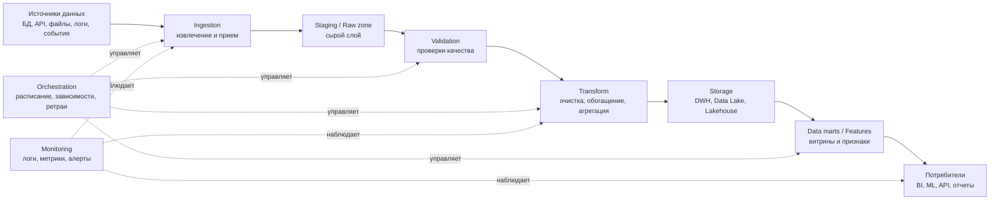
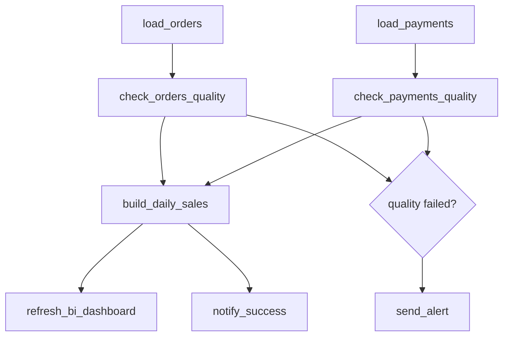
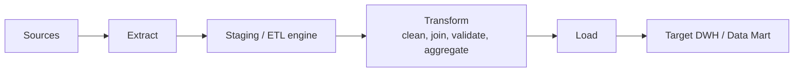
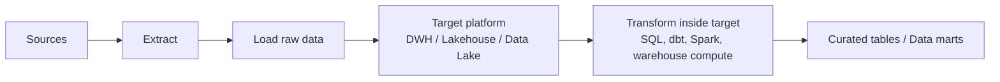
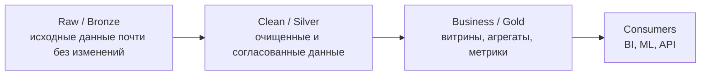

# 29. Конвейер обработки данных. ETL и ELT

## Краткий ответ

**Конвейер обработки данных** (*data pipeline*) - это организованная последовательность шагов, по которой данные проходят от источников к потребителям: извлекаются, передаются, очищаются, преобразуются, проверяются, сохраняются и становятся доступными для отчетности, аналитики, машинного обучения или операционных сервисов.

Главная идея конвейера - сделать обработку данных **повторяемой, управляемой и наблюдаемой**. Вместо ручного переноса файлов или разовых SQL-запросов строится процесс, который можно запускать по расписанию, по событию или непрерывно, контролировать его ошибки, качество данных, задержки и результат.

Типичный пример: интернет-магазин собирает заказы, платежи, клики пользователей и остатки на складе, затем каждый час или в реальном времени загружает эти данные в хранилище, очищает их, связывает между собой и строит витрины для отчетов: выручка, конверсия, средний чек, популярные товары.

## Назначение data pipeline

Конвейер нужен не просто для "переложить данные из A в B". Его назначение шире:

- **Интеграция источников**: объединить данные из баз данных, API, логов, файлов, очередей сообщений, CRM/ERP-систем.
- **Подготовка данных**: привести данные к нужному формату, удалить дубликаты, исправить типы, нормализовать справочники, обработать пропуски.
- **Доставка потребителям**: передать результат в DWH, data lake, BI-систему, ML-платформу, поисковый индекс или операционную БД.
- **Автоматизация**: запускать обработку регулярно или по событию без ручного вмешательства.
- **Контроль качества**: проверять полноту, свежесть, уникальность, соответствие схеме и бизнес-правилам.
- **Воспроизводимость**: понимать, как получился конкретный отчет или признак ML-модели.
- **Масштабирование**: обрабатывать растущие объемы данных, не переписывая весь процесс вручную.
- **Наблюдаемость**: видеть, где произошла ошибка, сколько времени занял этап, какие данные были обработаны.

Если говорить формально, data pipeline описывает **поток данных и зависимостей**: какие данные нужны, какие шаги над ними выполняются, в каком порядке, где хранится промежуточный и конечный результат, как обрабатываются сбои.

## Типовая структура конвейера

### 1. Источники данных

Источники могут быть разными:

- транзакционные БД: PostgreSQL, MySQL, Oracle, MS SQL Server;
- API внешних сервисов: платежные шлюзы, рекламные кабинеты, CRM;
- файлы: CSV, JSON, Parquet, Excel;
- логи приложений и веб-серверов;
- потоки событий: Kafka, RabbitMQ, Pulsar;
- IoT-датчики и телеметрия;
- ручные справочники и мастер-данные.

Чем больше источников, тем важнее явно описывать схемы, ключи, частоту обновления и владельцев данных.

### 2. Ingestion - прием и извлечение

На этом этапе данные попадают в конвейер. Возможные способы:

- **полная загрузка** (*full load*) - каждый раз забирается весь набор данных;
- **инкрементальная загрузка** - забираются только новые или измененные записи;
- **CDC** (*Change Data Capture*) - отслеживаются изменения в исходной БД;
- **stream ingestion** - события поступают непрерывно;
- **file ingestion** - система регулярно забирает файлы из S3, FTP, локальной папки или другого хранилища.

Пример: раз в ночь забрать все заказы за прошедший день из PostgreSQL. Или непрерывно читать события `order_created` из Kafka.

### 3. Staging / raw layer

Часто данные сначала сохраняют в "сыром" виде. Это полезно, потому что:

- можно повторно выполнить преобразования без повторной выгрузки из источника;
- сохраняется история исходных данных;
- легче расследовать ошибки;
- можно построить несколько разных витрин из одного сырого слоя.

В data lake такой слой часто называют **raw zone** или **bronze layer**. В DWH может использоваться staging-схема.

### 4. Валидация и контроль качества

Проверки качества позволяют не пустить плохие данные дальше. Типовые проверки:

- поле `order_id` не пустое;
- `created_at` имеет корректный формат даты;
- сумма заказа не отрицательная;
- доля пустых email не превышает допустимый порог;
- количество строк за день не отличается от обычного в 100 раз;
- внешний ключ `customer_id` существует в справочнике клиентов;
- схема файла не изменилась неожиданно.

Важно: проверки должны быть не только техническими, но и бизнесовыми. Например, "оплаченный заказ не может иметь нулевую сумму" - это бизнес-правило.

### 5. Transform - преобразование

Преобразования делают данные пригодными для использования:

- очистка строк, дат, чисел;
- приведение типов;
- дедупликация;
- объединение таблиц;
- расчет агрегатов;
- нормализация и денормализация;
- маскирование персональных данных;
- обогащение справочниками;
- расчет признаков для ML;
- построение витрин для BI.

Пример преобразования: из таблиц `orders`, `payments`, `customers` и `products` построить витрину `daily_sales`, где на каждый день есть выручка, количество заказов, средний чек и число новых клиентов.

### 6. Storage - хранилище

Результаты могут сохраняться в разные типы систем:

- **Data Warehouse** - аналитическое хранилище для SQL-запросов и отчетности;
- **Data Lake** - хранилище больших объемов разнородных данных, часто в файловом формате;
- **Lakehouse** - архитектура, сочетающая свойства data lake и DWH;
- **операционные БД** - если результат нужен приложению;
- **feature store** - если данные используются как признаки ML-моделей;
- **поисковые индексы** - например, Elasticsearch/OpenSearch.

Выбор зависит от сценария: BI-отчетам удобен DWH, большим сырым данным - data lake, признакам ML - feature store.

### 7. Data marts и потребители

Финальная цель конвейера - не само хранение, а использование данных:

- дашборды и отчеты;
- ad-hoc аналитика;
- скоринговые модели;
- рекомендации;
- мониторинг бизнеса;
- выгрузки для партнеров;
- API для внутренних продуктов.

Хороший конвейер проектируется от потребителя: какие решения будут приниматься по этим данным, какая нужна свежесть, точность и детализация.

## Оркестрация конвейера

**Оркестрация** - это управление выполнением шагов конвейера: расписаниями, зависимостями, повторами, параметрами, статусами и алертами.

Например, нельзя строить витрину продаж, пока не загружены заказы и платежи. Нельзя обновлять отчет, если проверка качества данных провалилась. Такие зависимости описываются в виде workflow, часто как DAG - направленный ациклический граф.

Apache Airflow, например, представляет workflow как DAG, где отдельные задачи связаны зависимостями и выполняются в заданном порядке.

Оркестратор обычно отвечает за:

- запуск по расписанию или событию;
- передачу параметров, например даты обработки;
- порядок выполнения задач;
- повторные попытки при сбоях;
- обработку зависимостей;
- логирование;
- уведомления;
- backfill - пересчет данных за прошлые периоды;
- контроль SLA: например, витрина должна быть готова до 08:00.

Типичные инструменты: Apache Airflow, Dagster, Prefect, Luigi, Argo Workflows, Azure Data Factory, AWS Glue Workflows, Google Cloud Composer.

## Batch и stream pipelines

Конвейеры могут быть пакетными, потоковыми или гибридными.

### Batch pipeline

**Batch-конвейер** обрабатывает данные порциями: раз в час, раз в сутки, раз в неделю или по готовности файла.

Примеры:

- ночная загрузка продаж за день;
- ежемесячный расчет бонусов;
- ежедневное обновление витрины клиентов;
- пакетная подготовка обучающей выборки для ML.

Плюсы batch-подхода:

- проще проектировать и отлаживать;
- удобно пересчитывать периоды;
- обычно дешевле при умеренной частоте обновления;
- хорошо подходит для отчетности, где задержка в часы допустима.

Минусы:

- данные устаревают между запусками;
- большие ночные окна могут перегружать системы;
- сбой одного запуска может задержать всю отчетность.

### Stream pipeline

**Stream-конвейер** обрабатывает события почти сразу после поступления.

Примеры:

- антифрод при оплате;
- мониторинг ошибок приложения;
- персональные рекомендации "на лету";
- обработка телеметрии устройств;
- real-time аналитика кликов.

Плюсы stream-подхода:

- низкая задержка;
- возможность реагировать на событие сразу;
- лучше подходит для мониторинга, антифрода, IoT, real-time персонализации.

Минусы:

- сложнее обеспечить порядок событий, дедупликацию и exactly-once/at-least-once семантику;
- сложнее тестировать и воспроизводить ошибки;
- нужна продуманная работа с поздними событиями;
- выше требования к мониторингу.

Apache Kafka описывает event streaming как работу с потоками событий в реальном времени: их захват, надежное хранение, обработку и доставку в целевые системы.

### Гибридный подход

На практике часто используют гибрид:

- поток быстро обновляет оперативные метрики;
- batch-процесс ночью пересчитывает точную витрину;
- сырые данные хранятся в data lake;
- DWH содержит очищенные таблицы для аналитики.

Пример: банк проверяет транзакцию на мошенничество в stream-режиме за миллисекунды, но финансовую отчетность формирует batch-процессом по итогам дня.

## ETL

**ETL** означает **Extract -> Transform -> Load**: извлечь данные, преобразовать их до загрузки в целевое хранилище, затем загрузить уже подготовленный результат.

### Как работает ETL

1. **Extract**: данные извлекаются из источников.
2. **Transform**: во внешнем ETL-движке или staging-зоне данные очищаются, нормализуются, объединяются, агрегируются.
3. **Load**: в целевое хранилище загружаются уже подготовленные данные.

### Когда ETL особенно уместен

ETL хорошо подходит, когда:

- целевое хранилище не должно содержать сырые данные;
- до загрузки нужно удалить или замаскировать чувствительные данные;
- целевая система ограничена по вычислительным ресурсам;
- данные должны быть приведены к строгой схеме заранее;
- есть зрелые ETL-инструменты и устоявшиеся регламенты;
- источники старые или разнородные, и перед загрузкой нужна серьезная нормализация.

### Пример ETL

Компания переносит данные из старой CRM в аналитическое хранилище:

- извлекает клиентов, сделки и менеджеров;
- очищает телефоны и email;
- удаляет дубликаты клиентов;
- приводит статусы сделок к единому справочнику;
- маскирует персональные данные;
- загружает итоговые таблицы в DWH.

В DWH попадает уже очищенный и согласованный набор данных.

## ELT

**ELT** означает **Extract -> Load -> Transform**: извлечь данные, сразу загрузить их в целевое хранилище, а преобразования выполнить уже внутри него.

### Как работает ELT

1. **Extract**: данные извлекаются из источников.
2. **Load**: сырые или почти сырые данные быстро загружаются в целевую платформу.
3. **Transform**: очистка, объединение и агрегации выполняются внутри DWH, lakehouse или data lake.

### Когда ELT особенно уместен

ELT хорошо подходит, когда:

- используется мощное облачное аналитическое хранилище;
- нужно быстро загрузить большие объемы данных;
- полезно хранить сырой слой для повторной обработки;
- преобразования удобно писать SQL-кодом внутри хранилища;
- разные команды строят разные витрины из одного raw-слоя;
- требуется гибкость при изменении аналитических требований.

### Пример ELT

SaaS-сервис собирает события пользователей:

- клики, просмотры страниц и действия в продукте пишутся в Kafka;
- события загружаются в data lake или cloud DWH почти без изменений;
- затем SQL/dbt/Spark-модели строят таблицы сессий, воронки, retention и продуктовые метрики.

Сырые события сохраняются, поэтому при изменении определения метрики можно пересчитать витрину.

## Главное различие ETL и ELT

Ключевое отличие - **где и когда выполняется преобразование**.

- В **ETL** данные преобразуются **до загрузки** в целевое хранилище.
- В **ELT** данные сначала загружаются в целевую платформу, а преобразуются **после загрузки**.

Иначе говоря:

- ETL: "сначала подготовь, потом положи";
- ELT: "сначала положи сырье, потом обрабатывай там, где оно хранится".

## Сравнение ETL и ELT

| Критерий | ETL | ELT |
|---|---|---|
| Порядок этапов | Extract -> Transform -> Load | Extract -> Load -> Transform |
| Где выполняются преобразования | До загрузки, во внешнем ETL-движке или staging-зоне | После загрузки, внутри DWH/data lake/lakehouse |
| Что попадает в целевую систему | Обычно очищенные и подготовленные данные | Часто сырые данные плюс очищенные слои |
| Скорость первичной загрузки | Может быть ниже из-за предварительных преобразований | Обычно выше: сначала быстрая загрузка сырья |
| Гибкость пересчета | Ниже, если сырые данные не сохранены | Выше, если raw-слой хранится в целевой системе |
| Требования к целевой платформе | Может быть менее мощной | Нужна платформа, способная выполнять преобразования |
| Контроль чувствительных данных | Проще не загружать чувствительные данные в цель | Нужно строго управлять доступом к raw-слою |
| Типичные инструменты | Informatica, Talend, IBM DataStage, SSIS, Pentaho | dbt, BigQuery/Snowflake/Redshift SQL, Spark, Databricks |
| Типичные сценарии | Legacy-системы, регламентированная отчетность, строгая очистка до загрузки | Cloud DWH, lakehouse, big data, аналитическая гибкость |
| Основной риск | Сложный ETL-движок становится узким местом | Raw-слой превращается в неуправляемую свалку данных |

## Примеры конвейеров

### Пример 1. BI-отчетность интернет-магазина

Источники:

- таблица заказов;
- платежи;
- каталог товаров;
- рекламные расходы;
- справочник клиентов.

Конвейер:

1. Каждую ночь извлекаются новые заказы и платежи.
2. Данные загружаются в staging.
3. Выполняются проверки качества: нет ли отрицательных сумм, пустых `order_id`, резкого падения числа заказов.
4. Строится витрина `daily_revenue`.
5. BI-дашборд обновляется утром.

Это может быть ETL, если данные очищаются до загрузки в DWH, или ELT, если они сначала попадают в DWH в raw-слой, а затем SQL-модели строят витрины.

### Пример 2. Real-time антифрод

Источники:

- события платежей;
- история клиента;
- геолокация;
- список подозрительных устройств.

Конвейер:

1. Новая транзакция поступает в Kafka.
2. Stream-процессор обогащает событие историей клиента.
3. Модель или набор правил рассчитывает риск.
4. Результат отправляется в платежную систему: разрешить, отклонить, отправить на ручную проверку.
5. Событие сохраняется в data lake для последующей аналитики.

Здесь важна малая задержка, поэтому используется stream pipeline.

### Пример 3. ML-конвейер для прогноза оттока клиентов

Источники:

- действия пользователя в продукте;
- обращения в поддержку;
- платежная история;
- тарифы и скидки.

Конвейер:

1. Данные за последние месяцы загружаются в raw-слой.
2. Выполняется очистка и объединение.
3. Рассчитываются признаки: число сессий, просрочки оплат, количество тикетов.
4. Признаки сохраняются в feature store.
5. Модель обучается по расписанию.
6. Скоринг клиентов обновляется ежедневно.

Такой pipeline может сочетать batch-обработку для обучения и stream-обработку для оперативного скоринга.

### Пример 4. Логи приложения и мониторинг

Источники:

- логи микросервисов;
- метрики инфраструктуры;
- события ошибок.

Конвейер:

1. Логи поступают в потоковую систему.
2. Выполняется парсинг и нормализация.
3. Ошибки группируются по сервису и версии.
4. Метрики отправляются в систему мониторинга.
5. При превышении порога создается алерт.

Это пример конвейера, где данные используются не только для аналитики, но и для оперативной реакции.

## Схема слоев данных

В современных хранилищах часто используют слоистую архитектуру.

Смысл слоев:

- **Raw/Bronze**: сохранить исходное состояние данных.
- **Clean/Silver**: привести данные к надежной технической и логической форме.
- **Business/Gold**: подготовить бизнес-метрики и витрины для конкретных потребителей.

Такой подход особенно часто встречается в ELT/lakehouse-архитектуре, но может применяться и в ETL.

## Проектные решения при построении pipeline

При проектировании нужно ответить на несколько вопросов:

| Вопрос | Почему важен |
|---|---|
| Какая нужна свежесть данных? | От этого зависит batch, stream или гибрид |
| Какие источники и схемы? | Нужно понимать форматы, ключи, ограничения |
| Что делать при сбое? | Ретраи, алерты, откаты, повторная обработка |
| Можно ли пересчитать данные? | Важны идемпотентность и хранение raw-слоя |
| Как контролировать качество? | Нужны проверки и пороги |
| Кто владелец данных? | Без владельца сложно исправлять ошибки |
| Какие данные чувствительные? | Нужны маскирование, права доступа, аудит |
| Как измерять успешность? | SLA, latency, полнота, стоимость обработки |

## Надежность и идемпотентность

Хороший data pipeline должен быть надежным. Важное свойство - **идемпотентность**: повторный запуск за тот же период не должен портить результат.

Плохой пример: pipeline каждый раз добавляет строки в витрину без удаления старой версии. После повторного запуска данные удваиваются.

Хороший пример: pipeline сначала удаляет или перезаписывает партицию за конкретную дату, затем записывает новую версию данных. Повторный запуск дает тот же результат.

Также важны:

- контроль уникальных ключей;
- версионирование схем;
- обработка поздних событий;
- checkpoint'ы в stream-обработке;
- транзакционная запись или атомарная замена результата;
- отдельные окружения dev/test/prod;
- тесты трансформаций.

## Типичные ошибки

### 1. Нет четкой цели конвейера

Pipeline строится "чтобы данные были", но не ясно, кто их использует и какие решения принимает. В итоге появляются таблицы без владельцев, ненужные витрины и непонятные метрики.

Как лучше: начинать с потребителя, SLA и бизнес-вопросов.

### 2. Не хранится сырой слой

Если исходные данные не сохранены, при ошибке в логике или изменении метрики приходится заново обращаться к источникам. Иногда это невозможно.

Как лучше: сохранять raw-данные хотя бы для критичных источников и периодов.

### 3. Нет проверок качества

Pipeline успешно завершился технически, но загрузил пустой файл, дубли или неверные суммы.

Как лучше: проверять схему, объем, ключи, допустимые значения и бизнес-инварианты.

### 4. Не учитываются изменения схемы

Источник добавил, удалил или переименовал поле, и конвейер сломался либо начал silently писать неверные данные.

Как лучше: использовать schema registry, контракты данных, версионирование и алерты на schema drift.

### 5. Повторный запуск меняет результат неконтролируемо

После ретрая появляются дубли или разные версии одной и той же метрики.

Как лучше: проектировать идемпотентные загрузки, использовать ключи, партиции и атомарную запись.

### 6. Все строится как один огромный job

Один монолитный job трудно отлаживать, тестировать и перезапускать частями.

Как лучше: разделять ingestion, validation, transformation и publication на понятные задачи.

### 7. Нет мониторинга стоимости и производительности

В ELT особенно легко написать SQL-трансформацию, которая каждый час сканирует терабайты данных без необходимости.

Как лучше: использовать партиционирование, инкрементальные модели, лимиты, метрики стоимости и оптимизацию запросов.

### 8. Неправильно выбран batch вместо stream или наоборот

Иногда real-time делают там, где достаточно ежедневного batch, и система становится неоправданно сложной. Бывает и обратное: бизнесу нужна реакция за секунды, а данные обновляются раз в сутки.

Как лучше: выбирать режим по требованиям к задержке, стоимости, сложности и последствиям устаревания данных.

### 9. Не разграничен доступ к raw-данным

В ELT raw-слой может содержать персональные или коммерчески чувствительные данные.

Как лучше: применять маскирование, RBAC/ABAC, аудит доступа, шифрование и принцип минимальных привилегий.

## ETL или ELT: как выбирать

Нельзя сказать, что ETL всегда лучше ELT или наоборот. Выбор зависит от контекста.

ETL чаще выбирают, если:

- до целевой системы нельзя допускать сырые или чувствительные данные;
- есть строгие регуляторные требования;
- целевое хранилище слабое или дорогое для преобразований;
- схема результата хорошо известна заранее;
- организация уже использует зрелую ETL-платформу.

ELT чаще выбирают, если:

- есть масштабируемое облачное хранилище;
- нужно быстро загружать большие объемы данных;
- аналитические требования часто меняются;
- важно хранить raw-слой и пересчитывать витрины;
- преобразования удобно делать SQL/Spark/dbt-моделями внутри платформы.

На практике подходы могут смешиваться. Например, персональные данные маскируются до загрузки по ETL-логике, а остальные преобразования выполняются уже в DWH по ELT-подходу.

## Мини-пример различия ETL и ELT

Допустим, есть файл заказов:

| order_id | user_email | amount | created_at |
|---|---|---:|---|
| 101 | ivan@example.com | 1200 | 2026-06-01 |
| 102 | anna@example.com | -50 | 2026-06-01 |
| 103 | ivan@example.com | 800 | 2026-06-02 |

Нужно построить отчет по дневной выручке, исключив некорректные суммы и скрыв email.

**ETL-вариант**:

1. Извлечь файл.
2. До загрузки удалить строку с `amount < 0`.
3. Замаскировать email.
4. Рассчитать дневную агрегацию.
5. Загрузить в DWH только готовый результат.

**ELT-вариант**:

1. Извлечь файл.
2. Загрузить исходные строки в raw-таблицу DWH.
3. SQL-моделью создать clean-таблицу без отрицательных сумм и с маскированным email.
4. SQL-моделью создать витрину дневной выручки.

Разница: в ETL сырые строки могут вообще не попасть в целевое хранилище, а в ELT они обычно сначала сохраняются и затем преобразуются внутри платформы.

## Вывод

Конвейер обработки данных - это инженерный механизм, который превращает разрозненные исходные данные в надежный, проверенный и полезный результат. Он включает источники, загрузку, хранение сырого слоя, проверки качества, преобразования, оркестрацию, мониторинг и доставку потребителям.

Batch-подход подходит для периодической обработки и отчетности, stream-подход - для событий и низкой задержки. ETL и ELT отличаются порядком загрузки и преобразования: ETL очищает и преобразует данные до целевого хранилища, ELT сначала загружает сырье, а затем использует вычислительную мощность хранилища для трансформаций.

Хороший pipeline должен быть не только работающим, но и управляемым: с понятными владельцами, проверками качества, идемпотентными перезапусками, наблюдаемостью, контролем доступа и возможностью пересчета.

## Источники

- IBM Think: [ELT vs. ETL: What's the Difference?](https://www.ibm.com/think/topics/elt-vs-etl)
- IBM: [What is ETL (Extract, Transform, Load)?](https://www.ibm.com/topics/etl)
- Apache Airflow Documentation: [Architecture Overview](https://airflow.apache.org/docs/apache-airflow/stable/core-concepts/overview.html)
- Apache Airflow Documentation: [DAGs](https://airflow.apache.org/docs/apache-airflow/stable/core-concepts/dags.html)
- Google Cloud Dataflow: [Work with Dataflow data pipelines](https://cloud.google.com/dataflow/docs/guides/data-pipelines)
- Google Cloud Dataflow: [Streaming pipelines](https://cloud.google.com/dataflow/docs/concepts/streaming-pipelines)
- Apache Kafka Documentation: [Introduction](https://kafka.apache.org/documentation/)
