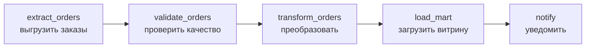
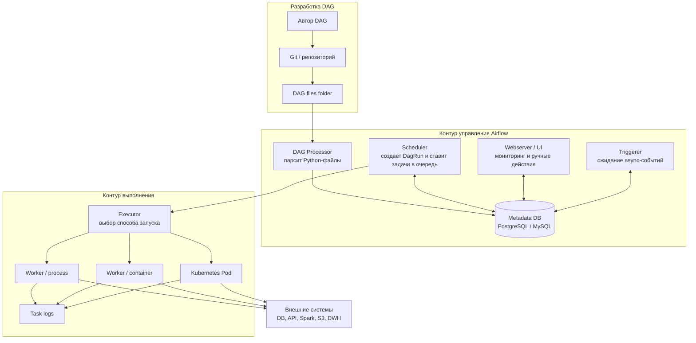
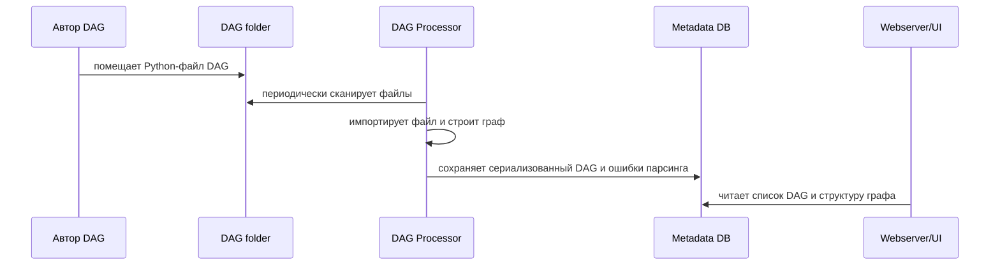
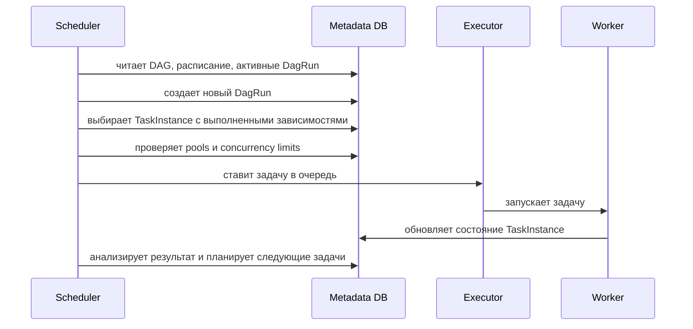
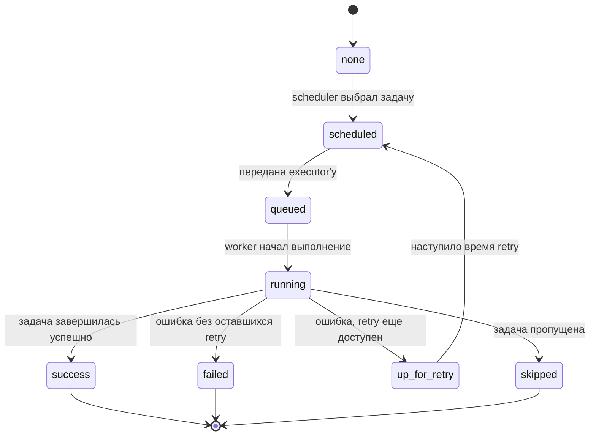
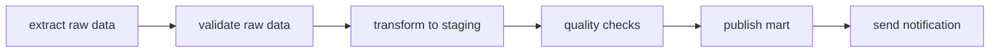
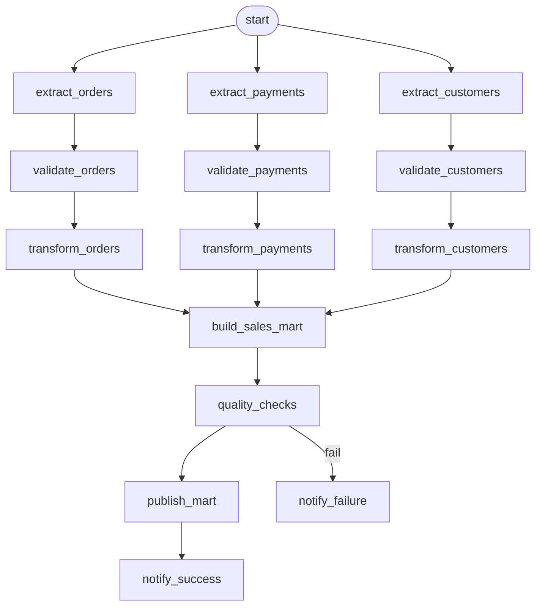
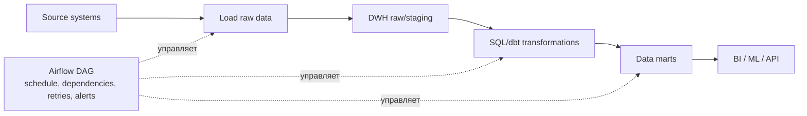

# 30. Архитектура Airflow. Принципы построения пайплайнов

## Краткий ответ

**Apache Airflow** - это платформа оркестрации рабочих процессов: она описывает пайплайны как Python-код, строит из них **DAG** (*Directed Acyclic Graph*, направленный ациклический граф), запускает задачи по расписанию или событию, отслеживает состояния, ретраи, логи, зависимости и историю запусков.

Airflow не является системой потоковой обработки данных и не выполняет тяжелые вычисления сам по себе как Spark или Flink. Его основная роль - **управлять порядком выполнения работ**: когда запустить извлечение данных, когда выполнить трансформацию, когда проверить качество, когда построить витрину и кому сообщить об ошибке.

Типовая архитектура Airflow состоит из следующих компонентов:

- **Scheduler** - планировщик, который создает DagRun, выбирает готовые TaskInstance и передает их executor'у.
- **DAG processor** - процессор DAG-файлов, который парсит Python-файлы с DAG и сериализует результат в metadata database.
- **Executor** - слой запуска задач: локально, через Celery, Kubernetes или другой механизм.
- **Workers** - процессы, контейнеры или pod'ы, где реально выполняется код задач.
- **Webserver / UI** - веб-интерфейс для просмотра DAG, логов, статусов, ручных запусков и отладки.
- **Metadata DB** - база метаданных, где хранятся состояния DAG, DagRun, TaskInstance, переменные, соединения, сериализованные DAG и другая служебная информация.
- **DAG files folder** - каталог с Python-файлами, в которых описаны DAG.
- **Triggerer** - дополнительный компонент для deferrable operators, то есть задач, которые могут освобождать рабочий слот во время ожидания внешнего события.

Ключевая идея хорошего пайплайна в Airflow: каждая задача должна быть **маленькой, идемпотентной, наблюдаемой, повторяемой и явно связанной зависимостями** с другими задачами.

## Что такое DAG и pipeline

В Airflow центральное понятие - **DAG**. Это направленный ациклический граф задач:

- **направленный**, потому что зависимости имеют направление: сначала `extract`, потом `transform`, потом `load`;
- **ациклический**, потому что задача не может зависеть от самой себя через цепочку других задач;
- **граф**, потому что зависимости могут ветвиться и сходиться, а не обязаны быть простой линейной последовательностью.

**Pipeline** в прикладном смысле - это бизнес-процесс обработки данных или операций: например, загрузить заказы за день, проверить качество, пересчитать агрегаты, обновить BI-витрину и отправить уведомление. В Airflow такой pipeline обычно выражается как DAG.

Пример простой структуры:



Важно: DAG описывает **оркестрацию**, а не обязательно саму бизнес-логику. Тяжелые вычисления лучше выносить в специализированные системы: SQL engine, Spark, dbt, Kubernetes job, внешнее API, ML-платформу.

## Архитектура Airflow

Ниже приведена обобщенная схема компонентов Airflow.



### Scheduler

**Scheduler** - один из главных компонентов Airflow. Он постоянно проверяет:

- какие DAG активны;
- нужно ли создать новый **DagRun** по расписанию или событию;
- какие **TaskInstance** готовы к запуску;
- выполнены ли upstream-зависимости;
- не нарушены ли ограничения по `pool`, `priority_weight`, `max_active_runs`, `max_active_tasks`;
- какие задачи нужно отправить executor'у.

Упрощенный цикл scheduler'а:

1. Прочитать сериализованное описание DAG из metadata DB.
2. Определить, нужны ли новые DagRun.
3. Найти TaskInstance в состоянии, допускающем планирование.
4. Проверить зависимости, пулы и лимиты параллелизма.
5. Перевести задачи в очередь.
6. Передать готовые задачи executor'у.
7. Получить от executor'а обновления о завершении, ошибках или сбоях.

Scheduler можно запускать в нескольких экземплярах для отказоустойчивости и производительности. В этом случае координация происходит через metadata DB, поэтому база становится критически важным компонентом.

### DAG processor

**DAG processor** читает Python-файлы из папки DAG, выполняет их на уровне построения графа, извлекает объекты DAG и сериализует результат в metadata DB.

Это важный компонент, потому что Airflow DAG - это Python-код. Чтобы понять структуру графа, Airflow должен импортировать файл и выполнить верхнеуровневый код, который создает DAG и задачи.

Следствия:

- в верхнеуровневом коде DAG нельзя делать тяжелые API-вызовы, SQL-запросы, сетевые операции и долгие вычисления;
- дорогие импорты лучше переносить внутрь callable-функций задач;
- динамическая генерация DAG должна быть быстрой и детерминированной;
- если DAG-файл плохо парсится, он может замедлить scheduler и весь кластер Airflow.

Плохой подход:

```python
# Плохо: API вызывается при каждом парсинге DAG-файла
tables = requests.get("https://example.com/tables").json()

with DAG("bad_dynamic_dag", schedule="@daily", start_date=...):
    for table in tables:
        ...
```

Лучше:

```python
# Лучше: конфигурация легкая, стабильная, без сетевого вызова на parse-time
TABLES = ["orders", "payments", "customers"]

with DAG("good_dynamic_dag", schedule="@daily", start_date=...):
    for table in TABLES:
        ...
```

### Webserver / UI

**Webserver** предоставляет веб-интерфейс Airflow. Через него можно:

- смотреть список DAG;
- видеть граф зависимостей и сетку запусков;
- запускать DAG вручную;
- очищать, повторять и пропускать задачи;
- смотреть логи TaskInstance;
- анализировать историю запусков;
- управлять Variables, Connections, Pools, пользователями и правами, если это разрешено.

Webserver обычно не выполняет задачи. Его задача - визуализация и операционное управление. В современных распределенных инсталляциях webserver может не иметь прямого доступа к DAG-файлам, а читать сериализованное представление из metadata DB. Это повышает изоляцию между авторами DAG и операторами системы.

### Executor

**Executor** определяет, как именно будут запускаться задачи. Scheduler решает, что задача готова, но executor отвечает за технический запуск.

Типовые executor'ы:

| Executor | Где выполняются задачи | Когда подходит |
|---|---|---|
| `SequentialExecutor` | последовательно в одном процессе | учебные и простые локальные установки |
| `LocalExecutor` | параллельно на одной машине | небольшие инсталляции без распределенных workers |
| `CeleryExecutor` | на Celery workers через broker | распределенная среда с несколькими worker-узлами |
| `KubernetesExecutor` | отдельный Kubernetes Pod на задачу | изоляция задач, эластичность, разные образы |
| `CeleryKubernetesExecutor` | часть задач через Celery, часть через Kubernetes | гибридные сценарии |

Executor не должен смешиваться с бизнес-логикой DAG. Один и тот же DAG в идеале можно запустить на другом executor'е без переписывания логики, если корректно настроены зависимости, окружение, connections и доступ к данным.

### Workers

**Workers** - это среда, где реально исполняется код задачи:

- Python callable из `@task` или `PythonOperator`;
- shell-команда из `BashOperator`;
- SQL-запрос через provider-operator;
- запуск контейнера;
- вызов API;
- Spark job, dbt run, ML training job и т.д.

В распределенной архитектуре разные задачи одного DAG могут выполняться на разных машинах. Поэтому нельзя рассчитывать, что файл, записанный локально одной задачей, будет доступен следующей. Для обмена данными нужно использовать внешнее хранилище: S3, HDFS, GCS, БД, DWH, shared volume или другой согласованный backend.

### Metadata DB

**Metadata DB** - центральное хранилище состояния Airflow. Обычно используется PostgreSQL или MySQL. SQLite годится только для простых локальных сценариев.

В metadata DB хранятся:

- DAG metadata;
- сериализованные DAG;
- DagRun;
- TaskInstance;
- состояния задач: `scheduled`, `queued`, `running`, `success`, `failed`, `skipped`, `upstream_failed` и другие;
- Variables;
- Connections;
- Pools;
- XCom;
- информация о пользователях и ролях;
- события, callback'и и служебные записи.

Metadata DB - не место для больших данных пайплайна. XCom и таблицы метаданных не следует использовать как хранилище датафреймов, файлов или больших JSON. Для больших результатов лучше передавать ссылку на объект во внешнем хранилище.

### Triggerer

**Triggerer** нужен для deferrable operators. Это задачи, которые могут перейти в состояние ожидания и освободить worker slot до наступления события.

Например, задача ждет:

- появления файла;
- завершения внешнего job;
- ответа API;
- наступления условия в облачном сервисе.

Обычный sensor в режиме постоянного ожидания может занимать worker slot. Deferrable operator передает ожидание triggerer'у, а worker освобождается для других задач. Это особенно важно при большом числе задач ожидания.

## Потоки выполнения в Airflow

### 1. Поток загрузки DAG



Если DAG не появился в UI, типовые причины:

- файл не попал в `DAGS_FOLDER`;
- в Python-файле ошибка импорта;
- DAG не создан на верхнем уровне модуля;
- `dag_id` изменился;
- DAG processor еще не успел перепарсить файл;
- зависимость Python-пакета есть у разработчика, но отсутствует в окружении Airflow.

### 2. Поток планирования запуска



### 3. Поток выполнения задачи

Жизненный цикл задачи обычно выглядит так:



Главное: Airflow управляет состояниями задач и зависимостями между ними. Код внутри задачи должен сам корректно работать с данными, транзакциями, внешними API и ошибками.

## Основные сущности Airflow

### DAG

**DAG** задает:

- `dag_id`;
- расписание `schedule`;
- дату начала `start_date`;
- правила catchup;
- максимальное число активных запусков;
- default arguments;
- набор задач;
- зависимости между задачами;
- callbacks, tags, owner, параметры.

Пример:

```python
import pendulum
from airflow.sdk import DAG, task

with DAG(
    dag_id="daily_orders_pipeline",
    schedule="@daily",
    start_date=pendulum.datetime(2026, 1, 1, tz="UTC"),
    catchup=False,
    max_active_runs=1,
    default_args={
        "retries": 3,
        "retry_delay": pendulum.duration(minutes=10),
    },
    tags=["dwh", "orders"],
):
    @task
    def extract_orders():
        return "s3://raw/orders/date={{ ds }}/orders.parquet"

    @task
    def validate_orders(path: str):
        print(f"validate {path}")

    @task
    def build_mart():
        print("build mart")

    raw_path = extract_orders()
    validate_orders(raw_path) >> build_mart()
```

### DagRun

**DagRun** - конкретный запуск DAG за определенный logical date / data interval. Один DAG может иметь много запусков: за разные дни, часы или ручные интервалы.

Например, `daily_orders_pipeline` может иметь запуски:

- за `2026-06-01`;
- за `2026-06-02`;
- ручной запуск для backfill;
- повторный запуск после исправления ошибки.

### Task

**Task** - узел графа. Это может быть:

- operator;
- sensor;
- TaskFlow-функция с `@task`;
- task group;
- mapped task при dynamic task mapping.

Task - это описание работы. **TaskInstance** - конкретное выполнение этой задачи в рамках конкретного DagRun.

### Operator

**Operator** - шаблон задачи. Примеры:

- `PythonOperator` или `@task` - выполнить Python-код;
- `BashOperator` - выполнить shell-команду;
- SQL-операторы - выполнить запрос;
- cloud provider operators - запустить работу в AWS, GCP, Azure;
- `KubernetesPodOperator` - запустить контейнер в Kubernetes.

Хороший operator должен делать одну понятную операцию и завершаться с корректным статусом.

### Sensor

**Sensor** - специальный operator ожидания. Он проверяет наступление условия:

- файл появился;
- запись в БД стала доступна;
- внешний job завершился;
- API вернул нужный статус.

Для долгого ожидания лучше использовать режим `reschedule` или deferrable sensors/operators, чтобы не занимать worker slot.

### XCom

**XCom** - механизм передачи небольших сообщений между задачами. Он удобен для:

- идентификатора job;
- пути к файлу;
- маленького словаря параметров;
- статуса или счетчика.

XCom не предназначен для больших данных. Нельзя передавать через него большие датафреймы, массивы, файлы и результаты тяжелых вычислений. Правильный паттерн: задача кладет данные во внешнее хранилище, а через XCom передает ссылку.

## Принципы построения DAG и pipeline

### 1. Явные зависимости

Зависимости должны отражать реальную причинно-следственную связь.

Плохо:

```python
extract >> cleanup >> transform >> validate >> load
```

Если `cleanup` не нужен для `transform`, такая зависимость только искусственно замедляет pipeline.

Лучше:

```python
extract_orders >> validate_orders >> transform_orders
extract_customers >> validate_customers >> transform_customers
[transform_orders, transform_customers] >> build_customer_orders_mart
```

Так Airflow сможет выполнять независимые ветви параллельно.

### 2. Маленькие задачи с понятными границами

Задача должна быть достаточно крупной, чтобы не превращать DAG в тысячу микрошагов, но достаточно маленькой, чтобы:

- было понятно, где произошла ошибка;
- можно было перезапустить только проблемный шаг;
- логи были читаемыми;
- ретраи не повторяли лишнюю работу.

Плохой пример: одна задача `run_everything`, которая делает extract, transform, load, проверки и уведомления.

Хороший пример:



### 3. Идемпотентность

**Идемпотентность** означает, что повторный запуск задачи с теми же входными данными приводит к тому же результату, без дублей и повреждений.

Airflow может перезапустить задачу из-за:

- временной сетевой ошибки;
- падения worker'а;
- ручного retry;
- backfill;
- очистки состояния задачи в UI;
- повторного запуска DAG.

Если задача неидемпотентна, retry может испортить данные.

Плохой пример:

```sql
INSERT INTO mart.daily_sales
SELECT order_date, sum(amount)
FROM staging.orders
GROUP BY order_date;
```

При повторе строки могут задублироваться.

Лучше:

```sql
DELETE FROM mart.daily_sales
WHERE order_date = '{{ ds }}';

INSERT INTO mart.daily_sales
SELECT order_date, sum(amount)
FROM staging.orders
WHERE order_date = '{{ ds }}'
GROUP BY order_date;
```

Или использовать `MERGE` / `UPSERT`, если это поддерживается СУБД.

Практические правила идемпотентности:

- писать в партицию конкретного `data_interval`, а не "куда получится";
- не читать "последние доступные данные" без привязки к интервалу;
- использовать `MERGE`, `UPSERT`, overwrite partition или transactional swap;
- не генерировать бизнес-результат на основе `now()` внутри задачи;
- временные данные писать в staging и атомарно публиковать результат;
- внешним API передавать idempotency key, если API это поддерживает.

### 4. Работа с retries

**Retries** нужны для временных сбоев: сеть, rate limit, временная недоступность БД, кратковременный сбой внешнего сервиса.

Но retry не должен маскировать систематическую ошибку:

- неверный SQL;
- сломанную схему данных;
- отсутствующую таблицу;
- неправильные credentials;
- баг в коде.

Пример:

```python
with DAG(
    dag_id="payments_pipeline",
    schedule="@hourly",
    start_date=pendulum.datetime(2026, 1, 1, tz="UTC"),
    catchup=False,
    default_args={
        "retries": 3,
        "retry_delay": pendulum.duration(minutes=5),
        "retry_exponential_backoff": True,
        "max_retry_delay": pendulum.duration(minutes=30),
    },
):
    ...
```

Рекомендации:

- для API и сетевых задач задавать несколько retry с backoff;
- для задач качества данных иногда лучше падать сразу;
- для дорогих batch-задач выбирать retry аккуратно, чтобы не перегрузить систему;
- обязательно задавать `execution_timeout`, если задача может зависнуть;
- отличать retry на уровне Airflow от retry внутри клиента API.

### 5. SLA, Deadline Alerts и контроль времени

В классической терминологии **SLA** означает допустимое время завершения задачи или процесса. В Airflow 2 был механизм SLA. В Airflow 3.0 старый SLA был удален, а в Airflow 3.1 появился механизм **Deadline Alerts**.

Смысл для проектирования pipeline остается тем же:

- определить, к какому времени результат должен быть готов;
- настроить оповещение при нарушении срока;
- понимать критический путь DAG;
- ограничивать время выполнения задач через `execution_timeout`;
- отделять "задача упала" от "задача работает, но слишком долго".

Пример проектного SLA:

> Витрина `daily_sales_mart` должна быть обновлена до 08:00 по Москве каждый рабочий день.

Для этого нужно:

- знать, когда доступны исходные данные;
- оценить длительность каждого этапа;
- настроить alert при превышении дедлайна;
- иметь retry, но не такой длинный, чтобы он съедал весь SLA;
- вынести долгие ожидания в sensors/deferrable operators;
- мониторить не только факт ошибки, но и задержку.

### 6. Dependencies и trigger rules

По умолчанию задача запускается, когда все upstream-задачи успешно завершились. Но в реальных DAG нужны разные правила:

- продолжить после успешной хотя бы одной ветки;
- выполнить cleanup даже при ошибке;
- отправить уведомление при падении;
- объединить ветви после branching;
- пропустить часть графа по условию.

Для этого используются:

- `>>` и `<<` для зависимостей;
- `BranchPythonOperator` или TaskFlow branching;
- `trigger_rule`;
- setup/teardown tasks;
- `TaskGroup`;
- sensors;
- datasets/assets и event-driven scheduling.

Пример с cleanup:

```python
from airflow.utils.trigger_rule import TriggerRule

cleanup = BashOperator(
    task_id="cleanup_temp_files",
    bash_command="rm -rf /tmp/pipeline/{{ run_id }}",
    trigger_rule=TriggerRule.ALL_DONE,
)

[extract, transform, load] >> cleanup
```

Здесь cleanup выполнится даже если одна из предыдущих задач упала.

### 7. Управление параллелизмом

Airflow может запустить слишком много задач, если не задать ограничения. Это опасно для БД, API и внешних сервисов.

Основные инструменты:

- `max_active_runs` - сколько запусков DAG могут идти одновременно;
- `max_active_tasks` - сколько задач DAG могут выполняться одновременно;
- `pool` - общий лимит для группы задач, например "не больше 5 запросов к billing API";
- `priority_weight` - относительный приоритет задач;
- executor-level parallelism - общий лимит на уровне Airflow;
- queues - разделение workers для CeleryExecutor.

Пример:

```python
load_to_billing = PythonOperator(
    task_id="load_to_billing",
    python_callable=send_to_billing,
    pool="billing_api_pool",
    retries=5,
)
```

### 8. Разделение orchestration и computation

Airflow хорошо управляет процессом, но не должен становиться местом тяжелой обработки данных.

Плохо:

- читать миллионы строк в память worker'а;
- обрабатывать большие датафреймы внутри `PythonOperator`;
- хранить промежуточные данные в XCom;
- запускать долгую ML-тренировку прямо в процессе worker'а без внешней системы.

Лучше:

- Airflow запускает Spark job;
- Airflow вызывает dbt;
- Airflow отправляет Kubernetes job;
- Airflow выполняет SQL в DWH;
- Airflow вызывает API внешней ML-платформы;
- Airflow мониторит завершение и проверяет результат.

### 9. Наблюдаемость

Хороший pipeline должен быть понятен в эксплуатации.

Нужно проектировать:

- информативные `task_id`;
- понятные логи;
- tags и owner;
- callbacks на failure/success;
- алерты по ошибкам и дедлайнам;
- метрики длительности и задержки;
- проверки качества данных;
- документацию к DAG и задачам.

Пример хороших имен:

```text
extract_orders_from_postgres
validate_orders_schema
load_orders_to_raw_s3
build_daily_sales_mart
check_daily_sales_freshness
```

Плохие имена:

```text
task1
run
python_task
step_a
final
```

## Пример промышленного DAG

Сценарий: интернет-магазин каждый день строит витрину продаж.



Пример кода:

```python
import pendulum
from airflow.sdk import DAG, task
from airflow.providers.common.sql.operators.sql import SQLExecuteQueryOperator

DEFAULT_ARGS = {
    "owner": "data-platform",
    "retries": 3,
    "retry_delay": pendulum.duration(minutes=10),
    "retry_exponential_backoff": True,
}

with DAG(
    dag_id="daily_sales_mart",
    schedule="0 3 * * *",
    start_date=pendulum.datetime(2026, 1, 1, tz="UTC"),
    catchup=False,
    max_active_runs=1,
    default_args=DEFAULT_ARGS,
    tags=["dwh", "sales", "daily"],
):
    extract_orders = SQLExecuteQueryOperator(
        task_id="extract_orders",
        conn_id="source_postgres",
        sql="""
        INSERT INTO raw.orders_{{ ds_nodash }}
        SELECT *
        FROM public.orders
        WHERE order_date >= '{{ data_interval_start }}'
          AND order_date < '{{ data_interval_end }}';
        """,
    )

    validate_orders = SQLExecuteQueryOperator(
        task_id="validate_orders",
        conn_id="dwh",
        sql="""
        SELECT
            CASE
                WHEN count(*) = 0 THEN raise_error('orders are empty')
                ELSE 1
            END
        FROM raw.orders_{{ ds_nodash }};
        """,
    )

    build_mart = SQLExecuteQueryOperator(
        task_id="build_sales_mart",
        conn_id="dwh",
        sql="""
        DELETE FROM mart.daily_sales
        WHERE sales_date = '{{ ds }}';

        INSERT INTO mart.daily_sales
        SELECT
            date(order_ts) AS sales_date,
            count(*) AS orders_count,
            sum(amount) AS revenue
        FROM raw.orders_{{ ds_nodash }}
        GROUP BY date(order_ts);
        """,
    )

    @task
    def notify_success():
        print("daily_sales_mart has been published")

    extract_orders >> validate_orders >> build_mart >> notify_success()
```

В этом примере есть важные свойства:

- данные обрабатываются по конкретному интервалу;
- результат за день перед записью удаляется или перезаписывается;
- есть retry;
- DAG не делает тяжелую работу на этапе парсинга;
- задачи названы по смыслу;
- `max_active_runs=1` защищает витрину от параллельной перезаписи.

## Backfill и catchup

**Catchup** - поведение, при котором Airflow может создать пропущенные DagRun за прошлые интервалы с момента `start_date`.

Если `catchup=True`, ежедневный DAG со `start_date` год назад может попытаться выполнить сотни запусков. Это полезно для исторической загрузки, но опасно без ограничений.

Если `catchup=False`, Airflow обычно запускает только актуальные интервалы, а исторические запуски делают вручную через backfill или ручной trigger.

Рекомендации:

- для регулярных production-DAG часто ставят `catchup=False`;
- для исторической обработки используют отдельный backfill-процесс;
- все задачи должны быть идемпотентны, иначе backfill опасен;
- обязательно ограничивать `max_active_runs`;
- проверять нагрузку на источники и DWH.

## Dynamic task mapping

**Dynamic task mapping** позволяет создавать несколько экземпляров задачи на основе списка входов во время выполнения.

Пример: обработать набор таблиц.

```python
from airflow.sdk import DAG, task

with DAG(...):
    @task
    def list_tables():
        return ["orders", "payments", "customers"]

    @task
    def process_table(table_name: str):
        print(f"process {table_name}")

    process_table.expand(table_name=list_tables())
```

Это лучше, чем вручную описывать десятки одинаковых задач, но есть ограничения:

- список не должен быть бесконечным;
- нужно контролировать параллелизм;
- task_id и логи должны оставаться читаемыми;
- не стоит использовать dynamic mapping для скрытия сложной бизнес-логики.

## TaskGroup

**TaskGroup** группирует задачи в UI и делает большой DAG читаемее.

Пример:

```python
from airflow.utils.task_group import TaskGroup

with TaskGroup("orders") as orders_group:
    extract_orders >> validate_orders >> transform_orders

with TaskGroup("payments") as payments_group:
    extract_payments >> validate_payments >> transform_payments

[orders_group, payments_group] >> build_mart
```

TaskGroup не создает отдельный DAG и не является SubDAG. Это визуальная и структурная группировка задач внутри одного DAG.

## Типичные ошибки при проектировании Airflow pipelines

### 1. Тяжелый код на уровне импорта DAG

Симптомы:

- DAG долго появляется в UI;
- scheduler загружен;
- парсинг DAG падает;
- webserver показывает import errors.

Причина: код выполняется при каждом парсинге файла.

Исправление:

- убрать API-вызовы, SQL и тяжелые вычисления из верхнего уровня;
- оставить наверху только создание DAG и tasks;
- тяжелую работу выполнять внутри task callable.

### 2. Один огромный task вместо графа

Проблема:

- непонятно, где ошибка;
- retry повторяет весь процесс;
- нельзя распараллелить независимые шаги;
- плохая наблюдаемость.

Исправление: разбить процесс на логические этапы с явными зависимостями.

### 3. Слишком мелкие задачи

Обратная крайность - сотни задач, каждая делает одну тривиальную операцию. Это увеличивает нагрузку на scheduler и metadata DB.

Исправление: группировать мелкие операции в разумные блоки, особенно если они всегда выполняются вместе и не требуют отдельного retry.

### 4. Неидемпотентные записи

Проблема:

- retry создает дубли;
- backfill портит витрины;
- повторный запуск меняет результат.

Исправление:

- `UPSERT` / `MERGE`;
- overwrite partition;
- delete+insert по конкретному интервалу;
- атомарная публикация результата;
- idempotency keys для внешних API.

### 5. Использование локального диска между задачами

В CeleryExecutor или KubernetesExecutor следующая задача может выполниться на другом worker'е.

Плохо:

```text
task A пишет /tmp/orders.csv
task B читает /tmp/orders.csv
```

Лучше:

```text
task A пишет s3://bucket/raw/orders/{{ ds }}/orders.parquet
task B получает путь через XCom и читает из S3
```

### 6. Большие данные в XCom

XCom хранится в metadata DB или специализированном backend'е и предназначен для небольших сообщений. Большие payload'ы замедляют UI, scheduler и базу.

Исправление: хранить данные во внешнем хранилище, передавать только ссылку.

### 7. Неправильные start_date и schedule

Частая ошибка - использовать динамический `start_date`, например `datetime.now()`. Это делает расписание непредсказуемым.

Лучше задавать фиксированную дату:

```python
start_date=pendulum.datetime(2026, 1, 1, tz="UTC")
```

Также нужно помнить: для периодического расписания Airflow запускает обработку после окончания интервала данных. Например, daily-запуск за день обычно стартует после завершения этого дня.

### 8. Отсутствие ограничений параллелизма

Без `pools`, `max_active_runs` и лимитов можно случайно:

- перегрузить источник;
- превысить API rate limit;
- запустить несколько перезаписывающих задач одновременно;
- забить worker slots.

### 9. Sensors занимают worker slots

Долгие sensors в режиме постоянного ожидания могут исчерпать workers.

Исправление:

- `mode="reschedule"`;
- deferrable operators;
- event-driven подход;
- отдельные pools для sensors.

### 10. Смешивание оркестрации и бизнес-вычислений

Airflow worker не должен становиться универсальным вычислительным кластером. Если задача обрабатывает большие объемы данных, лучше запускать внешнюю вычислительную систему и ждать ее завершения.

### 11. Нет проверок качества данных

Pipeline может успешно завершиться технически, но записать пустую или некорректную витрину.

Нужны проверки:

- число строк больше нуля;
- ключи уникальны;
- обязательные поля не null;
- значения в допустимых диапазонах;
- свежесть данных;
- сверка контрольных сумм;
- сравнение с предыдущим периодом.

### 12. Уведомления только по failure

Иногда задача не падает, но результат опаздывает или данные неполные. Поэтому нужны:

- alerts по дедлайнам;
- freshness checks;
- data quality checks;
- мониторинг длительности;
- уведомления о пропуске критичных веток.

## Как спроектировать DAG: пошаговый подход

1. **Определить цель**: какой результат должен появиться после выполнения DAG.
2. **Определить интервал данных**: день, час, неделя, конкретное событие.
3. **Описать источники**: БД, API, файлы, очереди, внешние job.
4. **Разбить процесс на этапы**: extract, validate, transform, load, publish, notify.
5. **Построить зависимости**: что реально должно быть раньше, а что можно выполнять параллельно.
6. **Выбрать стратегию записи**: overwrite partition, merge, upsert, transactional publish.
7. **Настроить retries и timeout**: отдельно для сетевых задач, SQL, sensors и внешних job.
8. **Задать лимиты**: pools, max active runs, concurrency.
9. **Добавить проверки качества**: технические и бизнесовые.
10. **Добавить наблюдаемость**: логи, owner, tags, alerts, deadline.
11. **Проверить backfill**: можно ли безопасно перезапустить прошлый период.
12. **Протестировать DAG parsing**: файл должен быстро импортироваться.

## Сравнение хорошего и плохого pipeline

| Критерий | Плохой pipeline | Хороший pipeline |
|---|---|---|
| Задачи | одна огромная задача | несколько логических этапов |
| Повторный запуск | создает дубли | идемпотентен |
| Данные | читаются "последние" | привязаны к data interval |
| Ошибки | трудно локализовать | видно проблемную TaskInstance |
| Ретраи | повторяют весь процесс | повторяют только нужный шаг |
| Обмен данными | локальные файлы и XCom с payload | внешнее хранилище и ссылки |
| Параллелизм | случайный | ограничен pools и concurrency |
| SLA/Deadline | не контролируется | есть дедлайн и alert |
| Наблюдаемость | task1/task2 без смысла | понятные имена, логи, tags |
| Backfill | опасен | предусмотрен проектно |

## Связь Airflow с ETL/ELT

Airflow часто используют для ETL и ELT:

- **ETL**: извлечь данные, преобразовать, загрузить готовый результат.
- **ELT**: извлечь, загрузить в DWH/lake, преобразовать уже внутри хранилища.

В современных DWH-процессах Airflow чаще выполняет роль оркестратора ELT:



Airflow не заменяет DWH, Spark, dbt или систему качества данных. Он связывает их в управляемый процесс.

## Безопасность и эксплуатация

При production-использовании важно:

- хранить секреты в Connections или secret backend, а не в коде DAG;
- разделять права авторов DAG и операторов;
- версионировать DAG в Git;
- иметь staging-окружение;
- проверять DAG через CI;
- следить за размером metadata DB;
- чистить старые логи и метаданные;
- не давать DAG-коду лишние привилегии;
- контролировать Python-зависимости providers и operators.

Отдельно важно понимать, что DAG-файл - это исполняемый Python-код. Ошибка или тяжелая операция в DAG-файле влияет не только на конкретную задачу, но и на процесс парсинга DAG.

## Мини-чеклист хорошего Airflow DAG

- Есть фиксированный `start_date`.
- Явно задан `schedule`, даже если `schedule=None`.
- Настроен `catchup` осознанно.
- Есть `max_active_runs`.
- Задачи идемпотентны.
- Нет тяжелого top-level кода.
- Зависимости отражают реальный порядок.
- Независимые ветки выполняются параллельно.
- Есть retries там, где возможны временные сбои.
- Есть `execution_timeout` для потенциально зависающих задач.
- Есть pools для ограниченных внешних ресурсов.
- XCom используется только для небольших сообщений.
- Большие данные лежат во внешнем хранилище.
- Есть проверки качества данных.
- Есть alerts по ошибкам и дедлайнам.
- Имена задач понятны без открытия кода.

## Вывод

Airflow - это система оркестрации, в которой pipeline описывается как DAG: набор задач и зависимостей между ними. Scheduler решает, какие задачи пора запускать, DAG processor парсит Python-описания DAG, executor выбирает способ запуска, workers выполняют код, webserver показывает состояние, а metadata DB хранит всю служебную историю и состояния.

Главный инженерный принцип Airflow: пайплайн должен быть не просто "последовательностью скриптов", а управляемым, повторяемым и наблюдаемым процессом. Для этого задачи делают идемпотентными, зависимости - явными, ретраи - осмысленными, SLA/дедлайны - контролируемыми, данные - привязанными к интервалу обработки, а тяжелые вычисления - вынесенными в подходящие внешние системы.

Хороший DAG легко читать, безопасно перезапускать, удобно отлаживать и можно масштабировать без переписывания бизнес-логики.

## Источники

- Apache Airflow Documentation. **Architecture Overview**. Официальная документация Airflow 3.2.2. https://airflow.apache.org/docs/apache-airflow/stable/core-concepts/overview.html
- Apache Airflow Documentation. **Scheduler**. Официальная документация Airflow 3.2.2. https://airflow.apache.org/docs/apache-airflow/stable/administration-and-deployment/scheduler.html
- Apache Airflow Documentation. **Executor**. Официальная документация Airflow 3.2.2. https://airflow.apache.org/docs/apache-airflow/stable/core-concepts/executor/index.html
- Apache Airflow Documentation. **Tasks**. Официальная документация Airflow 3.2.2. https://airflow.apache.org/docs/apache-airflow/stable/core-concepts/tasks.html
- Apache Airflow Documentation. **Best Practices**. Официальная документация Airflow 3.2.2. https://airflow.apache.org/docs/apache-airflow/stable/best-practices.html
- Apache Airflow Documentation. **Migrating from SLA to Deadline Alerts**. Официальная документация Airflow 3.2.2. https://airflow.apache.org/docs/apache-airflow/stable/howto/sla-to-deadlines.html
- Apache Airflow Documentation. **DAGs**. Документация по базовым понятиям DAG и зависимостей. https://airflow.apache.org/docs/apache-airflow/stable/core-concepts/dags.html
- Apache Airflow Documentation. **XComs**. Документация по передаче небольших сообщений между задачами. https://airflow.apache.org/docs/apache-airflow/stable/core-concepts/xcoms.html
- Apache Airflow Documentation. **Dynamic Task Mapping**. Документация по динамическому созданию экземпляров задач. https://airflow.apache.org/docs/apache-airflow/stable/authoring-and-scheduling/dynamic-task-mapping.html
